## Paint trims

### Basic paint

On the basic trim the bumpers and wheel arches is not painted

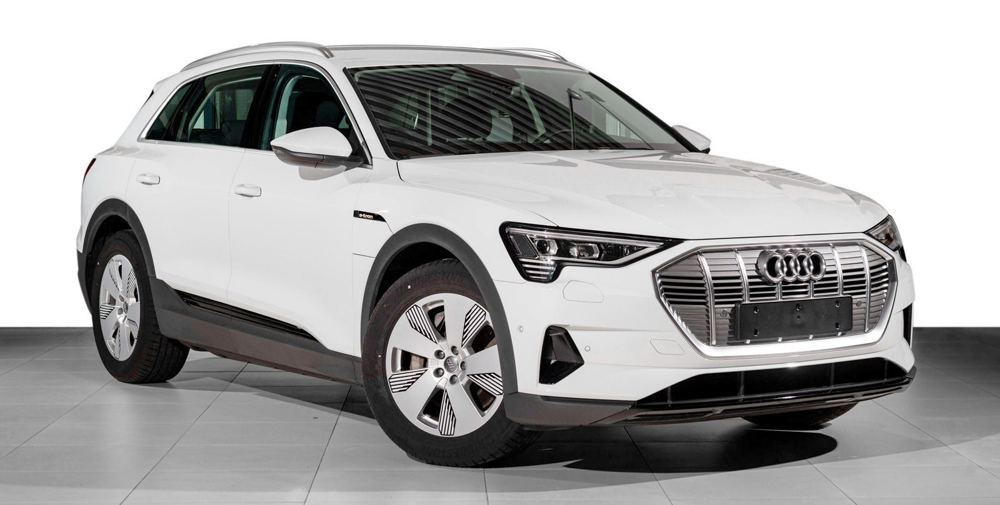

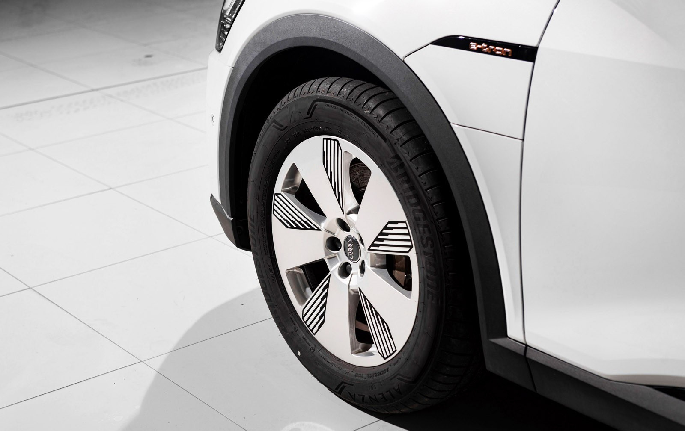

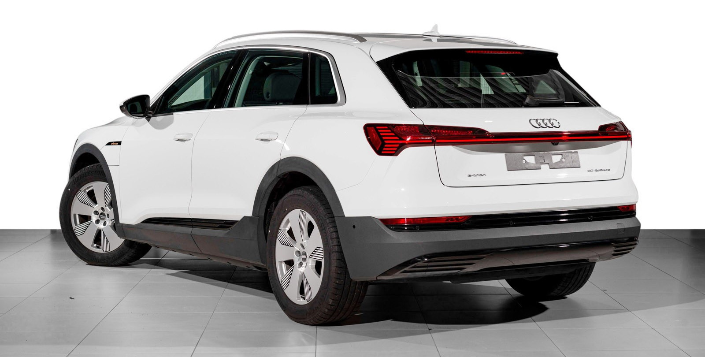

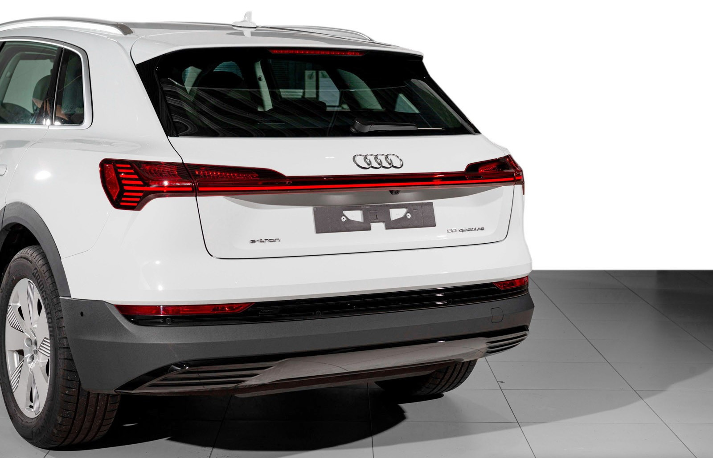

### Contrast paint

You can choose to get bumpers and wheel arches in contrast paint. This is option **2K5**
The contrast color is manhatten gray on all options except glacier white and florett silver. On those it is typhoon gray.

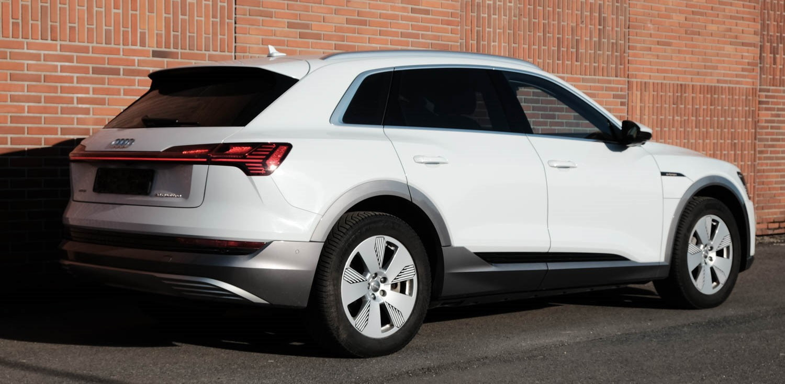

### Full body paint

You can also choose full body paint so bumpers and wheel archers are painted in body color.
This has option **VJ1** and is standard on S-line and S exterior trim.

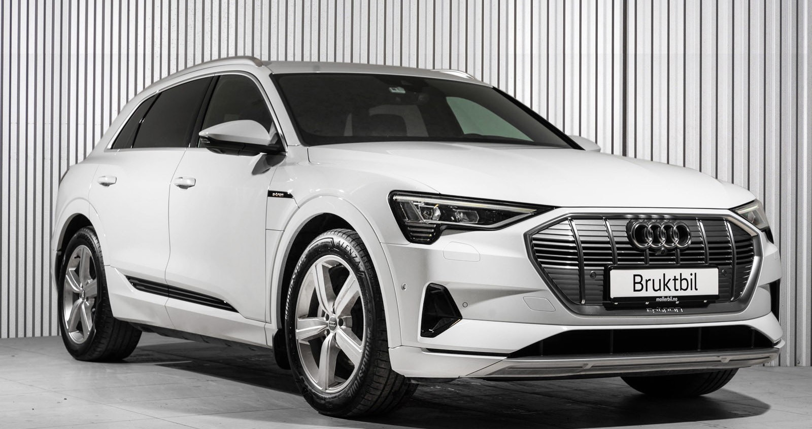

## Paint colors

The different standard colors are

### Glacier White

Color Code: **2Y**

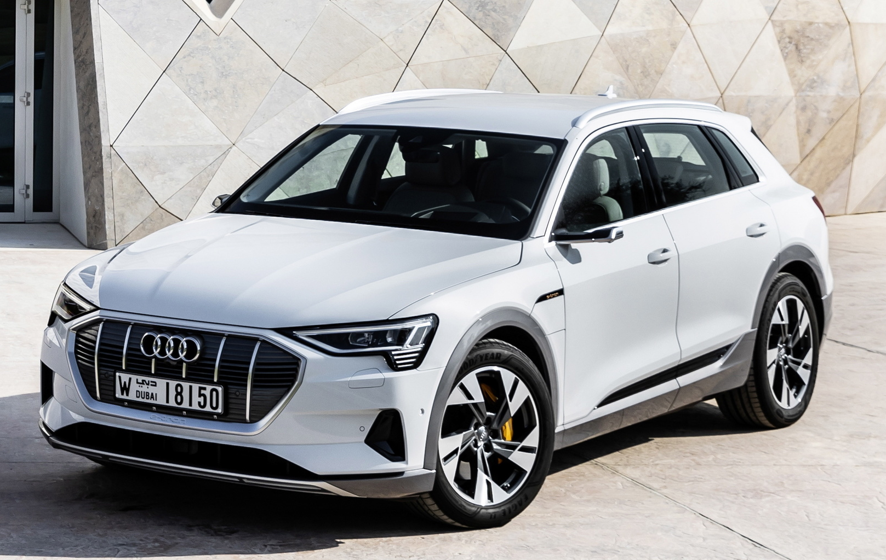

### Catalunya Red

Color Code: **Y6**

### Plasma Blue

### Florett Silver

Color Code: **L5**

### Chronos Grey

Color Code: **??**

### Typhoon Grey

Color Code: **2L**

### Daytona Grey

Color Code: **6Y**

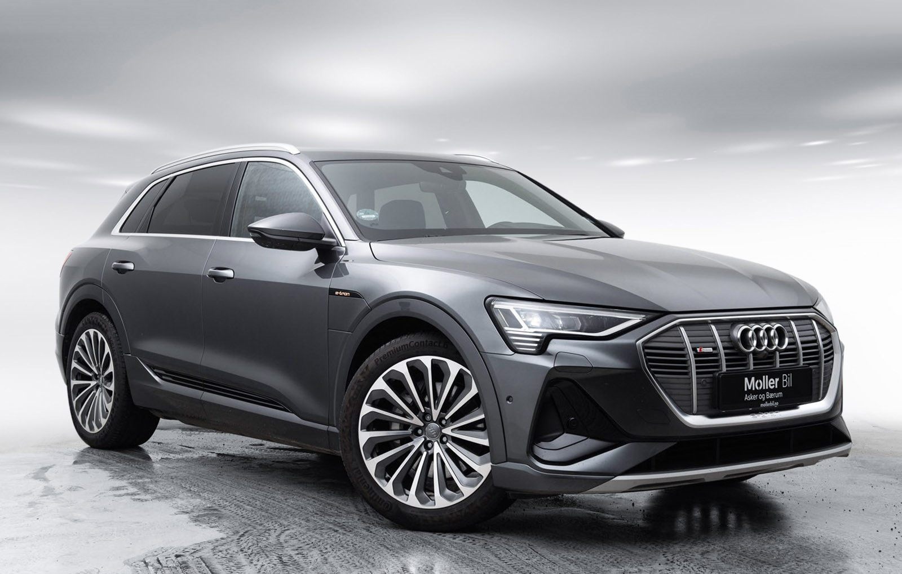

### Navarra Blue

Color Code: **2D**

### Galaxy Blue

Color Code: **S1**

### Antigua Blue

### Siam Beige

Color Code: **OE**

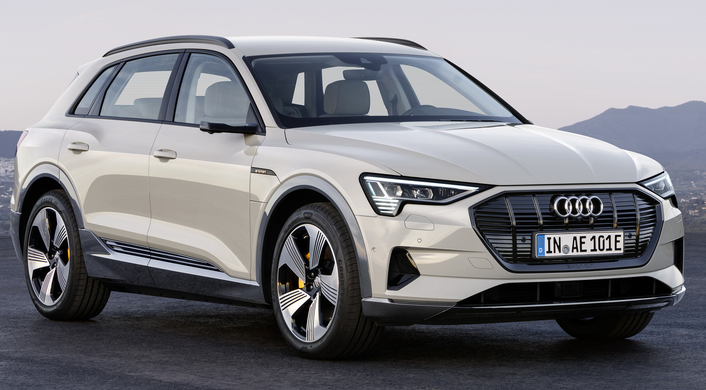

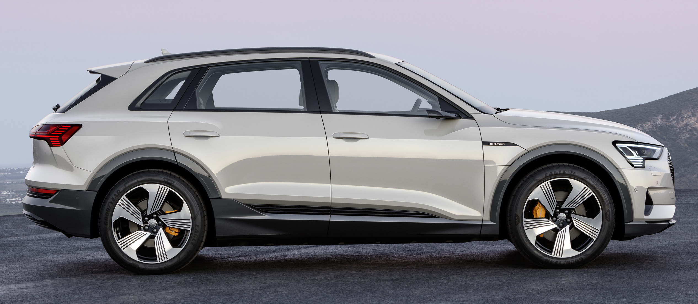

### Manhatten Grey

Color Code: **2Y**

### Brilliant Black

The only non metallic color.

Color Code: **A2**

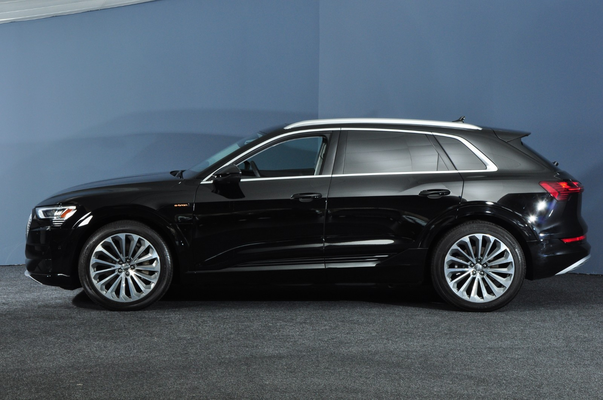

### Mythos black

Color Code: **OE**

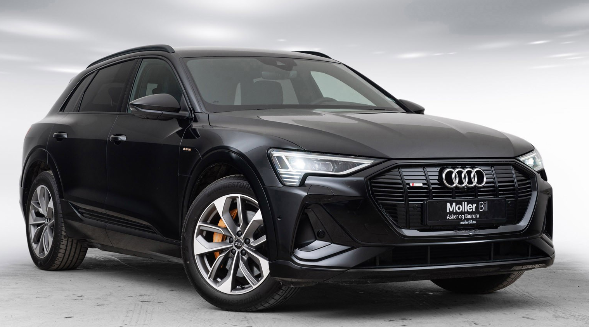

