<!-- markdownlint-disable MD033 -->
## Paint trims

### Basic paint

On the basic trim the bumpers and wheel arches is not painted

<figure>
    
    <figcaption><h4>Basic with non painted bumpers and wheel arches</h4></figcaption>
</figure>

<figure>
    
    <figcaption><h4>Basic with non painted bumpers and wheel arches</h4></figcaption>
</figure>

<figure>
    
    <figcaption><h4>Basic with non painted bumpers and wheel arches</h4></figcaption>
</figure>

<figure>
    
    <figcaption><h4>Basic with non painted bumpers and wheel arches</h4></figcaption>
</figure>

### Contrast paint

You can choose to get bumpers and wheel arches in contrast paint. This is option **2K5**
The contrast color is manhatten gray on all options except glacier white and florett silver. On those it is typhoon gray.

<figure>
    <a href="contrast1.jpg">
        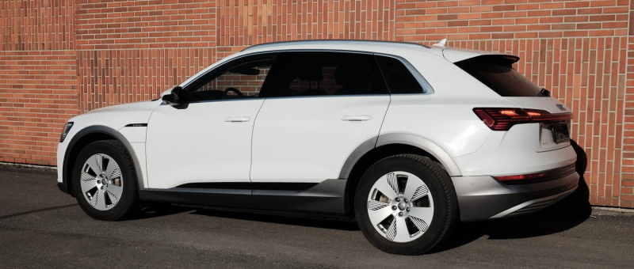
    </a>
    <figcaption><h4>Glacier white with contrast color</h4></figcaption>
</figure>

<figure>
    
    <figcaption><h4>Glacier white with contrast color</h4></figcaption>
</figure>

<figure>
    
    <figcaption><h4>Glacier white with contrast color</h4></figcaption>
</figure>

<figure>
    <a href="contrast4.jpg">
        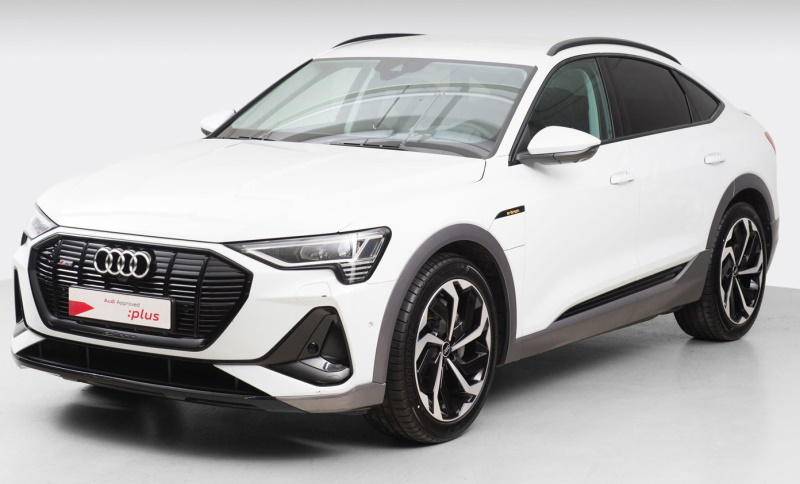
    </a>
    <figcaption><h4>S-Line Glacier white with contrast color</h4></figcaption>
</figure>

### Full body paint

You can also choose full body paint so bumpers and wheel archers are painted in body color.
This has option **VJ1** and is standard on S-line and S exterior trim.

<figure>
    
    <figcaption><h4>Glacier white with full body color</h4></figcaption>
</figure>

<figure>
    
    <figcaption><h4>Glacier white with full body color</h4></figcaption>
</figure>

<figure>
    
    <figcaption><h4>Glacier white with full body color</h4></figcaption>
</figure>

## Standard Paint colors

The different standard colors are

### Glacier White

Color Code: **2Y**

<figure>
    
    <figcaption><h4>Audi e-tron 55 in glacier white with contrast color</h4></figcaption>
</figure>

<figure>
    <a href="paint_glacierwhite_2.jpg">
        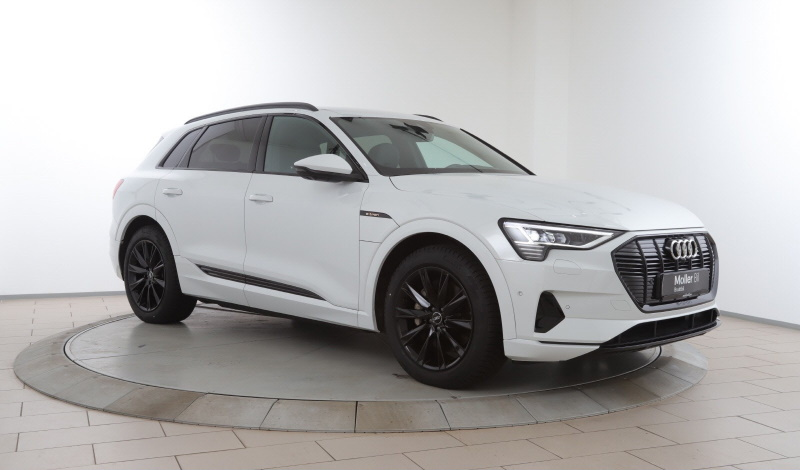
    </a>
    <figcaption><h4>Audi e-tron 55 in glacier white with black optics</h4></figcaption>
</figure>

<figure>
    
    <figcaption><h4>Audi e-tron 55 Sportback S-line in glacier white with black optics</h4></figcaption>
</figure>

### Catalunya Red

Color Code: **Y6**

<figure>
    
    <figcaption><h4>Audi e-tron 55 S-line Sportback in Catalunya Red with black optics</h4></figcaption>
</figure>

<figure>
    <a href="paint_catalunyared_2.jpg">
        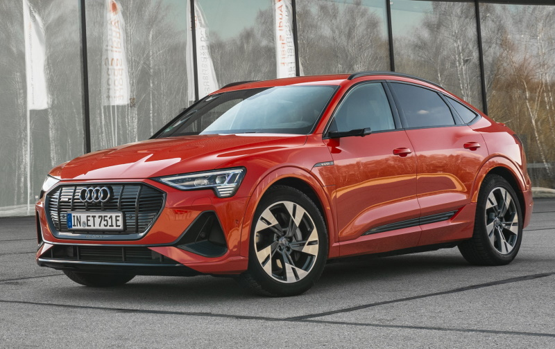
    </a>
    <figcaption><h4>Audi e-tron 55 S-line Sportback in Catalunya Red with black optics</h4></figcaption>
</figure>

The footage shows driving shots as well as stills of the Audi e-tron S Sportback in the color catalunya red.


### Plasma Blue

Color Code: **3D**

<figure>
    
    <figcaption><h4>Audi e-tron 55 S-line Sportback in Plasma Blue with contrast color</h4></figcaption>
</figure>

<figure>
    <a href="paint_plasmablue_2.jpg">
        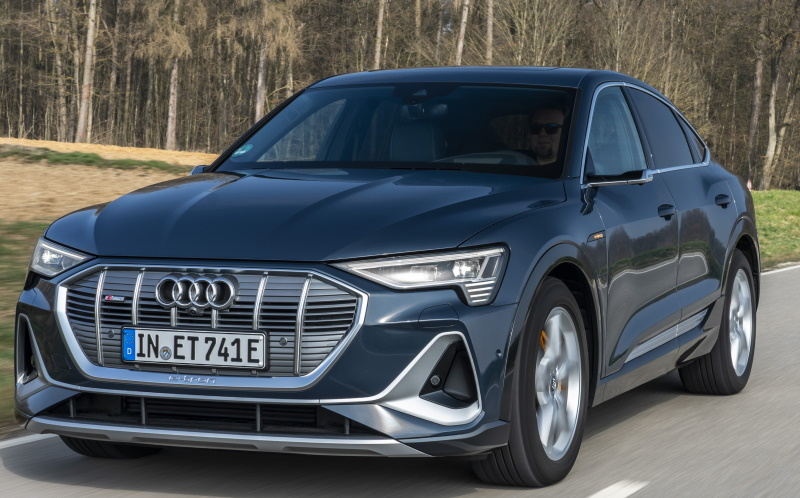
    </a>
    <figcaption><h4>Audi e-tron 55 S-line Sportback in Plasma Blue with contrast color</h4></figcaption>
</figure>

<figure>
    
    <figcaption><h4>Audi e-tron 55 S-line Sportback in Plasma Blue with contrast color</h4></figcaption>
</figure>

### Florett Silver

Color Code: **L5**

<figure>
    
    <figcaption><h4>Audi e-tron 55 S-line Sportback in Florett Silver with contrast color</h4></figcaption>
</figure>

<figure>
    
    <figcaption><h4>Audi e-tron 55 S-line Sportback in Florett Silver with contrast color</h4></figcaption>
</figure>

<figure>
    
    <figcaption><h4>Audi e-tron 55 S-line Sportback in Florett Silver with contrast color</h4></figcaption>
</figure>

### Chronos Grey

Color Code: **Z7**

<figure>
    <a href="paint_chronosgrey_1.jpg">
        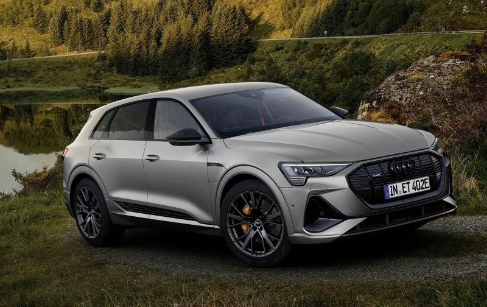
    </a>
    <figcaption><h4>Audi e-tron 55 in Chronos Grey with black optics</h4></figcaption>
</figure>
<figure>
    
    <figcaption><h4>Audi e-tron Sportback 55 in Chronos Grey with black optics</h4></figcaption>
</figure>

<figur>
    
    <figcaption><h4>Audi e-tron 55 in Chronos Grey with black optics</h4></figcaption>
</figur>
<figur>
    
    <figcaption><h4>Audi e-tron 55 in Chronos Grey with black optics</h4></figcaption>
</figur>
<figur>
    <a href="paint_chronosgrey_5.jpg">
        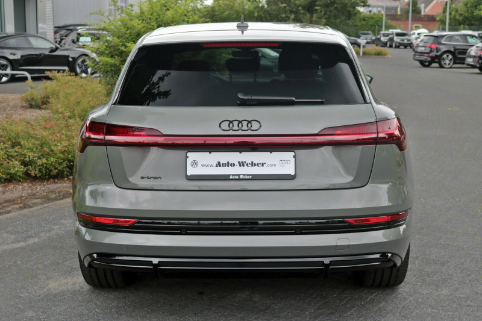
    </a>
    <figcaption><h4>Audi e-tron 55 in Chronos Grey with black optics</h4></figcaption>
</figur>

### Typhoon Grey

Color Code: **2L**

<figure>
    
    <figcaption><h4>Audi e-tron 55 in Typhoon Grey with black optics</h4></figcaption>
</figure>

<figure>
    
    <figcaption><h4>Audi e-tron 55 in Typhoon Grey with black optics</h4></figcaption>
</figure>

### Daytona Grey

Only available on S-line and e-tron S.

Color Code: **6Y**

<figure>
    
    <figcaption><h4>Audi e-tron 60S Sportback in Daytona Grey</h4></figcaption>
</figure>

<figure>
    
    <figcaption><h4>Audi e-tron 55 Sportback S-Line in Daytona Grey</h4></figcaption>
</figure>

<figure>
    <a href="paint_daytona_3.jpg">
        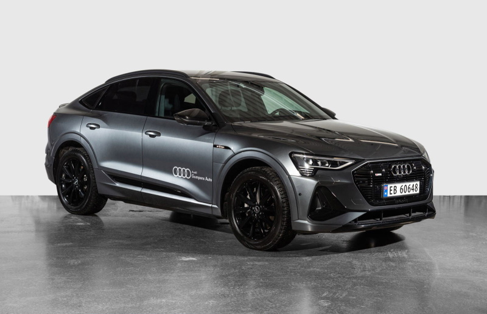
    </a>
    <figcaption><h4>Audi e-tron 55 Sportback  S-Line in Daytona Grey with black optics</h4></figcaption>
</figure>

<figure>
    <a href="paint_daytona_4.jpg">
        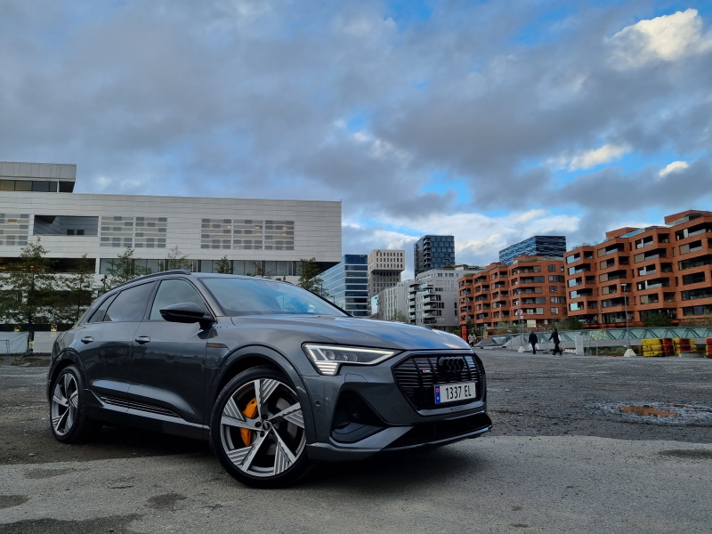
    </a>
    <figcaption><h4>Audi e-tron 55 S-line in Daytona Grey with black optics</h4></figcaption>
</figure>

<figure>
    <a href="paint_daytona_5.jpg">
        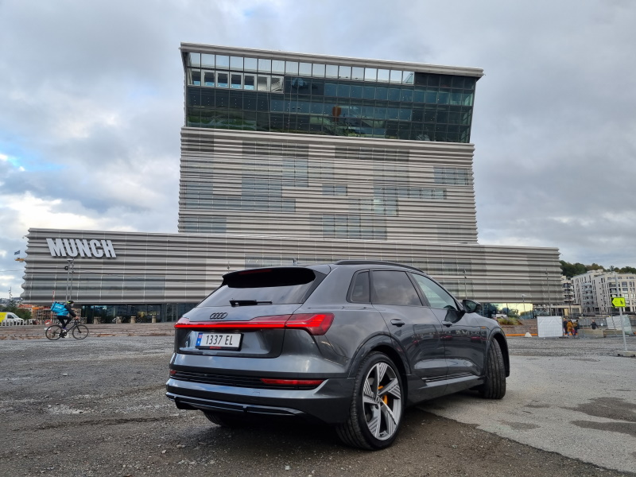
    </a>
    <figcaption><h4>Audi e-tron 55 S-line in Daytona Grey with black optics</h4></figcaption>
</figure>

<figure>
    
    <figcaption><h4>Audi e-tron 60S Sporttback in Daytona Grey with black optics</h4></figcaption>
</figure>

The footage shows driving shots as well as stills of the Audi e-tron S Sportback in the color daytona grey.



### Navarra Blue

Color Code: **2D**

<figure>
    
    <figcaption><h4>Audi e-tron 60S  Sportback in Navarra Blue with contrast color</h4></figcaption>
</figure>

The footage shows driving shots as well as stills of the Audi e-tron S Sportback in the color navarra blue.



 



### Galaxy Blue

Color Code: **S1**

<figure>
    
    <figcaption><h4>Audi e-tron 55 in Galaxy Blue</h4></figcaption>
</figure>

### Antigua Blue

Color Code: **??**

<figure>
    
    <figcaption><h4>Audi e-tron 55 in Antigua Blue with contrast color</h4></figcaption>
</figure>

<figure>
    
    <figcaption><h4>Audi e-tron 55 S-line in Antigua Blue with black optics</h4></figcaption>
</figure>

### Siam Beige

Color Code: **OE**

<figure>
    <a href="paint_siambeige_3.jpg">
        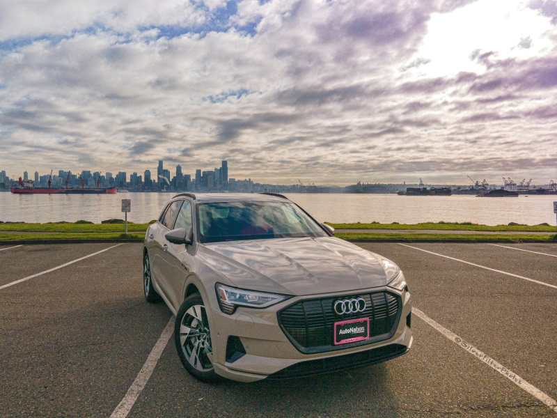
    </a>
    <figcaption><h4>Audi e-tron 55 in Siam Beige with black optics</h4></figcaption>
</figure>

<figure>
    
    <figcaption><h4>Audi e-tron 55 in Siam Beige with black optics and contrast color</h4></figcaption>
</figure>

<figure>
    
    <figcaption><h4>Audi e-tron 55 in Siam Beige with black optics and contrast color</h4></figcaption>
</figure>

### Manhatten Grey

Color Code: **2Y**

<figure>
    
    <figcaption><h4>Audi e-tron 55 in Manhatten grey</h4></figcaption>
</figure>

### Brilliant Black

The only non metallic color.

Color Code: **A2**

<figure>
    
    <figcaption><h4>Audi e-tron 55 in Brilliant Black</h4></figcaption>
</figure>

### Mythos black

Color Code: **OE**

<figure>
    
    <figcaption><h4>Audi e-tron 55 in Mythos Black with black optics</h4></figcaption>
</figure>

<figure>
    
    <figcaption><h4>Audi e-tron sportback S60 in Mythos Black with black optics</h4></figcaption>
</figure>

## Audi Exclusive Paint colors

It is possible to order Audi e-tron with Audi exclusive Paint colors. There are lots of colors to choose from.

Below you see some of the colors you can choose from.

<figure>
    
    <figcaption><h4>Pearl effect paint finishes</h4></figcaption>
</figure>

<figure>
    
    <figcaption><h4>Crystal effect paint finishes</h4></figcaption>
</figure>

<figure>
    
    <figcaption><h4>Uni paint finishes</h4></figcaption>
</figure>

<figure>
    
    <figcaption><h4>Metallic paint finishes</h4></figcaption>
</figure>

<figure>
    <a href="paint_exclusive_overview5.jpg">
        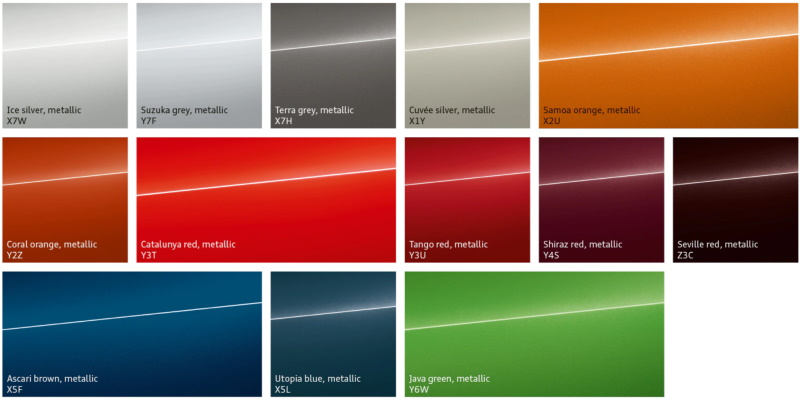
    </a>
    <figcaption><h4>Metallic paint finishes</h4></figcaption>
</figure>

### Sonoma Green

Color Code: **X6R**

<figure>
    
    <figcaption><h4>Audi e-tron S in Sonoma Green</h4></figcaption>
</figure>

<figure>
    
    <figcaption><h4>Audi e-tron S in Sonoma Green</h4></figcaption>
</figure>