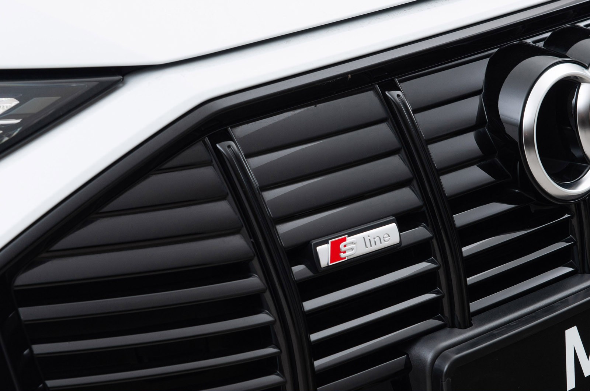
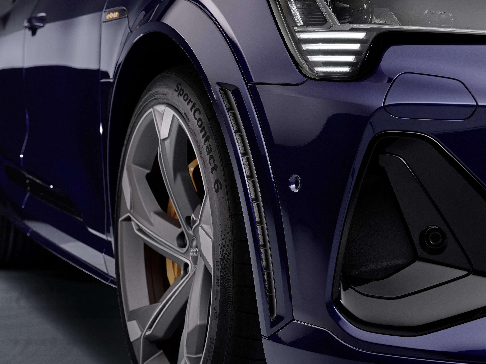

S-line eksteriørpakken inneholder ekstra stylingelementer. I motsetning til grunnmodellen er festene på S line eksteriør
lakkert i utvendig karosserifarge – inkludert hjulbuelister, dørterskler, støtfangere og utvendige speil. Audi tilbyr også den svarte stylingpakken som fremhever området til Singleframe, sidevinduene og støtfangeren. Ytterspeilhusene er også tilgjengelige i sort som ekstrautstyr.

## S-linje eksteriør

Den mer karakteristiske støtfangeren er flankert av mer uttrykksfulle luftgardiner, som forbedrer luftstrømmen. De
strekker seg under frontlysene, og skaper dermed et dynamisk utseende selv på avstand. Et S-linjeemblem pryder radiatorgrillen, mens
opplyste dørterskellister i aluminium har en #S-logo.

Den bakre diffusoren har et mer sporty og dynamisk utseende.

## S eksteriør

 Støtfangeren foran har en slående design og de integrerte luftgardinene er større og mer uttrykksfulle. Hjulbuene på begge sider er hele 23 millimeter (0,9 tommer) bredere og
 diffusorinnsatsen i den bakre støtfangeren strekker seg nesten over hele bredden av bakenden. Sølvelementer legger til høydepunkter over hele bilen, fra kanten av frontstøtfangeren og
 Enkelramme og helt til diffusorinnsatsen.
 
 Dørinnsatsene og husene til sidespeilene er laget av aluminium, og front- og bakenden er dekorert med S-merker. Audi kan male tilbehør som frontleppe, hjulbuer og terskellister i kontrastfarge på forespørsel.

{}
