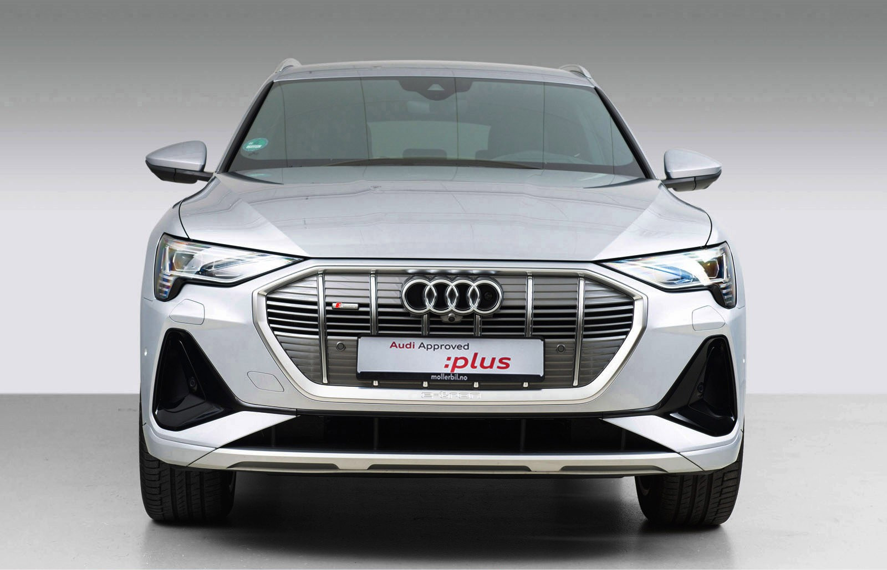
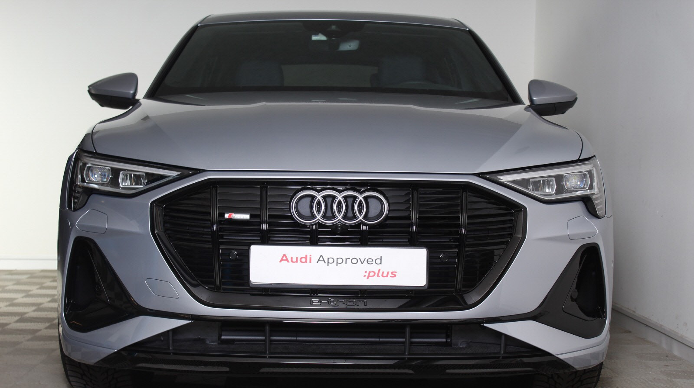

## Black Optics

The black optics package contains gloss black front, rails and window rims. 

## Mirrors

The mirrors can be delivered in different styles

## Painted Calibers

You can order orange painted calibers on Audi e-tron. The code is **PC2** on e-tron 55/50 and **PC4** on e-tron S. 

{}
