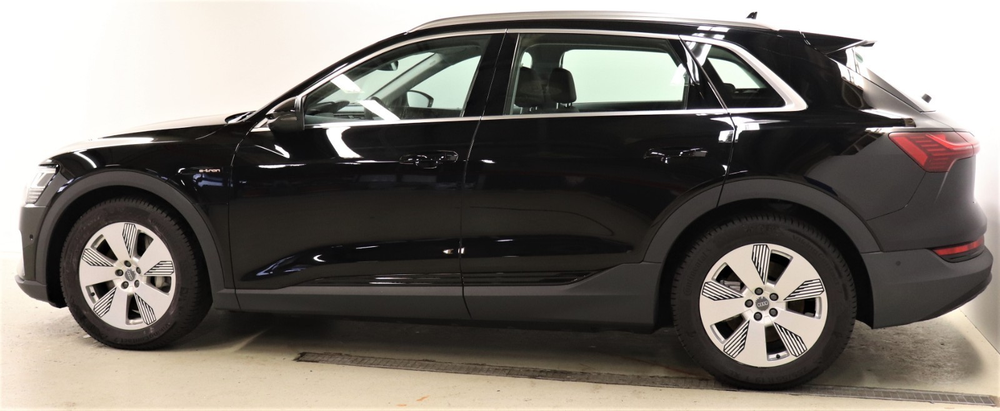
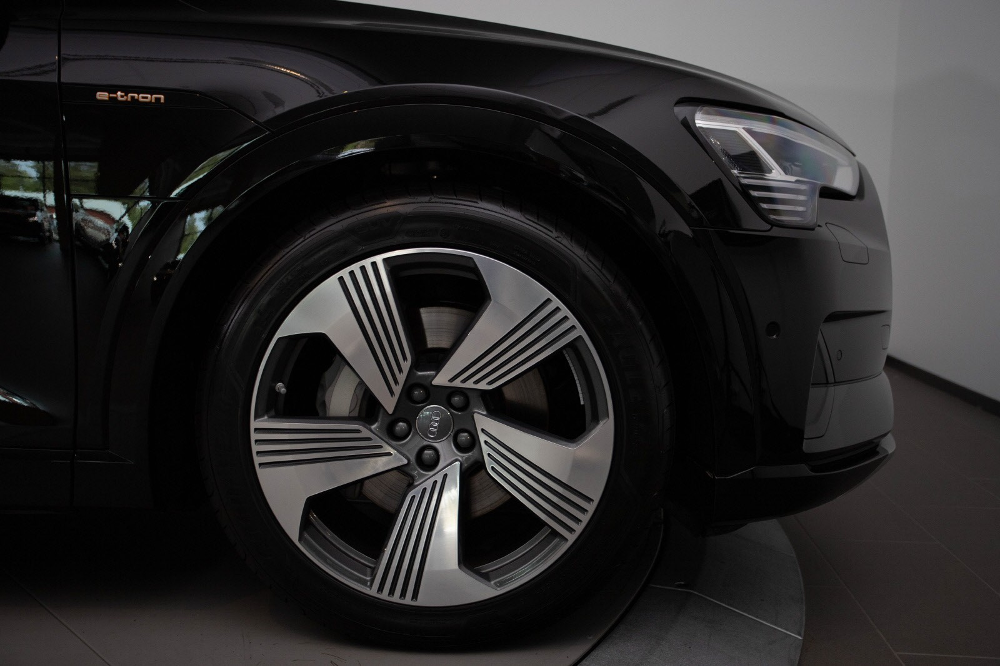
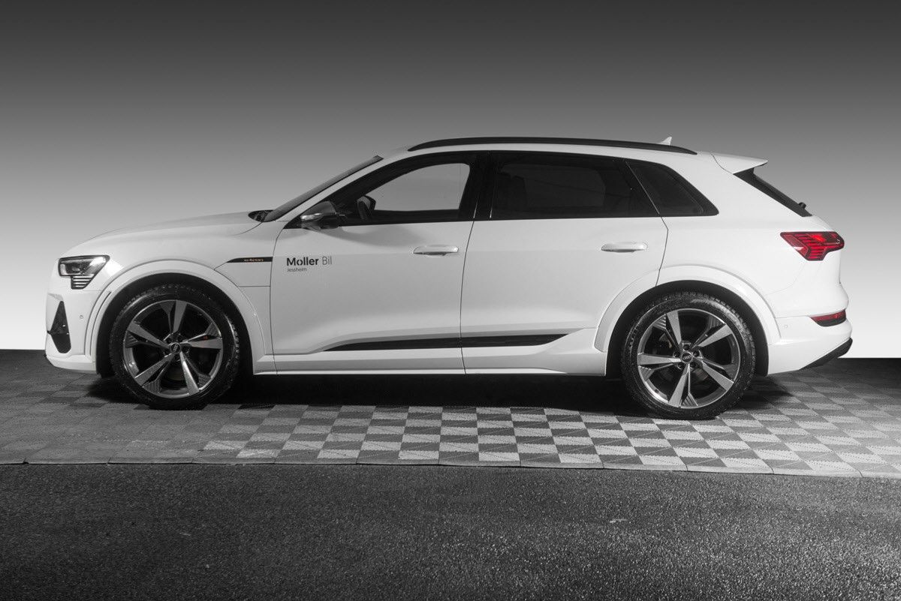
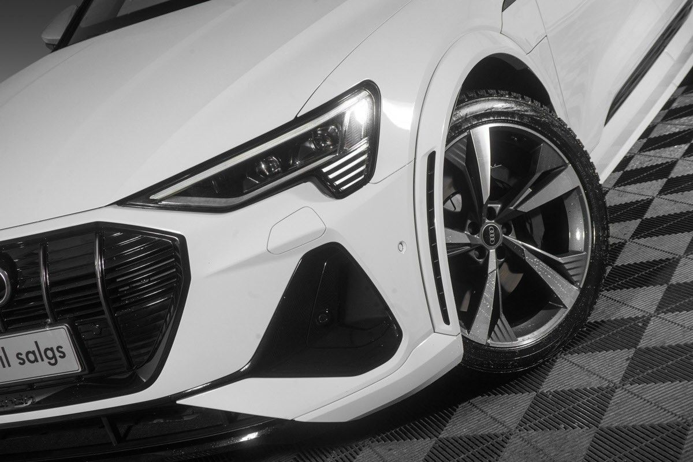
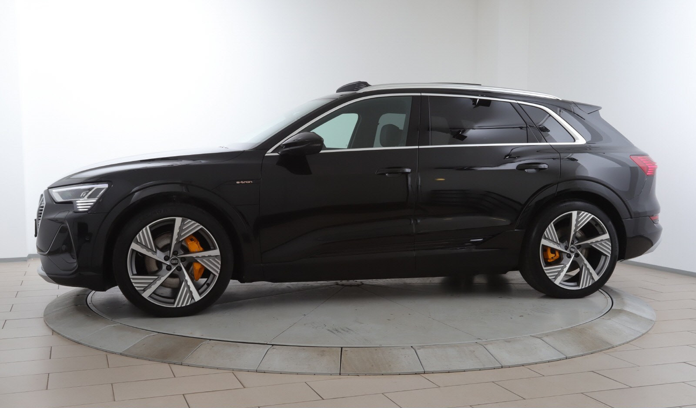
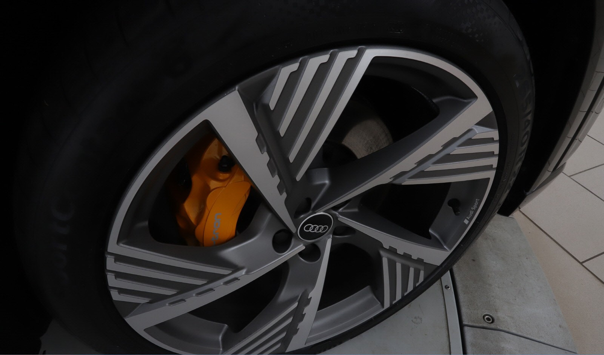
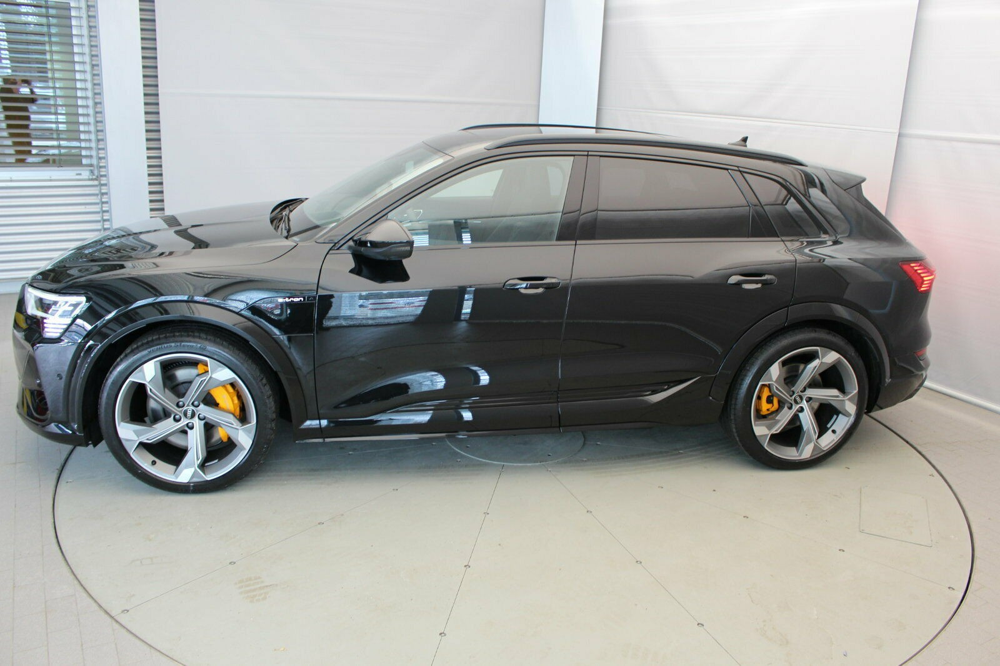
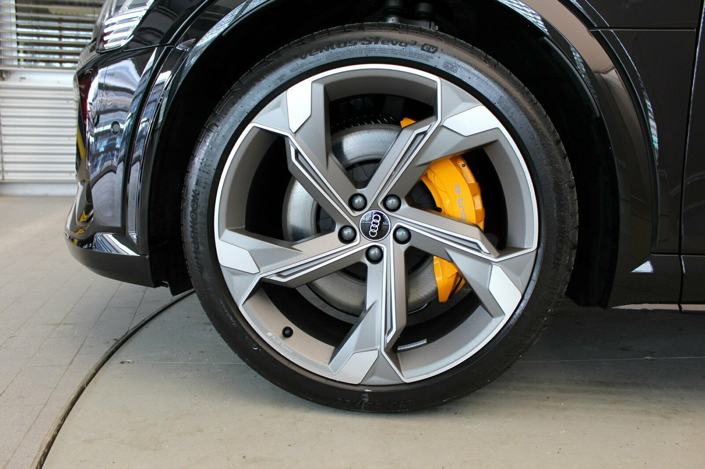

The following wheels have been available from Audi to Audi e-tron. Varies for the different markets

## 19" 5-arm aero design

Entry level wheel. Just stay away. Part No: 40V

## 20" 5-arm dynamic design

Part No: F08 255/50 R 20 Tires

## 20-inch 9J 5-twin arm edge design

Audi sport wheels

## 21 inch 15 arm design

Wheels for Audi e-tron. Part No F49. Tires 265/45 R21

## 21 inch 5 Arm Turbing design

Wheels for Audi e-tron. Part No F48. Tires 265/45 R21

## 21 inch 5V Arm design

Wheels for Audi e-tron. Part No F51. Tires 265/45 R21

## 21 inch 9.5J 10-spoke rotor gloss Anthracite black

Audi sport wheels for Audi e-tron. Part No 42P. Tires 265/45 R21

## 22" inch 10.5J 5-arm star design

Audi sport wheels for e-tron 60S. Part No: U95

## 22" x 9.5J '5-spoke structured' matt titanium finish

Audi Sport alloy wheels. Tires 265/40 R22  Part No: 54L

## 22" 5-arms interferenz-design

Audi sport wheels for e-tron 60S. Dimensjon 10,5 J x 22 with 285/35 R 22 tires. Part No: V40

