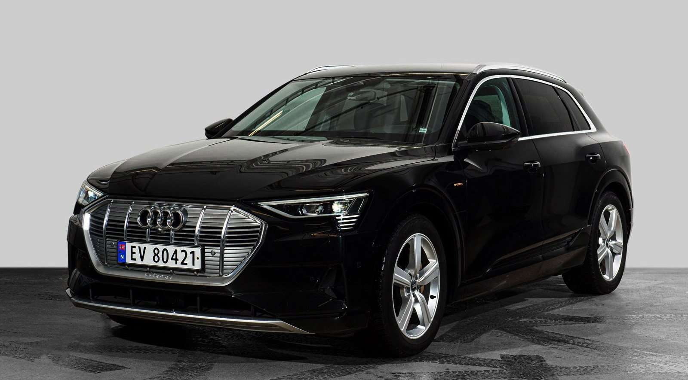
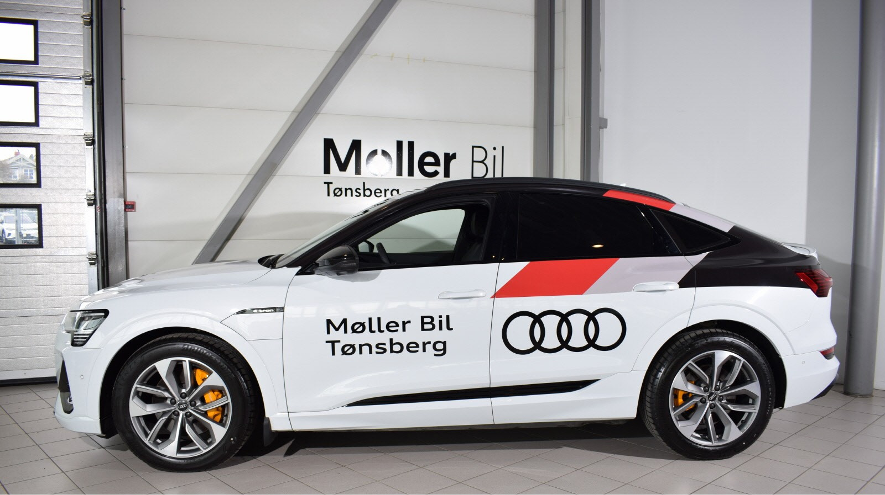
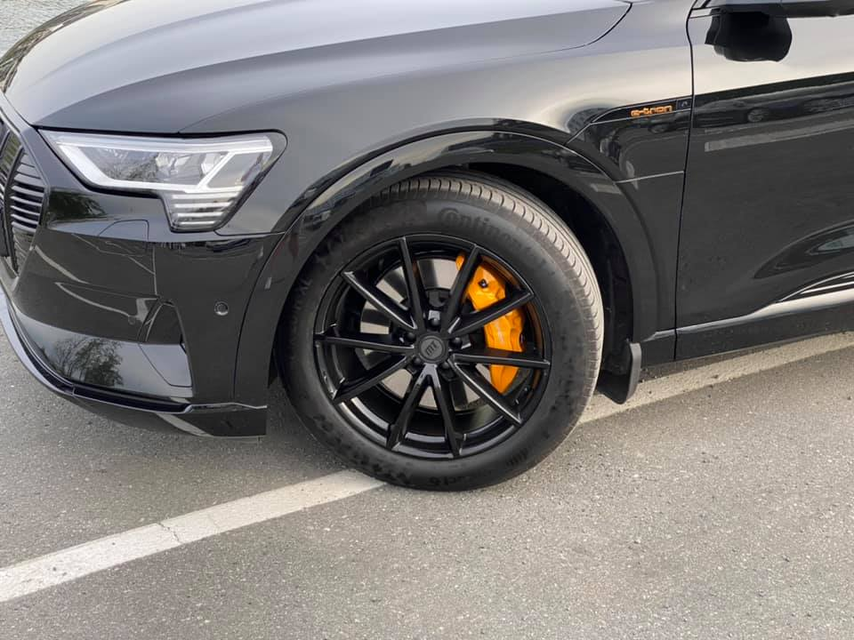
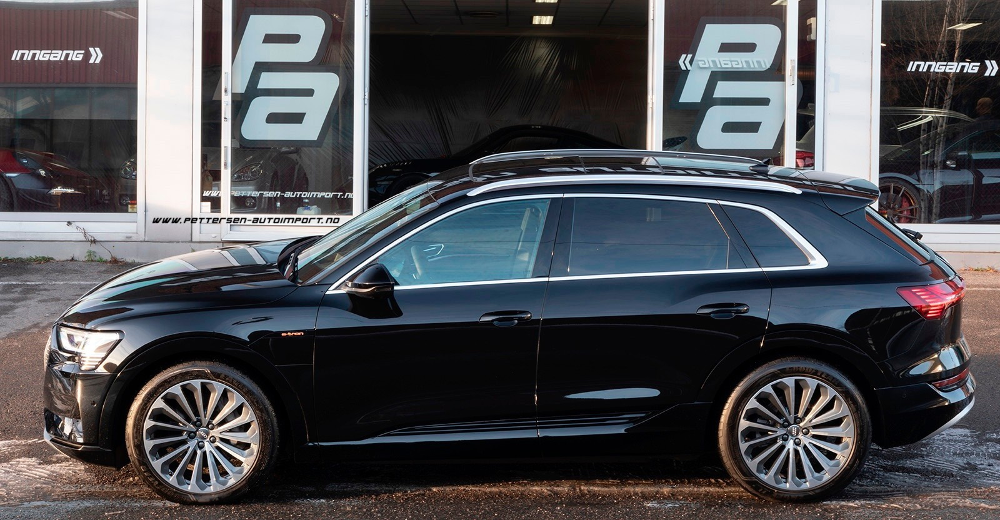
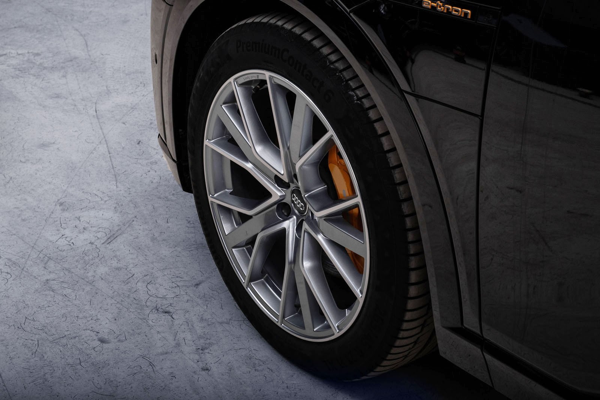
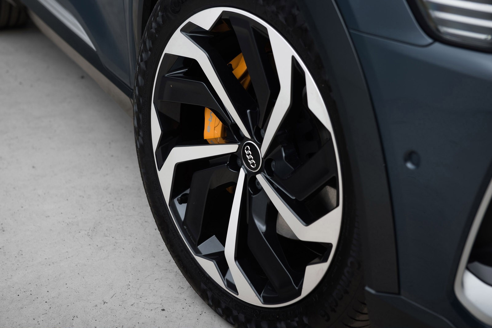
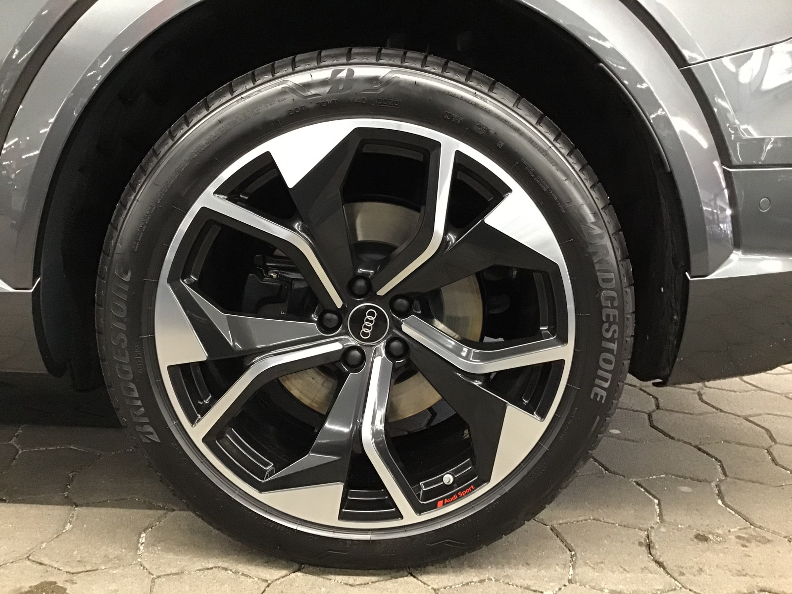
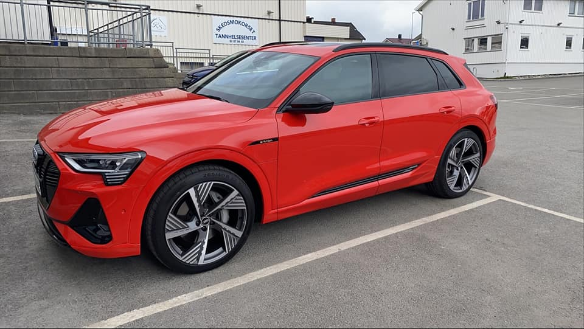
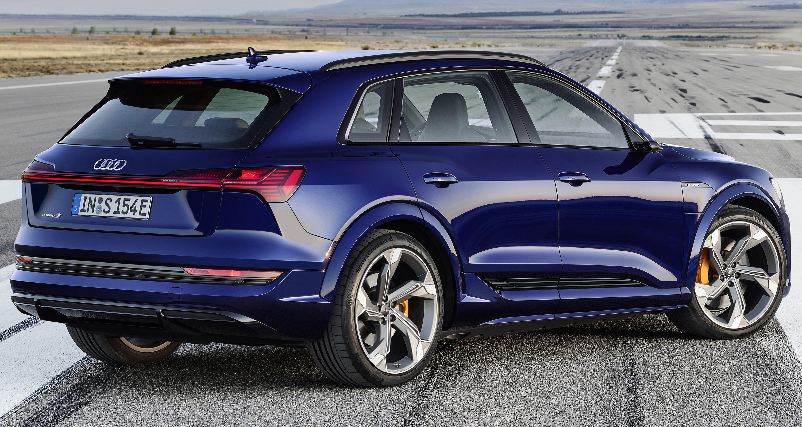
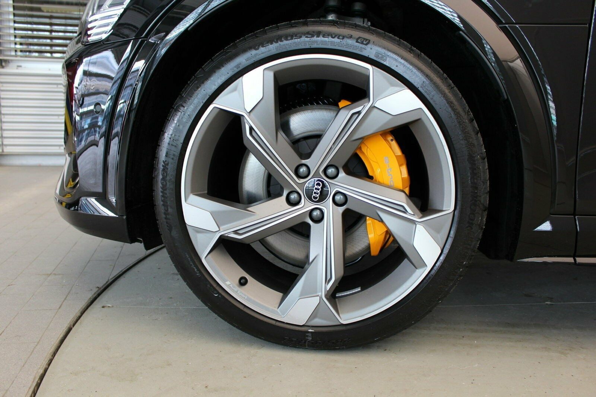

Følgende felger har vært tilgjengelige fra Audi til Audi e-tron. Varierer for de ulike markedene 

## 19" 5-arm aero design

Entry level wheel. 8.5J 19" Just stay away. Part No: **40V**

## 19" 5-arm aero design winter wheels

Entry level wheel for winter. 8J x 19" Just stay away. Part No: **2WL**

## 20" 5-arm design

 9 J x 20 med 255/50 R 20 tires. Part No: **42G**

 

  

## 20" 5-arm dynamic design

Part No: F08 255/50 R 20 Tires

## 20" 10-arm Lamina design

 9 J x 20 med 255/50 R 20 tires.

 

  

## 20-inch 9J 5-twin arm edge design

Audi sport wheels. Part No: **CN7**

## 20-inch MT Galvani

Sold as winter tires by Audi Norway.

## 20-inch 10J 5V design wheels for e-tron S

Sold as winter tires by Audi Norway. Part No: **CA0**

## 21" 10-arm Lamina design

 9 J x 21 med 255/50 R 21 tires. Sold as winter wheels.

 

## 21 inch 15 arm design

Wheels for Audi e-tron. Part No F49. Tires 265/45 R21

## 21 inch 5 Arm Turbin design

Wheels for Audi e-tron. Part No F48. Tires 265/45 R21

## 21 inch 5V Arm design

Wheels for Audi e-tron. Part No F51. Tires 265/45 R21

## 21 inch 5V Arm design black

Wheels for Audi e-tron. Part No F50. Tires 265/45 R21

## 21 inch 9.5J 10-spoke rotor gloss Anthracite black

Audi sport wheels for Audi e-tron. Part No 42P. Tires 265/45 R21

## 21 inch  10.5J 5Y design

Audi sport wheels for Audi e-tron S. Part no **U99** Tires 285/40 R21 

## 21" inch 10.5J 5-arm star design

Audi sport wheels for e-tron 60S. Part No: **U95** Tires 285/40 R21 

## 22" x 9.5J '5-spoke structured' matt titanium finish

Audi Sport alloy wheels. Tires 265/40 R22  Part No: 54L

## 22" 5-arms interferenz-design

Audi sport wheels for e-tron 60S. Dimensjon 10,5 J x 22 with 285/35 R 22 tires. Part No: V40

## Reservehjul

Som ekstrautstyr til e-tron kan du få oppblåsbare reservehjul. Alternativ-ID **3F1**
Dette har en nødvendig kombinasjon av jack med alternativ-ID **1S1**

