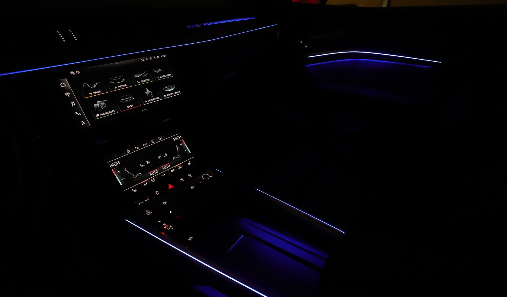

## Standard interiørlys

Følgende interiørlys er standard på Audi e-tron

- LED-takmodul foran og bak (hvit)
- bagasjeromslys, venstre og høyre (hvit)
- oppbevaringsrom i midtkonsollen foran (hvit)
- opplyst hanskerom
- Gulvbelysning foran/bak
- Sminkespeil med lys
- Lys i bakdøren

## Ambient light-pakke

Hvite lys med alternativ-ID **QQ1** gir deg

- Hvitt omgivelseslys i stoffområder i dører
- Orienter lyn i utvendige dørhåndtak
- Hvitt omgivelseslys i midtkonsollen

## Flerfarget kontur/omgivelseslyspakke

Dette alternativet med alternativ-ID **QQ2** gir deg.

- Hvitt omgivelseslys i stoffområder i dører
- Orienter lyn i utvendige dørhåndtak
- Flerfarget omgivelseslys i midtkonsollen
- Flerfargede konturlys i midtkonsollen
- Konturlyn i instrumentpanel og dashbord.

Fargene kan justeres med 30 fargealternativer per kontrollerbar

Fargen kan endres basert på kjøremodusen din i [Audi Drive Select](/models/e-tron/technology/audidriveselect/).

Se video nedenfor hvorfor dette er alternativet å få.

