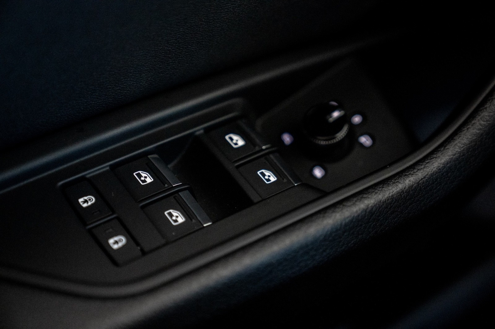
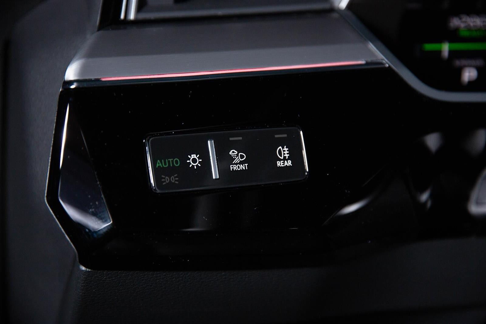

## Buttons in black glas finish

To get a nicer look, you can order control keys in a black glass finish.

Control keys and light keys in black glass finish. The control keys and the light keys have haptic feedback.

The light keys also have a finger sensor. Operating keys for driver assistance systems, window lifter, luggage compartment lock and frame
for cylinder insert for 12-volt socket in aluminum finish.

This has option id **GSS**

{}