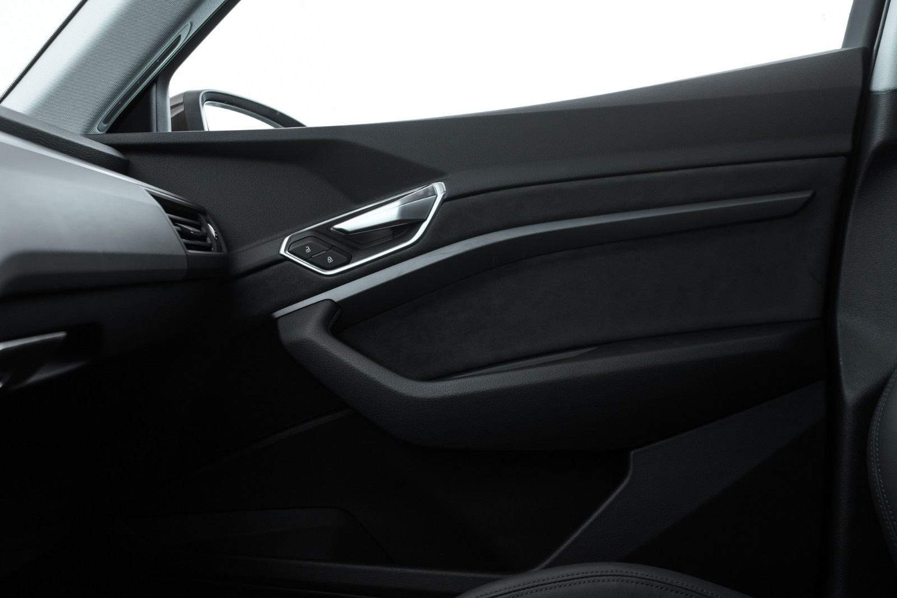
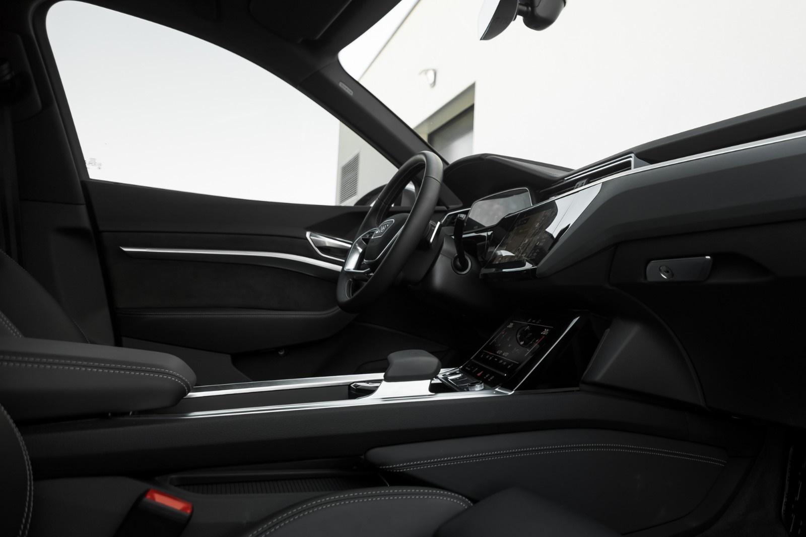

There are serveral levels

## Standard

The standard interior has rubber/plastic upper part of dashboard and instrument cluster. In addition armrest on doors
and lower part of center consol are made of rubber/plastic.

## Artifical leather on dashboard, doors and center consol

In this option the upper part of dashboard, the armrest on doors and the lower part of center consol
are covered by artifical leather.

OptionId **7HC**

## Leather on dashboard

OptionId **7HC**

## Leather on dashboard, artifical leather on centerconsol and door 

OptionID **7HM**

## Full leather on dashboard, door and lower part of center consol

OptionID **7HD**