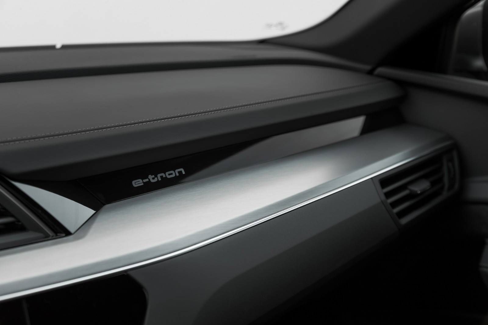

There are serveral levels of interior trim.

## Standard

The standard interior has syntethic leather upper part of dashboard. In addition armrest on doors
and lower part of center consol are made of rubber/plastic.

## Imiated leather doors and center consol

On this option the dashboard is same as standard buth the armrest on doors and the lower part of center consol
is imitated leather.

OptionId **7HC**

## Leather on dashboard, imitated leather on doors/centerconsole

In this option you get leather on upper part of dashboard, and imiated leather on lower part of centerconsole and on armrest on doors.

OptionId **7HC**

## Leather on dashboard, artifical leather on centerconsol and door

On this option you get leather on dashboard and imitated leader on armrest on doors and lower part of interior

OptionID **7HM**

## Full leather on dashboard, door and lower part of center consol

OptionID **7HD**