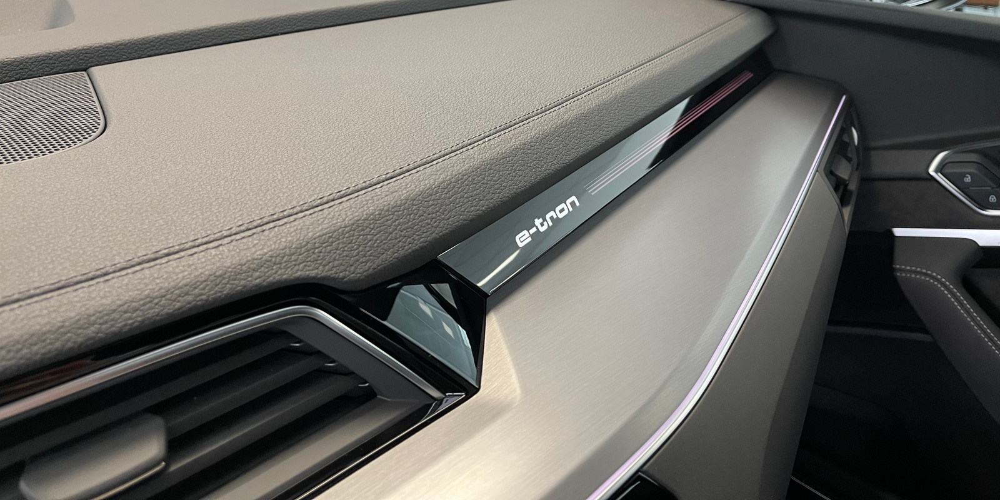
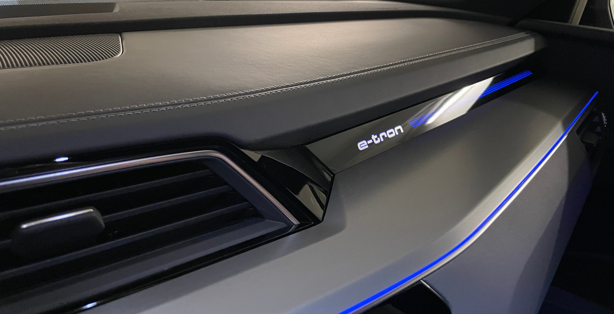

Det er flere nivåer av interiørdesign

## Standard

Standardinteriøret har en øvre del av syntetisk skinn på dashbordet. I tillegg armlen på dører
og nedre del av senterkonsollen er laget av gummi/plast.

## Imiterte skinndører og senterkonsoll

På dette alternativet er dashbordet det samme som standard med armlenet på dørene og den nedre delen av midtkonsollen
er imitert skinn.

OptionId **7HC**

## Lær på dashbord, imitert skinn på dører/midtkonsoll

I dette alternativet får du skinn på øvre del av dashbord, og imitert skinn på nedre del av midtkonsoll og på armlen på dører.

OptionId **7HC**

## Skinn på dashbordet, kunstskinn på midtkonsollen og døren

På dette alternativet får du skinn på dashbordet og imitert leder på armlenet på dører og nedre del av interiøret

Alternativ-ID **7HM**

## Helskinn på dashbord, dør og nedre del av midtkonsollen

Alternativ-ID **7HD**