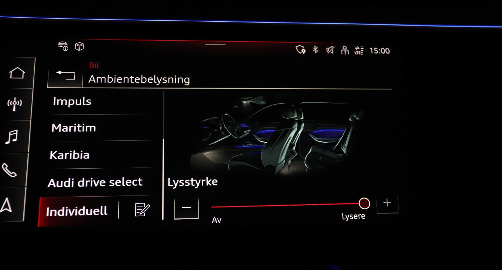
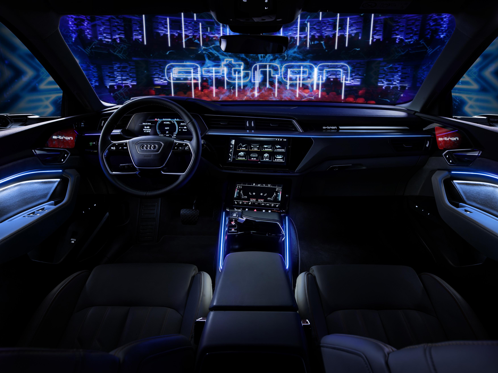

## Standard interiørlys

Følgende interiørlys er standard på Audi e-tron

- LED-takmodul foran og bak (hvit)
- bagasjeromslys, venstre og høyre (hvit)
- oppbevaringsrom i midtkonsollen foran (hvit)
- opplyst hanskerom
- Gulvbelysning foran/bak
- Sminkespeil med lys
- Lys i bakdøren

## Ambientelyspakke

Hvite lys med alternativ-ID **QQ1** gir deg

- Hvitt omgivelseslys i stoffområder i dører
- Orienteringslys i utvendige dørhåndtak
- Hvitt omgivelseslys i midtkonsollen

## Flerfarget Kontur-/ambientelyspakke

Dette alternativet med alternativ-ID **QQ2** gir deg.

Endret innhold og fargetilpasninger i tillegg til omfanget i ambientelyspakken.
Seks forhåndsdefinerte fargeprofiler i tillegg til interaktiv og individuell fargeprofil. Den interaktive fargeprofilen
styres av modusene i Audi drive select. Du kan velge blant 30 farger i den individuelle fargeprofilen.
Fargetilpasningen skjer separat for kontur- og ambientebelysningen som gir 900 forskjellige farger.

- Flerfarget lys i dørlommer foran/bak
- Flerfarget linjebelysning (kontur) i for-/bakdører
- Flerfarget ambientebelysning for områder med stofftrekk i for-/bakdørene
- Flerfarget ambientebelysning i midtkonsollen foran
- Flerfarget linjebelysning (kontur) i midtkonsollen foran
- Flerfarget linjebelysning (kontur) i instrumentpanelet med lysgrafikk og belyst e-tron-emblem

Fargen kan endres basert på kjøremodusen din i [Audi Drive Select](/models/e-tron/technology/audidriveselect/).

Se video nedenfor hvorfor dette er alternativet å få.

