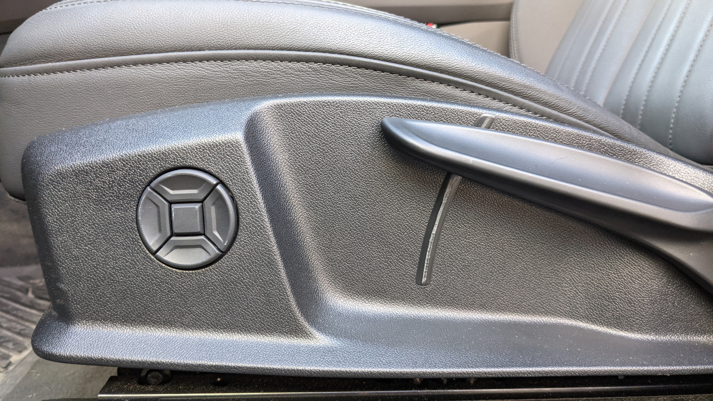

Hver setetype har forskjellige setematerialer i forskjellige farger å velge mellom. Gjør det mulig å konfigurere interiøret akkurat slik du vil ha det.

## Setefunksjonalitet

Standardsetene er manuelle.

### 4-veis korsryggstøtte

Som et alternativ til standardseter kan du legge til 4-veis elektrisk korsryggstøtte som kan justeres slik du liker det. Alternativ-ID **7P1**

Lumbard-støtte er standard på alle seter unntatt standardseter. (Obligatorisk alternativ)

### Elektrisk justering

Du kan legge til elektrisk kontroll til seter for høyde og vinkel i tillegg til 4-veis elektrisk korsryggstøtte. Alternativ-ID **PV3**

For de individuelle kontursetene har du ekstra justering i MMI.
Både øvre og nedre sidestøtte og lårstøtte styres i MMI både for venstre og høyre sete

### Setevarme

For setevarme er det to alternativer. Setevarme foran med alternativ id **4A3** og setevarme foran og bak med
alternativ-ID **4A4**

### Minne

Alle seter med elektrisk justering har minne for to sitteplasser for fører. For passasjerseter er den kun tilgjengelig med kombinasjon
av individuelle konturseter. Minne brukes også av elektrisk kontrollerbart ratt.

### Ventilerte seter

For individuelle konturseter kan du få ventilerte seter. Viftene justeres i MMI.

### Massasje

Med den valgfrie massasjefunksjonen kan brukeren velge mellom tre forskjellige intensiteter i åtte forskjellige programmer for å la ti luftkamre massere ryggen.

| **Setetype** | **Standard** | **Sport** | **S-line sport**| **S-Sport** | **Contur** |
|-------|-------|-------|-------|-------|-------|
|Justering av hodestøttehøyde| standard | standard | standard |N/A |standard |
|Justering av nakkestøtteavstand| alternativ | alternativ |opsjon |N/A |standard |
|Forsetevarme| alternativ | alternativ | alternativ |standard | standard |
|Baksetevarme| alternativ | alternativ | alternativ | alternativ | alternativ |
|Elektrisk 4-veis korsryggjustering |alternativ | standard | standard |standard | standard |
|Elektrisk setejusteringsdriver | alternativ | alternativ | standard |standard | standard |
|Elektrisk setejustering passasjer | alternativ | alternativ | standard |standard | standard |
|Minne for førersete | alternativ | alternativ | alternativ | standard | standard |
|Minne for passasjersete | N/A | N/A | N/A |N/A | standard |
|Forseteventilasjon| N/A | N/A | N/A |N/A |alternativ |
|Forsetemassasje| N/A | N/A | N/A |I/T |alternativ |
|Forlengende lårstøtte |N/A | standard |standard |standard | standard |
|Delt baksete | 40:20:40 | 40:20:40 | 40:20:40 |40:20:40 | 40:20:40 |

## Standard seter

## Sportsseter

## S-Line sportsseter

## S-sportseter

## individuelle konturseter

 De individuelle kontursetene har 18-veis effektjustering med minnefunksjon. Sidestøttene og korsryggstøtten kan justeres pneumatisk.
 Setene har opsjons-ID **PS8**.

Med valgfri ventilasjon holder setene kjølige på varme dager. Dette har alternativet **4D3**

Med den valgfrie massasjefunksjonen kan brukeren velge mellom tre forskjellige intensiteter i tre forskjellige programmer for å få ti luftkamre til å massere ryggen.
Massasjefunksjonen har alternativ-id **4D8**
 

Videoen nedenfor viser justeringene på kontursetene. Demonstrert på en Audi A7.

