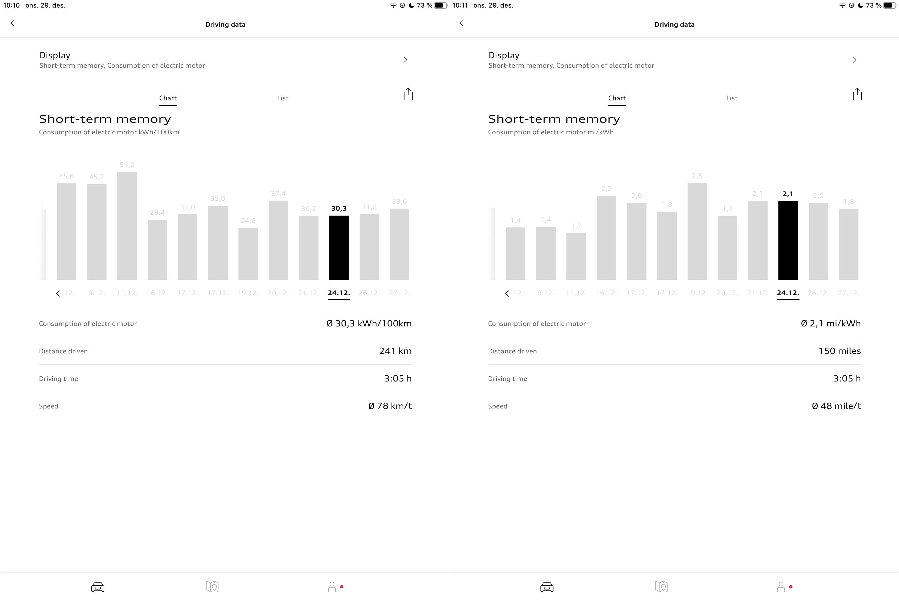

## What is the specified range/consumption?

Audi does not give only one number on the range. The range varies a lot between the variants and depending on trim level.

It also depends on how the range is measured/calculated. In Europe, they use WLTP to calculate range and in the US they use EPA to calculate range.
These numbers are typically different because the drive cycle in these two tests is not the same.

### WLTP Range

| Variant | WLTP Range | Consumption km | Consumption miles |
|-------|-----------|-----------|------|
| Audi e-tron 50 min trim |  341km/212 miles | 18.97/100km | 3.28miles/kWh |
| Audi e-tron 55 min trim |  441km/274 miles | 19.61/100km | 3.17miles/kWh |
| Audi e-tron S min trim |  374km/232 miles | 23.13/100km | 2.69miles/kWh |
| Audi e-tron 50 max trim |  282km/175 miles | 22.94/100km | 2.71miles/kWh |
| Audi e-tron 55 max trim |  369km/229 miles | 23.44/100km | 2.65miles/kWh |
| Audi e-tron S max trim |  343km/213 miles | 25.22/100km | 2.46miles/kWh |

### EPA Range

| Variant | EPA Range | Consumption km | Consumption miles |
|-------|-----------|-----------|------|
| Audi e-tron 55 max trim |  357km/222 miles | 24.23/100km | 2.57miles/kWh |
| Audi e-tron S max trim |  291km/181 miles | 25.22/100km | 2.09miles/kWh |

In advertising the minimum trim level is often used when they report the range either in WLTP or EPA numbers.

Many consumers are not aware that adding more equipment like larger wheels reduces the rated range.

## Real-world range examples

Owners typically react when their Audi e-tron estimated range is much lower than advertised by Audi.
Below you see some examples of ranges posted by users in different social media groups.

## Why does the car estimate this range?

The range indicator base its range on the following data

- Average consumption on the last 100km/62 miles driven
- The state of charge (of much is the battery charged)
- The planned route in the navigation system

So assume you have an e-tron 55 with 86.5kWh battery and you have charged it to 100%.

If you check the driving data in myAudi app on short-term memory you will see your drives.

If we calculate the range based on the consumption on 24.12 with 30.3 kWh/100km we get

86.5/30.3 = 285km.

Same calculation based in miles 2.1mi/kWh

86.5*2.1 = 181 miles.

But this is the best guess based on previous trips. If you change behavior on the next trip, the range calculated would be wrong.

If you have done many short trips in cold weather, you would have spent lots of energy to heat up the car. But this average consumption is not relevant if you the next day are taking a long drive. The car would then underestimate the range.

If a route is defined in the car navigation system the car would adjust range based on elevation and road ahead.

## The numbers do not match up, can it be something wrong?

If your average consumption on our last trip does not match up with the estimated range it might be a problem with your Audi e-tron.

We have seen examples of defects that cause low range.

The first you should try is to calculate the battery capacity so you are sure there is a problem. This would also make it easier for you to document this for your dealer.

Read this guide to [calculate and verify your Audi e-tron battery status](../../../../../guides/checkingbatteryhealth/)

If your conclusion is that the battery capacity is much lower of the specified capacity it might be one of the following problems. Click on the links for the problem database with additional info.

- [Defect battery module](https://github.com/electrichasgoneaudi/etron-issues/issues/9)
- [Defect BMS module](https://github.com/electrichasgoneaudi/etron-issues/issues/58)

## Learn more about the range

Read our complete range guide **[Understanding range](../../../../../guides/understandingrange/)**.
See full specification on all variants of [Audi e-tron](../../../specifications). 
