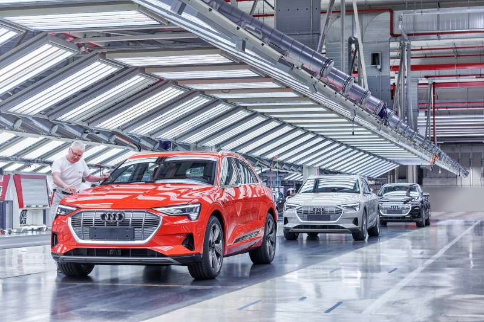
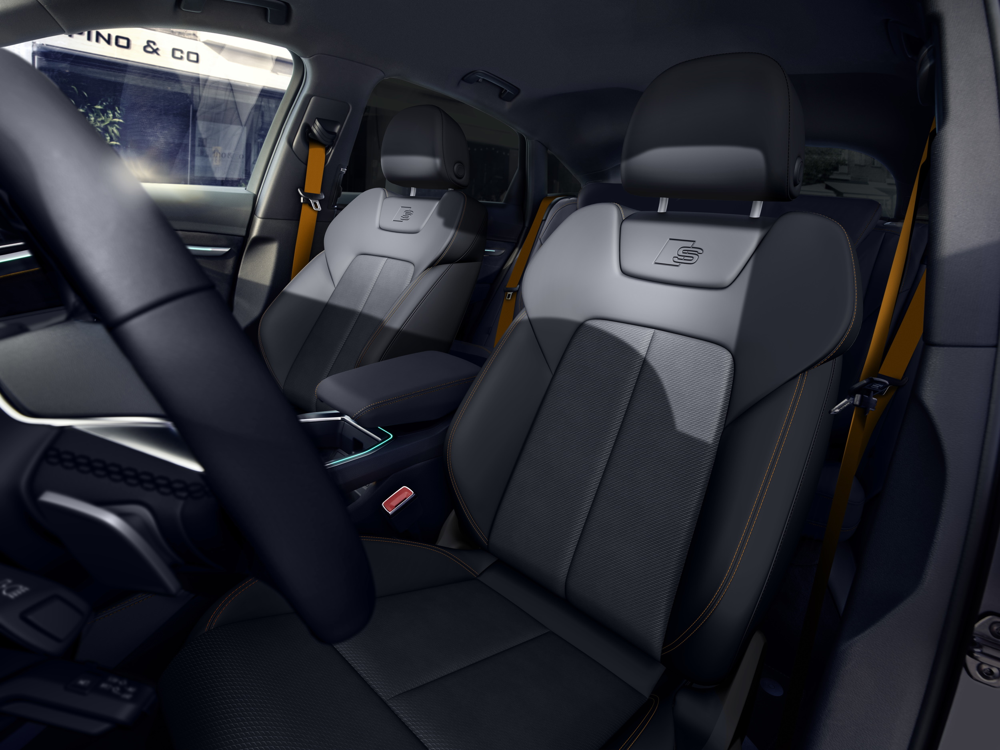

<!-- markdownlint-disable MD033 -->
### MY2019 - Produksjonsstart uke 36 2018

Produksjonen startet hos [Audi Brussels fabrikken](https://www.google.com/maps/place/Audi+Brussels/@50.8106698,4.3148004,730m/data=!3m1!1e3!4m5!3m4!1s0x0:0x603fdd7e2d943989!8m2!3d50.8113307!4d4.31490) i uke 36 2018

<figur>
    
    <figcaption><h4>Produksjon av Audi e-tron startet uke 36 2018</h4></figcaption>
</figur>

### MY2019 - > MY2020 Uke 28 2019

- Lidar-radaren er borte på 2020-modellen
- Det er mulig å justere lademål på 2020-modeller i app. (senere gjort tilgjengelig for 2019)
- vin nr har en L som 10 siffer for 2020-modelleksempel: WAUZZZGE0**L**B028888

### MY2020 - > MY2020v2 (bygg uke 49 2019)

- Redusert toppbuffer. Tilgjengelig batteri økes fra 83,6 kWh til 86,5 kWh
- Andre effektivitetsforbedringer (se diagram nedenfor)
- Også tilgjengelig som e-tron 50 med mindre batteri
- Tilgjengelig som Sportback fra uke 2-2020
- [Oppgradering ble gjort tilgjengelig som oppgradering *93M3* til tidligere produksjonsmodeller fra 28. oktober 2021](https://kommunikasjon.ntb.no/pressemelding/programvareoppgradering-for-audi-e-tron-55-quattro?publisherId=14867825&releaseId=17918998)

Hvis byggemåneden er 122019 eller senere, bør det være en oppgradert versjon

### MY2020v2 - > MY2021 (fra byggeuke 32. august 2020)

- vin nr har M som 10 siffer for 2021-modelleksempel: WAUZZZGEX**M**B008973
- Mulig å bestille oppvarmet ratt sammen med ACC
- Oppgradert MMI-system til MIB 3 (Modular Infotainment Toolkit) (endringer i menyer, kraftigere).
- Byttet ut USB A med USB C
- Fjernet SIM- og SD-kortinngang

- Også tilgjengelig som e-tron 60 med 3 motorer.

### MY2021 -> MY2021V2 (ca. uke 1 2021)
  
- Celler på e-tron 55-batteri [erstattet fra LG Chem til Samsung SDI](../drivetrain/battery/)

### MY2021V2 - > MY 2022 (fra bygget uke 25 2021)

- vin nr har N som 10 siffer for 2022-modelleksempel: WAUZZZGE0**N**B000625
- Ny lakkfarge tilgjengelig: [Chronos grå](../exterior/paint/#chronosgrå-metallic)
- Alcantara byttes ut med Dinamica
- Svart optikk pluss pakke tilgjengelig (svarte ringer)
- Black Edition med oransje detaljer i interiøret
- Nye pakker for USA-merket
- Strømmetjenesten Apple Music er nå tilgjengelig valgfritt som en ny Audi connect-tjeneste, kun i utvalgte markeder.
- Støtte for Wirless Android Auto
- Snarvei til ladeskjerm i MMI lagt til nedre MMI-skjerm

### MY 2023 (fra sommeren 2022)

Dette er den første ekte ansiktsløftningen av e-tron. Den forventes å ha et større batteri. Hva slags størrelse er foreløpig ikke bekreftet, men en teori er det de vil erstatte 432 60AH-cellene i en 108s4p-konfigurasjon med en 108s3p-konfigurasjon med Samsung 94AH-celler. Totalt 324 celler på e-tron 55.

Dette vil holde den nominelle spenningen på 397 volt, men øke bruttokapasiteten fra 95kWh til 112kWh. Hvis 108kWh gjøres tilgjengelig vil dette øke rekkevidden til 461 - 565km avhengig av utstyrstrim dette fra gjeldende rekkevidde på 369-452km avhengig av utstyrstrim.

For e-tron 50 kunne de i teorien tilby en versjon med 108s2p med kun 74kWh bruttobatteri. Men dette er ikke sannsynlig.

I tillegg kan du forvente noen andre tekniske forbedringer som vil redusere forbruket litt. Gjeldende minimums WLTP-forbruk er 19,1 kWh/100 km.
Hvis de er i stand til å redusere dette til 18,5, kan du se rangert rekkevidde på opptil 580 km.

Men alt er ubekreftet. Oppdateres når vi vet mer.

Nedenfor er det et spionbilder fra [Motor1](https://www.motor1.com/news/538895/audi-e-tron-sportback-spied)

