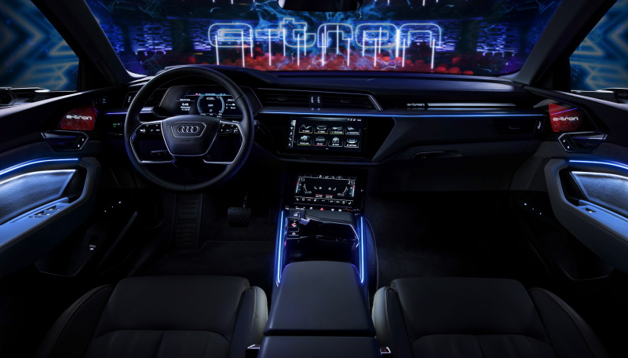

Følgende veiledning er basert på grunnmodellen. Mange markeder har trimpakke med tilleggsutstyr. I Norge har man f.eks pakkene Advance Sport og Advance Business som inneholder mye utstyr.

Nedenfor er de viktigste alternativene du må vurdere når du kjøper en e-tron

## Audi smartphone interface: Alternativ-ID IU1

Uten Audi smartphone interface kan du ikke bruke Android Auto / Apple Carplay og deretter bruke apper som Waze eller kontrollere Spotify på en god måte.

[Se Audi smartphone interface for detaljer.](../technology/uiandoperations/smartphoneinterface/)

## Privacy vinduer (sorte vinduer): Alternativ-ID QL5

Forbedrer utseendet mye, og du trenger ikke å kjøre rundt i en fisketank på skjermen.

[Se vinduene for detaljer](../exterior/windows/#privacy-glass)

## Rullegardiner baksete

Beskytter personer i baksetet mot sol.

[Se gardin for detaljer](../interior/curtain)

## Turpakke: Alternativ ID PCC

Turpakken inneholder det meste av de viktige førerassistentfunksjonene som [Adaptive Cruise Assist](../technology/drivingassistance/adaptivecruiseassist/), [Adaptive Cruise Control](../technology/drivingassistance/adaptivecruisecontrol/), [Effektassistent](../technology/drivingassistance/predictiveefficiencyassist/), [Turn Assist](../technology/drivingassistance/turnasist/), [Unnamanøvreringsassistent](../technology/drivingassistance/collisionavoidanceassist/), [Trafikkskiltgjenkjenning](../technology/drivingassistance/trafikskiltgjenkjenning/), [Nødstoppassistent](../technology/drivingassistance/emergencyassist/)

## Filskiftepakke PCH / Bypakke PCM

Sideassistent er ikke en del av turpakken og er inkludert i to forskjellige assistentpakker. Sideassistentpakken inkluderer [Side Assist](../technology/drivingassistance/sideassist/), [exit warning](../technology/drivingassistance/exitwarning/), [cross traffic assist rear](../technology/drivingassistance/crosstrafficassistrear/), [Audi Pre Sense rear](../technology/drivingassistance/presenserear/). Bypakken inkluderer det samme, men i tillegg [Audi pre sense side](../technology/drivingassistance/presenseside/) og [gatekryssassistent](../technology/drivingassistance/crossingassist/)

## Flerfarget ambientbelysning: Alternativ ID QQ2

Med flerfarget ambientbelysning kommer utseendet og følelsen inne i bilen til en annen planet.

[Se ambientbelysning for å bli overbevist](../interior/ambientlights/)

## Komplett utstyrliste

Se også den  [komplette utstyrlisten](list) for alle muligheter slik at du ikke går glipp av noe.

{}
