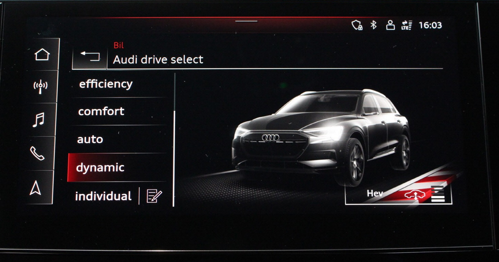

The Audi drive select dynamic handling system allows drivers to experience different setups in their Audi e-tron.
Choosing one of the modes auto, comfort, all-road, offread, dynamic or efficiency changes the characteristic of important drive and suspension components from a comfort bias to distinctly 
dynamic or particularly energy-efficient.

In individual mode, drivers can configure the setup according to their personal preferences.

### Modes

**Offroad** - Provides assistance when driving offroad. The vehicle will be raised to the secondhighest level using the air suspension®. The ESC
will be restricted and the hill descent assist* will be activated. The vehicle will exit this mode after the ignition is switched off.

**allroad** - Provides balanced vehicle handling. The vehicle will be raised to the second-highest level using the air suspension*.

**efficiency** - The vehicle switches to a fuel-efficient vehicle setup and supports the driver with fuel economy messages. The “E” driving program is selected.  

**comfort** - Provides a comfort-oriented vehicle setup and is suited for long drives on highways.

**auto** - Provides an overall comfortable yet dynamic driving feel and is suited for everyday use.

**dynamic** - Gives the driver a sporty driving feel and is suited to a sporty driving style. The “S” driving program is selected.

**Individual** - Provides the option for personalized vehicle settings.

### Individual settings

#### Drive

The drive system will react to accelerator pedal moves more quickly or in a more balanced manner.

#### Steering

The power steering will adapt. Light steering is suitable for long trips on highways or smooth driving around curves, for example. 

#### Suspension

The suspension adjusts to be tighter or more comfort-oriented when it comes to compensating for uneven spots on the road.
The vehicle ground clearance is adjusted by the air suspension* based on the setting.

In all models, Audi drive select influences the engine characteristic and steering. Optional equipment features may extend the number of tuning parameters (depending on the model).

They are

- quattro drive
- sport differential
- adaptive air suspension with electronic damper control
- dynamic steering, all-wheel steering and dynamic all-wheel steering
- electromechanical active roll stabilization
- Matrix LED headlights and HD Matrix LED headlights
- ambient lighting 

{}
