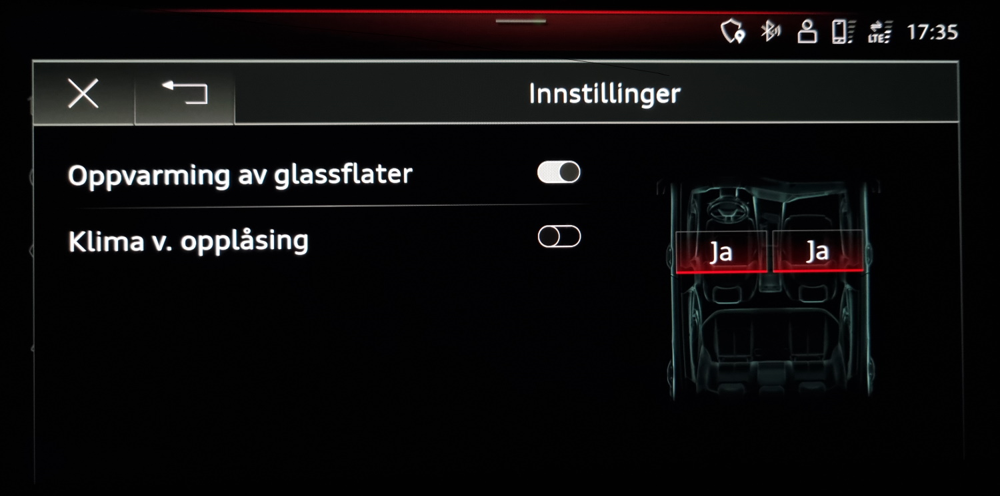

Klimaanlegget styres i hovedsak den nedre MMI-skjermen.

Standardsystemet har følgende egenskaper

- Separat temperaturfordeling på fører- og passasjersiden
- Klimaregulering bak via luftdyser i midtkonsollen bak
- Defrosterdyser for frontruten og sidevinduene
- Kombinert skadestoff- og finstøvfilter

Varmepumpen kan utnytte spillvarmen fra elektriske drivkomponenter til å varme opp kupeen. Slik kan den
levere tilstrekkelig varmeytelse ved lave utetemperaturer. Energien som spares på denne måten, kan i stedet brukes til å
drive bilen.

### 4-soners elektronisk klimakontroll

Som ekstrautstyr kan du bestille 4-soners elektronisk klimakontroll.

Dette gir i tilegg til egenskapene med 2 soner.

- Separat justering av temperaturregulering og luftfordeling på venstre og høyre side bak
- Luftdyser i B-stolpen
- Klimabetjeningsdel med berøringsfunksjon
- Registrering av passasjerer gir effektiv klimasoneregulering
- Automatisk omluftregulering med luftkvalitetssensor og solvarmeavhengig regulering
- Støv- og luktutskillende allergenfilter
- Utnyttelse av restvarme
- Personlige innstillinger

4-soners AC har alternativ ID **9AQ**

### Parkeringsklimanlegg

Audi e-tron er utstyrt med et parkeringsklimaanlegg som kan brukes når bilen er parkert. Denne kan aktiveres
fra MMI-manual eller satt av en timer. Et typisk brukstilfelle er når du lader siden bilen må slås av da og AC-hovedenheten ikke fungerer.

 og kan startes fra MMI eller myAudi app" )

Parkeringsklimaanlegget kan kan også styres av [myAudi-appen](../../technology/audiconnect/myaudi/). Dette er nyttig når du skal varme eller avkjøle bilen før du bruker den.

Parkeringsklimaanlegget kan ikke brukes hvis batteriet har for lav ladning (<30 %)

### Komfort førklimatisering

Du kan få parkeringsklimanlegg med ekstra komfort som ekstrautstyr. Med dette alternativet kan du varme vinduer, seter og ratt i tillegg til kupeen.
Dette forutsetter at du har dette utstyret.

Opsjonsid **GA2**

{}
