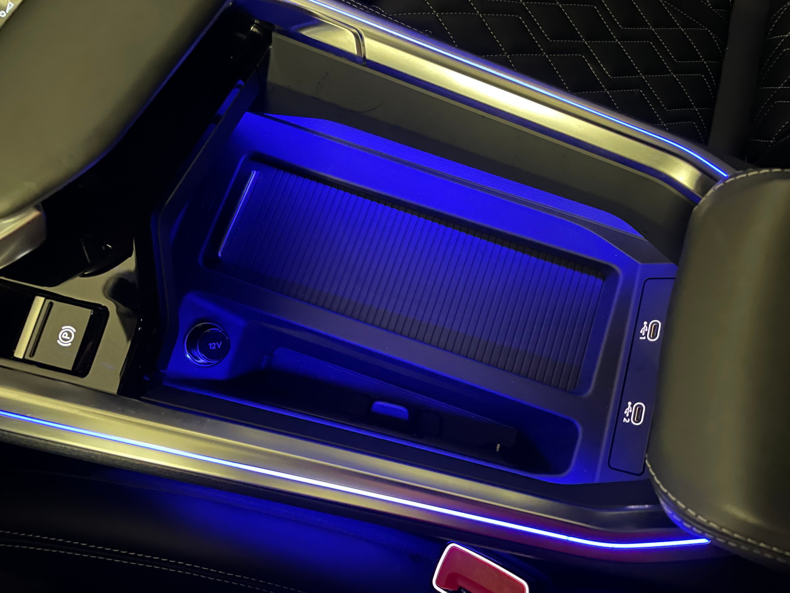

## 12 Volt

Audi e-tron kommer med 3 stk 12-volts uttak som standard. I forseter, i bakseter og i bagasjerom.

De er bare aktive når tenningen er på.

## Audi Music-interface foran

Audi music interface foran er standard.

## Audi Music interface bak

Som ekstrautstyr **UF8** kan du få 2 USB-C tilkoblinger for baksetene.

## SD-kort og SIM-kort for 2019-2020-modeller

På 2019 og 2020-modellene var SIM-kort og SD-kort standard.

{}
