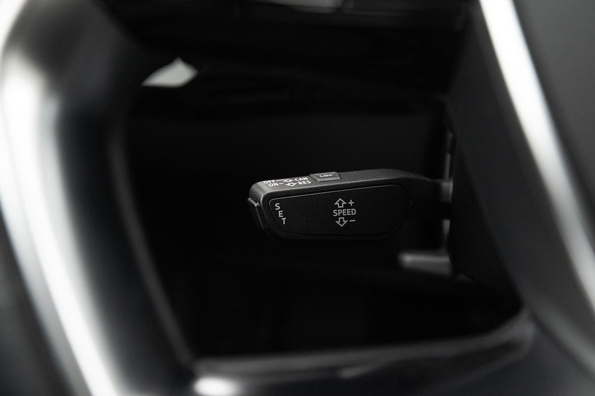

The system offers relief to drivers in this way – especially on long trips. At the same time, the constant speed mode of driving contributes towards lower fuel consumption and lower CO2 emissions. The system is operated via a separate steering column stalk, and the preset driving speed is shown in the instrument cluster. The system is deactivated when the driver brakes.

See also [Adaptive Cruise Control](../adaptivecruisecontrol/) 

{}
