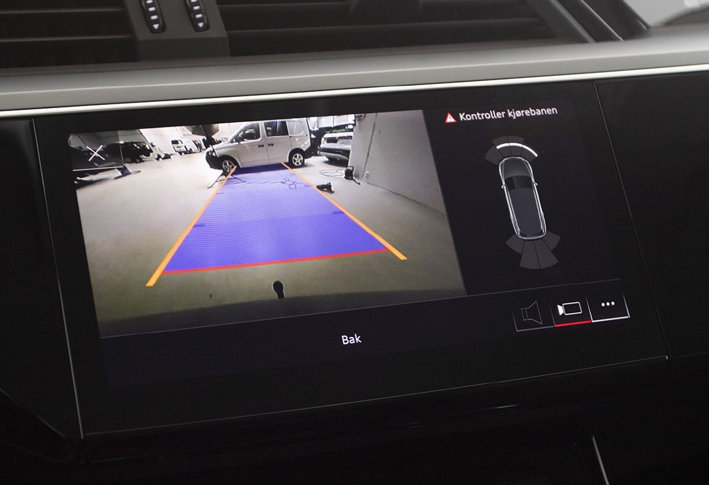

Advarslene gis når avstanden til en gjenstand i kjørebanen er mindre enn 90 cm (35,4 tommer) – avhengig av den spesifikke modellen – etter at føreren har lagt inn revers og aktivert systemet ved å trykke på en knapp i midten konsoll. Ultralydsensorer som er upåfallende integrert i støtfangerne, måler avstanden. MMI-displayet viser det visuelt. Et hvitt segment viser et detektert objekt utenfor kjørebanen. Røde segmenter representerer oppdagede objekter innenfor kjørebanen. Den virtuelle kjøreveivisningen viser også sideveis ledelinjer som er forhåndsberegnet basert på den valgte styreinngangen og hjelper derved med praktisk parkering og utstigning. Økende frekvens av lydvarselet indikerer at avstanden til hindringen minker. Ved rundt 30 cm (11,8 tommer) avstand til det oppdagede objektet hører sjåføren en konstant tone – signalet om å stoppe.

 Parkeringssystem pluss er standardutstyr på Audi e-tron.

{}
