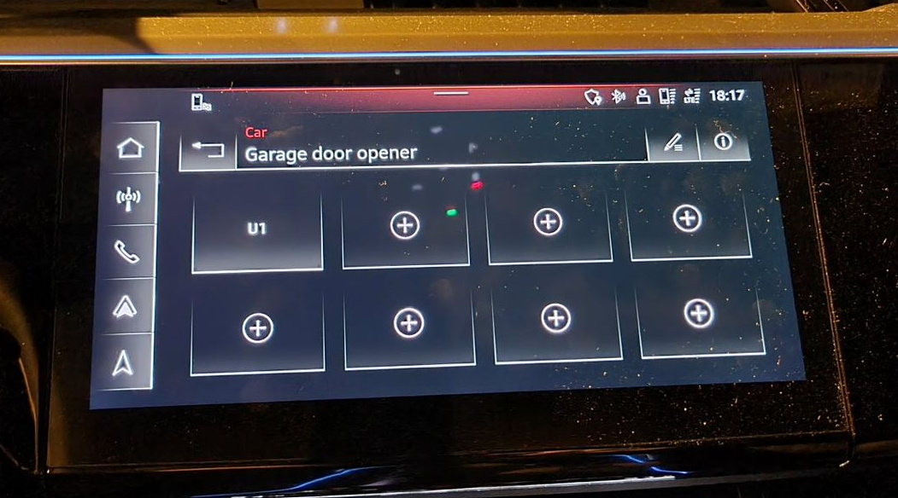

Garasjeportåpneren støtter opptil 8  porter og kan bli knyttet til en GPS lokasjon. Garasjeportåpneren må være [homelink kompatibel](https://www.homelink.com/).

Dette er tilvalg **VC2**

Videon under viser hvordan den kan programmeres.



{}
