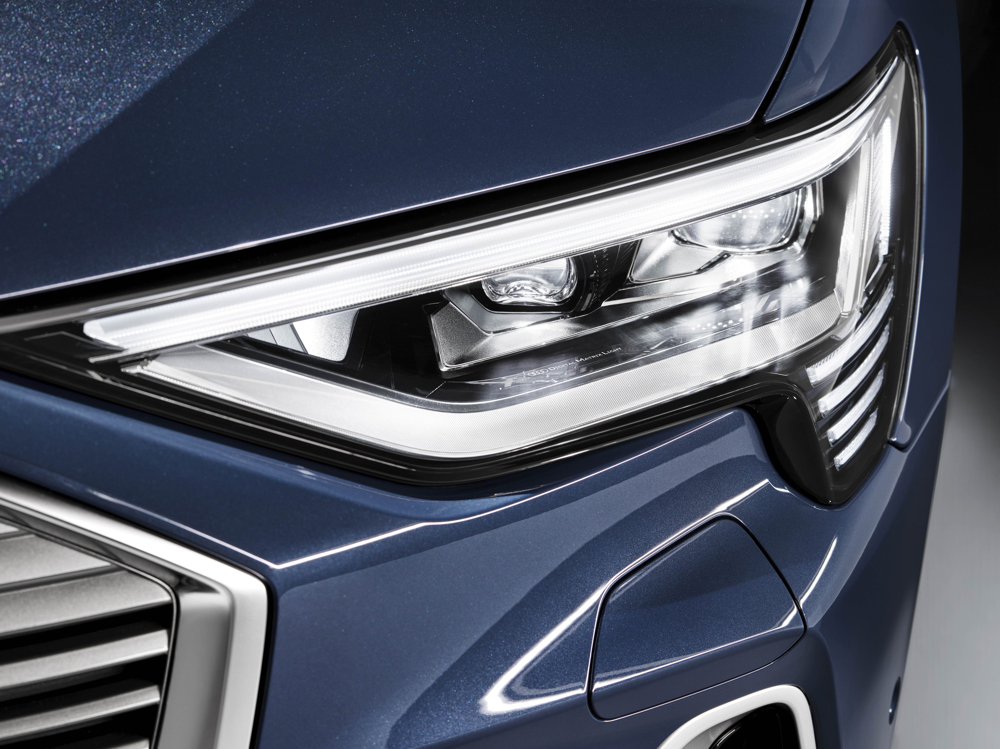

## LED headlights

Along with their high level of efficiency, LED headlights also offer significant benefits in terms of safety and comfort. With a color temperature of around 5,500 Kelvin, their light resembles daylight and hardly causes any eye fatigue – especially in the dark and in the case of adverse weather conditions. In addition, LED headlights offer longer visual range than xenon headlights. In fog and precipitation, they cause the driver less glare. The LEDs are maintenance-free and designed to last the life of the car. The give the Audi models a distinctive look and strong accents with their innovative daytime and nighttime designs.

Depending on the model the LED headlights are designed differently. In the Audi A5, for example, 26 LEDs per headlight generate all lighting functions. In each headlight, 14 LEDs work together to generate the low and high beam lights, and they are supplemented by a module for the all-weather and turning lights. A light conductor along the upper border of the headlight generates the daytime running lights, parking lights and turn signal lights. Special illumination functions are available for intersections, country roads, expressways and poor weather – and their interplay with the navigation system makes their range of performance even greater.

## HD Matrix LED headlights

Matrix LED headlights produce the high beam with tiny light-emitting diodes that are bundled in common reflectors or lenses, depending on the model. With their intelligent function, they illuminate the road superbly without blinding other road users.

When the light switch is set to Automatic and the high beams are on, the system is switched on outside of urban areas at speeds of 30 km/h (18.6 mph) and above. As soon as the camera on the windshield detects other vehicles or city limits, the controller switches off individual LEDs or dims them in 64 stages, creating several million possible light patterns. The Matrix LED light masks out other vehicles while continuing to fully illuminate the zones between and adjacent to them.

The LEDs in the Matrix LED headlights also assume the function of cornering lights, shifting the focal point of the light along the curve. This occurs shortly before the wheel is turned, based on predictive route data provided by MMI navigation plus. 

Audi introduced the next development stage of this technology, the HD Matrix LED high beam, in the A8 (D5). Each headlight integrates 32 small, individually controllable light-emitting diodes. They are arranged in two rows in a common housing. Thanks to the new configuration and to a low beam that is also variable, the HD Matrix LED headlights illuminate the road particularly dynamically and precisely.

HD Matrix LED lights is installed on all e-trons, but you need to buy an option to active it. The optionId is **PX6**

If you dont buy this option when ordering the car you can also buy it as [function on demand](/models/e-tron/technology/fod/) from the myAudi app. Note it requires two packages to get the full matrix experience as described above. The HD Matrix and Light Function package.

See video below how HD Matrix works on an e-tron



## Digital matrix LED headlights

With the digital matrix LED headlights as top-of-the range equipment, Audi presents a worldwide first in a production vehicle: Broken down into minute pixels, their light can illuminate the road in high resolution. The design is based on a technology abbreviated as DMD (digital micromirror device) and is also used in many video projectors. At its heart is a small chip containing one million micromirrors, each of whose edge length measures just a few hundredths of a millimeter. With the help of electrostatic fields, each individual micromirror can be tilted up to 5,000 times per second. Depending on the setting, the LED light is either directed via the lenses onto the road or is absorbed in order to mask out areas of the light beam.

In the Audi e-tron Sportback, the digital light that will expand the offering in mid-2020, performs multiple tasks. It can generate dynamic leaving- and coming-home animations that appear as projections on a wall or on the ground. This presentation transforms the area in front of the car into a carefully illuminated stage. Not only does the digital light system deliver cornering, city, and highway lighting as versions of the low-beam light with exceptional precision, it also supplements the high-beam light by masking out other road users with even greater accuracy. Above all, however, it offers innovative functions such as lane light and orientation light. On freeways, the lane light creates a carpet of light that illuminates the driver’s own lane brightly and adjusts dynamically when he or she changes lane. In this way, it improves the driver’s awareness of the relevant lane and contributes to improved road safety. In addition, the orientation light uses darkened areas masked out from the light beam to predictively show the vehicle’s position in the lane, thereby supporting—especially on narrow roads or in highway construction zones—the safe lane centering assist. The marking light function is also used in conjunction with the optional night vision assist. The light automatically draws attention to any pedestrians it detects, thereby reducing the danger of overlooking pedestrians in the immediate vicinity of the lane.

The optionID is **PXC** for Digital matrix LED Headlights.

## Entry Lights

You can order e-tron entry lights option id **9TF**

{}

