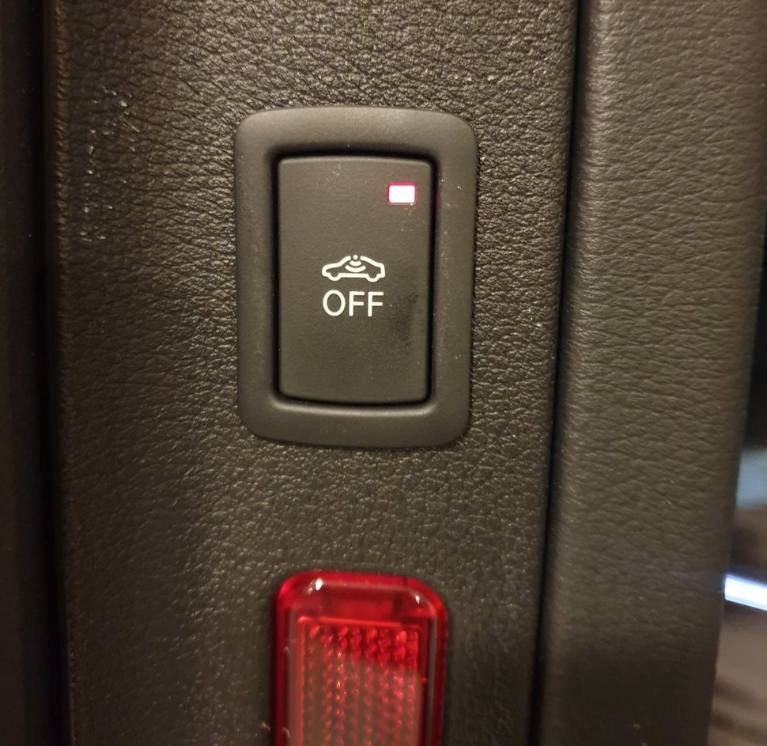

## Standard nøkkel

Standardnøkkelen på Audi e-tron er utstyrt med Keyless Go. Dette betyr at motorstartautorisasjonen frigis uten aktiv betjening av nøkkelen.

For å gjøre dette må sjåføren sitte i kjøretøyet og ha med seg bekvemmelighetsnøkkelen.

Motoren startes og slås av ved hjelp av motorstart-stopp-knappen i midtkonsollen.

## Komfortnøkkel PGC

Forhånds-/bekvemmelighetsnøkkelen gir praktisk kontroll over tilgang og motorstartautorisasjon uten at nøkkelen må betjenes aktivt

Ved å betjene dørhåndtaket kan kjøretøyet åpnes uten aktiv bruk av nøkkelen. Dette er mulig med alle dører. Adgangsautorisasjonen bekreftes av trådløs kommunikasjon mellom nøkkelen og kjøretøyet.

For å låse kjøretøyet fra utsiden trenger du bare å trykke på en av sensorknappene på alle dørhåndtakene.

Bagasjeromslokket kan enkelt låses opp ved hjelp av bagasjeromsknappen på bekvemmelighetsnøkkelen eller, hvis du ikke har fri hånd, med en fotbevegelse (sparkbevegelse) bak.

Som standardnøkkel er fremføringsnøkkelen på Audi e-tron utstyrt med Keyless Go. Dette betyr
motorstartautorisasjonen frigis også uten aktiv betjening av bekvemmelighetsnøkkelen.

For å gjøre dette må sjåføren sitte i kjøretøyet og ha med seg bekvemmelighetsnøkkelen.

Motoren startes og slås av ved hjelp av motorstart-stopp-knappen i midtkonsollen.

En visuell differensiering av høy kvalitet på toppen og bunnen av nøkkelen gjennom høyglans sorte komponenter og metallspenner i aluminiumslook gjør de innovative funksjonene til bekvemmelighetstasten synlige.

## Komfortnøkkel med tyverialarm PG3

Komfortnøkkelen gir praktisk kontroll over tilgang og motorstartautorisasjon uten at nøkkelen må betjenes aktivt

Pakken inkluderer følgende spesialutstyr:
Komfortnøkkel inkludert sensorstyrt opplåsing av bagasjerom med bagasjeromslokk, elektrisk åpning og lukking (med Safelock *: Safelock forhindrer at dørene åpnes fra innsiden så snart kjøretøyet er låst med kjøretøynøkkelen.)
Tyverialarmsystem

## Audi Connect nøkkel 2F1

Audi connect key lar deg sette opp Android-telefonen din som den eneste nøkkelen du trenger.



## Replacing battery



{}
