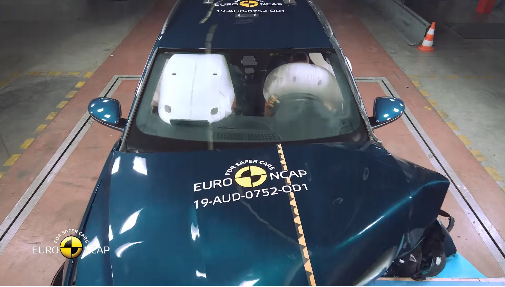

## Airbags

Audi e-tron has serveral airbags as standard.

### Front airbags

### Head airbags

Both front and rear are protect with head airbags. 

### Side Airbags front

In front there is standard with side Airbags build in to the seat that protects the body.

### Side Airbags rear

In rear the side air bags is optional. The option ID is **4X4**. It is also
included in the Audi Pre senmse backseat package **4X9**

## Seat belts

Front seats belts have reversible belt tensioners at the front

## Audi Pre-sense back seat pacakge

The safety package includes features for increased safety and comfort in the back seat. Rear side airbags in addition to the front airbags and the headrest system provide extra protection for the rear seat passengers. Reversible belt tensioners at the rear in addition to the Audi pre sense basic equipment reversible belt tensioners at the front. In case of emergency braking, braking
due to danger or in driving dynamic border situations, preventive tightening of the seat belts is implemented in addition
to the measures in Audi pre sense basic. It reduces the forward and lateral movements of the rear seat passengers.
Belt lock with light provides better comfort for passengers, and gives the cabin elegant and exclusive lighting. Now the search is over
after the belt buckle in the dark.

## Crash testing

Audi e-tron has received full score on different crash testes. See below. 

### Euro NCAP Crash Test of Audi e-tron 2019



### 2019 Audi e-tron driver-side small overlap IIHS crash test



### 2019 Audi e-tron side IIHS crash test



### 2019 Audi e-tron moderate overlap IIHS crash test



{}
