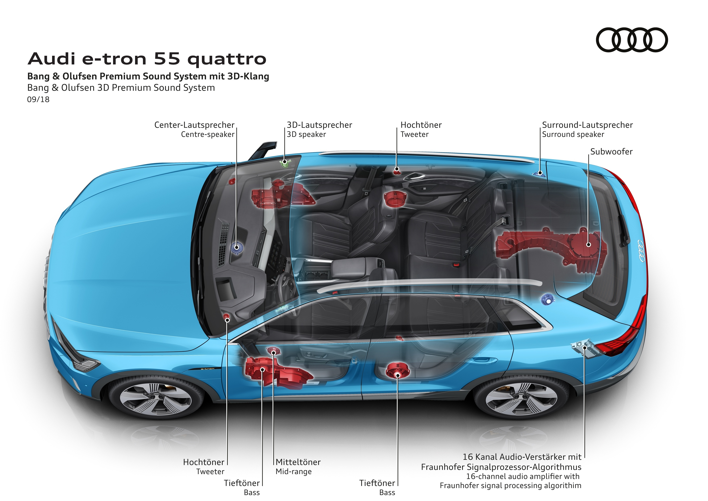

## Audi sound system

Standard lydsystemet er et 180 Watt 6-kanalssystem med 10 høyttalere inkludert senterhøyttaler og subwoofer.

OptionId **9VD**

## Bang & Olufsen lydsystem med 3D-lyd

Bang & Olufsen lydsystem med 3D-lyd tilbyr en fascinerende funksjon for hi-fi-fans – lyd som inkluderer den romlige høyden. Den oppnår dette via flere ekstra høyttalere. Interiøret forvandles til en bred lydscene der musikken utfolder seg akkurat slik den ble spilt inn i konsertsalen – uten kunstige effekter. Bak denne teknologien ligger en algoritme som Audi utviklet i samarbeid med Fraunhofer Institute i Erlangen. Den tar stereo- eller 5.1-opptak, beregner informasjonen for den tredje dimensjonen og tilpasser den for 3D-høyttalerne.

I toppversjonen implementerer Bang & Olufsen Sound System 3D-lyd også i det bakre sitteområdet. Ved hjelp av MMI-systemet og en separat kontrollenhet for bakpassasjerene, avhengig av modell, kan lydinnstillingen optimaliseres til personlige preferanser – med fokus på enten for- eller bakseter, eller på alle seter.

Illustrasjonen under viser hvor de 16 forskjellige høyttalerne er plassert.

Alternativ-IDen for dette systemet er **9VS**

{}
