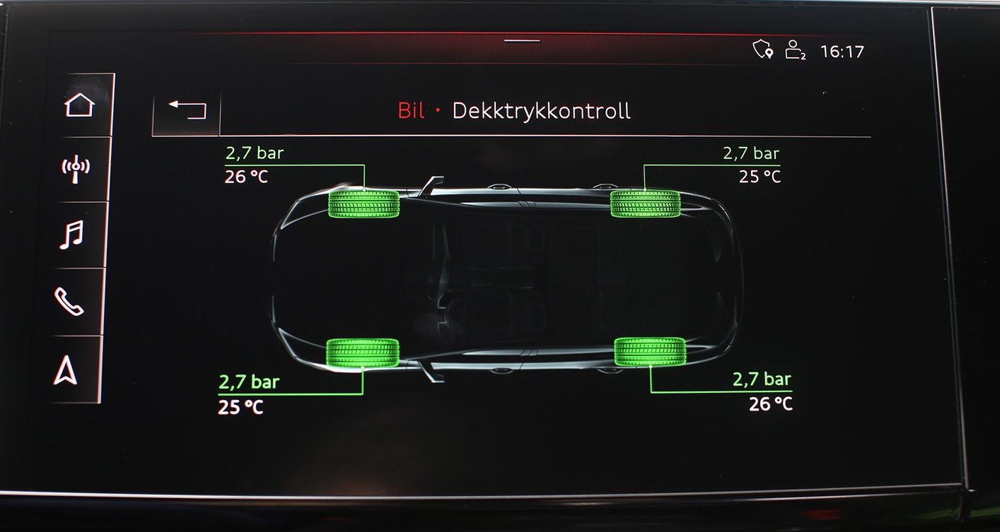

Audi e-tron er utstyrt med et indirekte TPMS-system som standard. Dette betyr at den bruker ABS-sensoren til å oppdage om det er hjul med lavt trykk sammenlignet med de andre.

### Direkte TPMS

Med direkte TPMS er det en lufttrykksensor i hvert dekk som kommuniserer med bilen. Denne måler temperaturen og trykket for hvert hjul og presenterer dette i MMI.

Nedenfor ser du hvordan MMI indikerer at venstre fordekk har mye lavere trykk enn andre hjul.

Alternativ-ID **7K3**

### Riktig trykk

Følgende tabell viser riktig dekktrykk

{}
