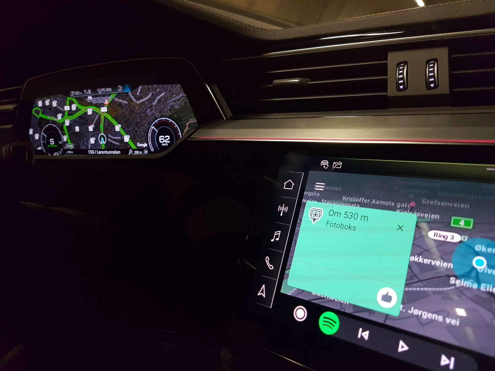

With Audi smartphone interface with option id **IU1** you get the possibility to use Apple Carplay or Android Auto in your MMI system.

This gives you access to many usefull apps like Spotify and Waze directly in MMI.

The below image show how Waze warns users about a speed camera.

Android Auto requires you to use cable, but Apple Carplay is supported throug cable and wireless.

From 2022 model, Android Auto wireless is supported. 

{}
