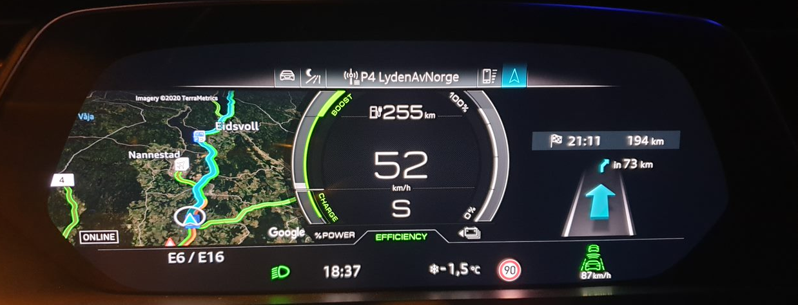

Den virtuelle cockpit-skjermen har en full HD-oppløsning på 1 920 x 720 piksler. Skjermgrafikken er usedvanlig skarp og svært detaljert.

Displayet viser et bredt spekter av informasjon klart og i ryddig, skarp, svært detaljert grafikk. Den inkluderer tradisjonell hastighet, batteristatus, strømlinjetall samt informasjon om navigasjon, media og førerassistentsystemer. Faste indikatorer vises langs den nedre kanten; de viser utetemperatur, tid og kilometerstand samt advarsels- og informasjonssymboler. Bildet oppdateres 60 ganger i sekundet slik at den virtuelle nålen til turtelleren følger jevnt og veldig presist.

Føreren kan bruke View-knappen på multifunksjonsrattet for å bytte Audi virtual cockpit mellom to visninger: Mens turtelleren og speedometeret vises som store måleinstrumenter i kjørevisningen, dominerer et sentralt vindu i infotainmentvisningen. Det skaper en stor scene for navigasjonskartet eller for lister i telefon-, radio- og lydområdene. I dette tilfellet vises turtelleren og hastighetsmåleren som små måleinstrumenter.

## Virtuell cockpit pluss

Hvis du kjøper det virtuelle cockpit pluss-alternativet (9S9) får du en ekstra e-tron-sportsmodus.

Modusen kan velges i MMI

## Modus og visninger

Nedenfor ser du noen av modusene og visningene som er tilgjengelige i Virtual Cockpit

{}
