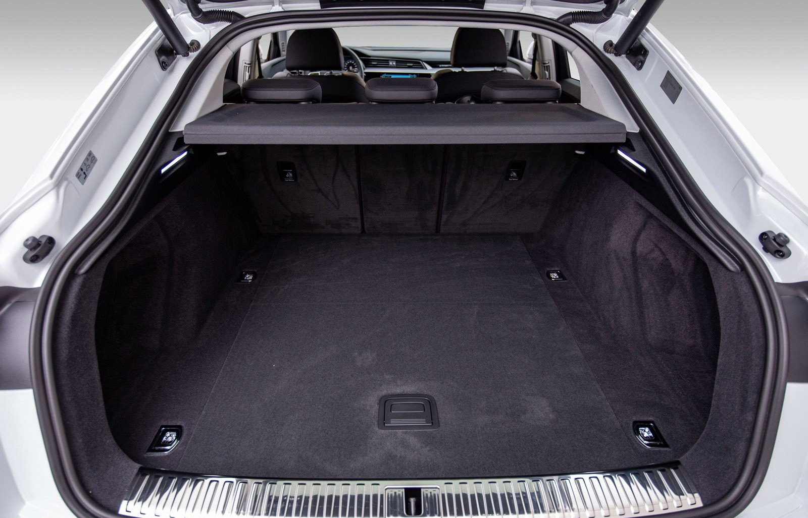
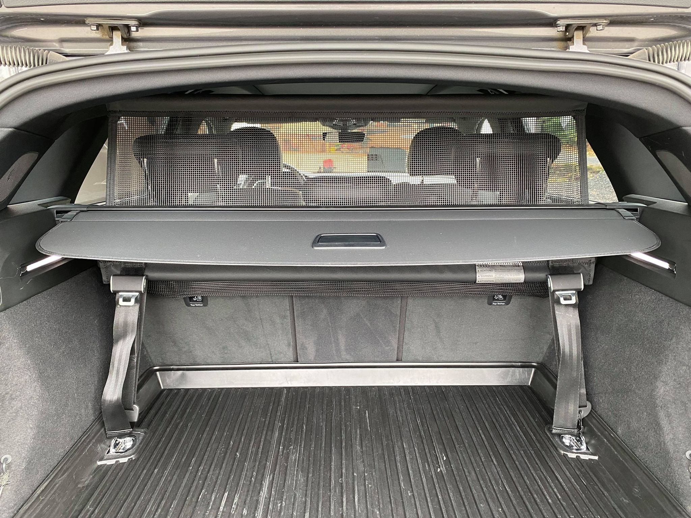
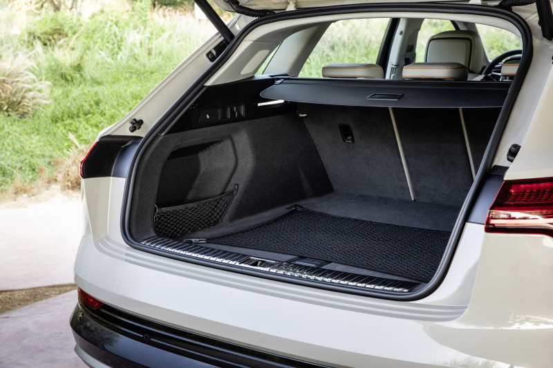
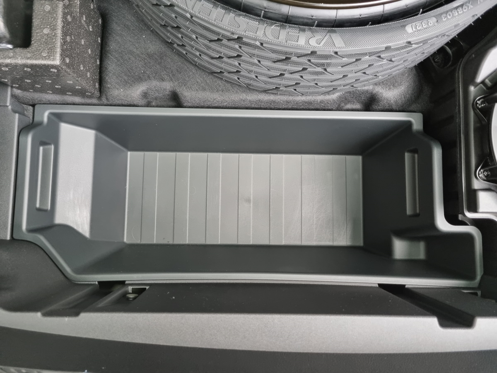

## Bagasjerom

### Separasjonsnett for bagasjerom

Som ekstrautstyr kan du få et nett for å separere bagasjerommet med passasjerene.
Alternativ-IDen er **3CX**

### Oppbevarings- og bagasjeromspakke

Du kan bestille Audi e-tron med oppbevarings- og bagasjeromspakke

Den inneholder følgende.

## Frunk

Se nedenfor for Bananabox-test for e-tron og e-tron sportback.





## Taklagring

Du kan lagre opptil 75 kg på taket.

Både e-tron og e-tron Sportback modellene kan utstyres med skinner for enkel montering av takboks.
Alternativer ID **3S1** for aluminiumsskinner og **3S2** for svarte skinner.

## Trailer

Audi e-tron kan dra tilhengere opp til 1800 kg. Du kan forvente at forbruket går opp avhengig av størrelse på tilhenger

### Trailereksempel 1

I dette eksemplet dro eieren en 1800 kg tilhenger med båt. Forbruket endte på 52,5kWh/100km over en distanse
på 568,1km. Dette gir en teoretisk rekkevidde på 164km.

I miles er den 1,9 miles/kWh og rekkevidde på 101.

### Trailereksempel 2

I dette eksemplet dro eieren en 1800 kg tilhenger med båt. Forbruket endte på 60,6kWh/100km over en distanse
på 83,1 km. Dette gir en teoretisk rekkevidde på 144km.

I miles er den 1,03 miles/kWh og rekkevidde på 89.

{}
