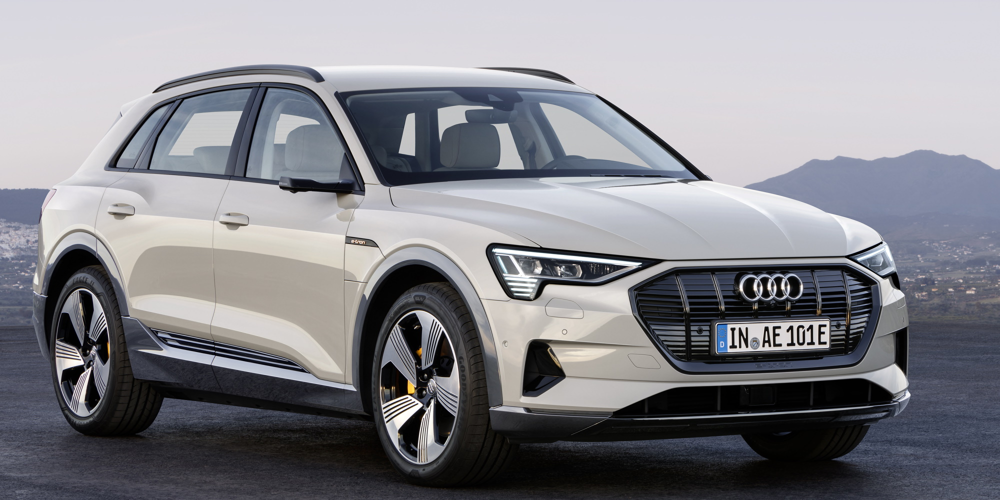
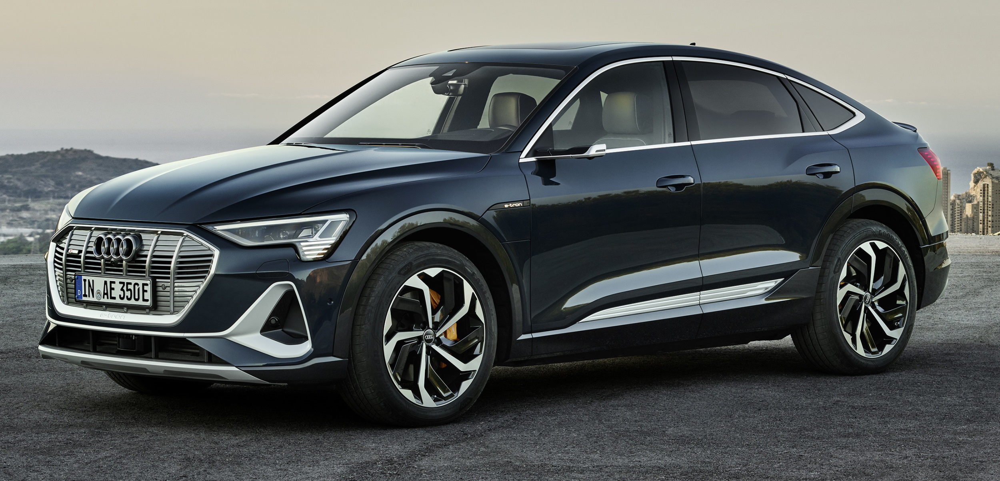

### Audi e-tron 50

Audi e-tron 50 is the least expensive version. It has SUV form factor and the smallest battery.
71kWh gross battery with 64.7 kWh available. WLTP range between 282-341km depending on equipment trim. The two engines output 230kW (312 hp).

It is not possible to differentiate e-tron 50 from 55 by looks.

[See detailed specification](/models/e-tron/specifications/#audi-e-tron-50)

### Audi e-tron 50 Sportback

Audi e-tron 50 Sportback is the least expensive Sportback version. It has Sportback form factor and the smallest battery.
71kWh gross battery with 64.7 kWh available. WLTP range between 282-347km depending on equipment trim. The two engines output 230kW (312 hp).

It is not possible to differentiate e-tron 50 Sportback from e-tron 55 Sportback by looks.

[See detailed specification](/models/e-tron/specifications/#audi-e-tron-50-sportback)

### Audi e-tron 55

Audi e-tron 55 was the first version available. With 95kWh gross battery (86.5kWh net) and 300KW (408HP) engine output.
WLTP range between 371-441km depending on equipment trim. The two engines output 300kW (408 hp).

[See detailed specification](/models/e-tron/specifications/#audi-e-tron-55)

### Audi e-tron 55 Sportback

Audi e-tron 55 Sportback is the Sportback version of e-tron 55. With 95kWh gross battey (86.5kWh net) and 300KW (408HP) engine output.
WLTP range between 373-452km depending on equipment trim. The two engines output 300kW (408 hp).

[See detailed specification](/models/e-tron/specifications/#audi-e-tron-55-sportback)

### Audi e-tron 60S

Withs its wider body and wheels Audi e-tron 60S looks apart from the e-tron 50/55.

Audi e-tron S have the same battery as e-tron 55 with 95kWh gross capacity and 86.5kWh net capacity.

Its electric drive use three electric motors, two of which operate on the rear axle. The intelligent drive control raises vehicle safety, and dynamic handling in particular, to a new level.
 In addition to the electric all-wheel drive, the vehicle are equipped with electric torque vectoring with active and fully variable torque distribution on the rear axle.

Audi e-tron S  deliver dynamics in a new dimension. In S gear, they provide full boost performance for eight seconds – 370 kW of power and 973 Nm (717.6 lb-ft) of torque.
The standard sprint takes just 4.5 seconds and acceleration ends at 210 km/h (130.5 mph).

The new S models have two electric motors on the rear axle and one on the front axle, making them the first mass-produced electric cars in the world to have three electric motors.

WLTP range between 343-374km depending on equipment trim.

[See detailed specification](/models/e-tron/specifications/#audi-e-tron-60s)

### Audi e-tron 60S Sportback

Withs its wider body and wheels Audi e-tron 60S Sportback looks apart from the e-tron 50/55 Sportback.

Audi e-tron S have the same battery as e-tron 55 with 95kWh gross capacity and 86.5kWh net capacity.

Its electric drive use three electric motors, two of which operate on the rear axle. The intelligent drive control raises vehicle safety, and dynamic handling in particular, to a new level.
 In addition to the electric all-wheel drive, the vehicle are equipped with electric torque vectoring with active and fully variable torque distribution on the rear axle.

Audi e-tron S Sportback deliver dynamics in a new dimension. In S gear, they provide full boost performance for eight seconds – 370 kW of power and 973 Nm (717.6 lb-ft) of torque.
The standard sprint takes just 4.5 seconds and acceleration ends at 210 km/h (130.5 mph).

The new S models have two electric motors on the rear axle and one on the front axle, making them the first mass-produced electric cars in the world to have three electric motors.

WLTP range between 343-374km depending on equipment trim.

[See detailed specification](/models/e-tron/specifications/#audi-e-tron-60s-sportback)

{}
