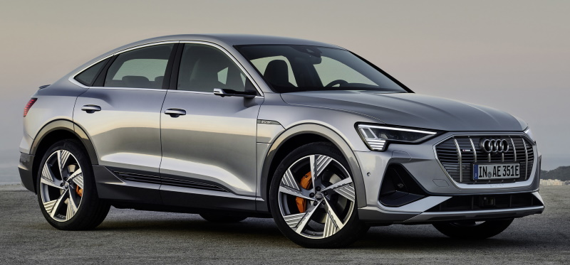
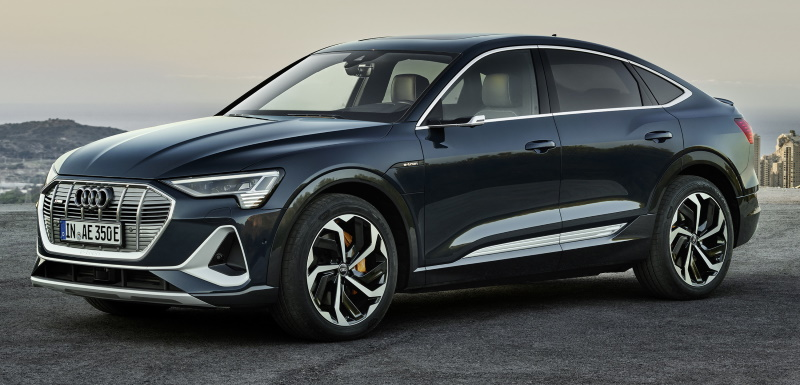
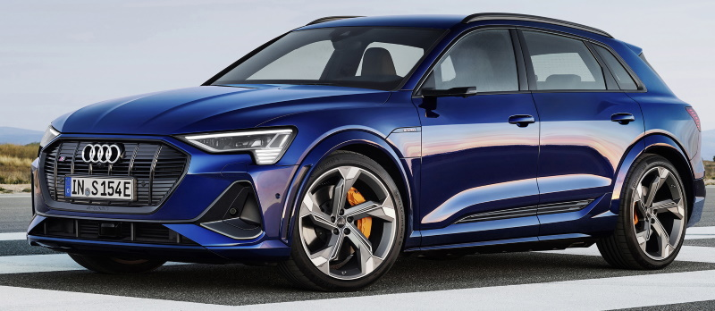
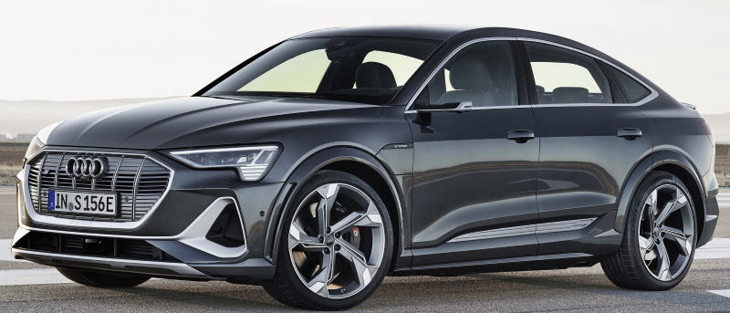

<!-- markdownlint-disable MD033 -->

### Audi e-tron 50

<figur>
    
    <figcaption><h4>Audi e-tron 50 i Siam beige og svart optikk</h4></figcaption>
</figur>

Audi e-tron 50 er den billigste versjonen. Den har en SUV-formfaktor og det minste batteriet.
71kWh bruttobatteri med 64,7 kWh tilgjengelig. WLTP-rekkevidde mellom 282-341 km avhengig av utstyrsnivå. De to motorene yter 230 kW (312 hk).

Det er ikke mulig å skille e-tron 50 fra e-tron 55 etter utseende.

[Se detaljert spesifikasjon](/models/e-tron/specifications/#audi-e-tron-50)

### Audi e-tron 50 Sportback

<figur>
    
    <figcaption><h4>Audi e-tron Sportback 50 i Florett Silver</h4></figcaption>
</figur>

Audi e-tron 50 Sportback er den billigste Sportback-versjonen. Den har en Sportback-formfaktor og det minste batteriet.
71kWh bruttobatteri med 64,7 kWh tilgjengelig. WLTP-rekkevidde mellom 282-347 km avhengig av utstyrsnivå. De to motorene yter 230 kW (312 hk).

Det er ikke mulig å skille e-tron 50 Sportback fra e-tron 55 Sportback etter utseende.

[Se detaljert spesifikasjon](/models/e-tron/specifications/#audi-e-tron-50-sportback)

### Audi e-tron 55

<figur>
    
    <figcaption><h4>Audi e-tron 55 S-Line i Chronos-grå</h4></figcaption>
</figur>

Audi e-tron 55 var den første versjonen tilgjengelig. Med 95 kWh bruttobatteri (86,5 kWh netto) og 300 KW (408 HK) motoreffekt.
WLTP-rekkevidde mellom 371-441 km avhengig av utstyrsnivå. De to motorene yter 300kW (408 hk).

[Se detaljert spesifikasjon](/models/e-tron/specifications/#audi-e-tron-55)

### Audi e-tron 55 Sportback

<figur>
    
    <figcaption><h4>Audi e-tron 55 Sportback S-Line i plasmablått</h4></figcaption>
</figur>

Audi e-tron 55 Sportback er Sportback-versjonen av e-tron 55. Med 95kWh bruttobatteri (86,5kWh netto) og 300KW (408HK) motoreffekt.
WLTP-rekkevidde mellom 373-452 km avhengig av utstyrsnivå. De to motorene yter 300kW (408 hk).

[Se detaljert spesifikasjon](/models/e-tron/specifications/#audi-e-tron-55-sportback)

### Audi e-tron 60S

<figur>
    
    <figcaption><h4>Audi e-tron 60S</h4></figcaption>
</figur>

Med sitt bredere karosseri og hjul, skiller Audi e-tron 60S seg ut fra e-tron 50/55.

Audi e-tron S har samme batteri som e-tron 55 med 95kWh bruttokapasitet og 86,5kWh nettokapasitet.

Den elektriske drivverket bruker tre elektriske motorer, hvorav to opererer på bakakselen. Den intelligente kjørekontrollen hever kjøretøysikkerheten, og spesielt dynamisk håndtering, til et nytt nivå. I tillegg til elektrisk firehjulsdrift er e-tron 60S utstyrt med elektrisk momentvektoring med aktiv og fullt variabel dreiemomentfordeling på bakakselen.

Audi e-tron S leverer dynamikk i en ny dimensjon. I S-gir gir de full ytelse i åtte sekunder – 370 kW kraft og 973 Nm (717,6 lb-ft) dreiemoment.
Standardsprinten tar bare 4,5 sekunder og akselerasjonen ender ved 210 km/t (130,5 mph).

De nye S-modellene har to elektriske motorer på bakakselen og en på forakselen, noe som gjør dem til de første masseproduserte elbilene i verden som har tre elektriske motorer.

WLTP-rekkevidde mellom 343-374 km avhengig av utstyrsnivå.

[Se detaljert spesifikasjon](/models/e-tron/specifications/#audi-e-tron-60s)

### Audi e-tron 60S Sportback

<figur>
    
    <figcaption><h4>Audi e-tron 60S Sportback</h4></figcaption>
</figur>

Dette er Sportback-versjonen av 60. WLTP-rekkevidde mellom 343-374 km avhengig av utstyrsnivåning.

[Se detaljert spesifikasjon](/models/e-tron/specifications/#audi-e-tron-60s-sportback)

{}
