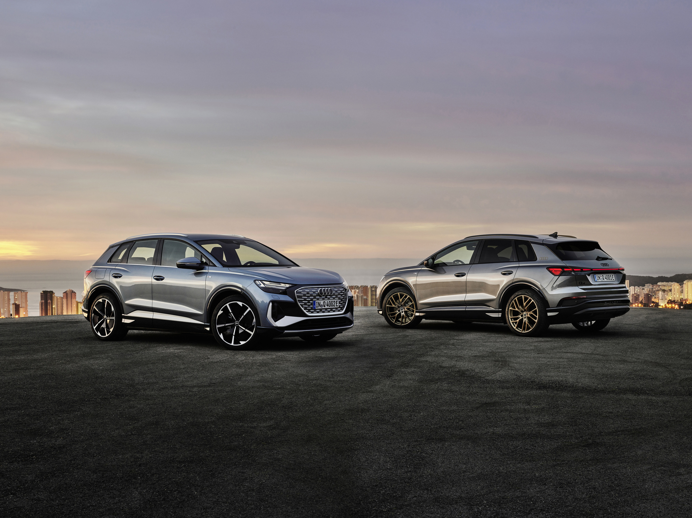

Both of them impress with a new spacious dimension in the interior and pioneering solutions when it comes to operation, display, and assist systems. The augmented
reality head-up display connects the virtual and the real worlds in a totally new way.

It is based on the MEB platform as Skoda Enyaq and Volkswagen ID4 and ID3.

The world premiere was April 14. 2021.

Below you find every detail you need to know about Audi Q4 e-tron and Audi Q4 e-tron Sportback

{}
