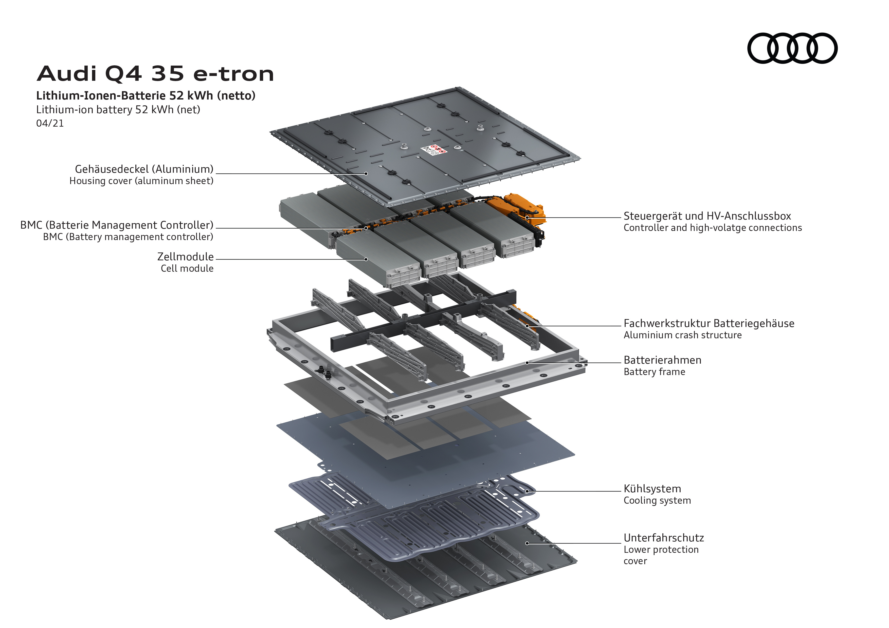
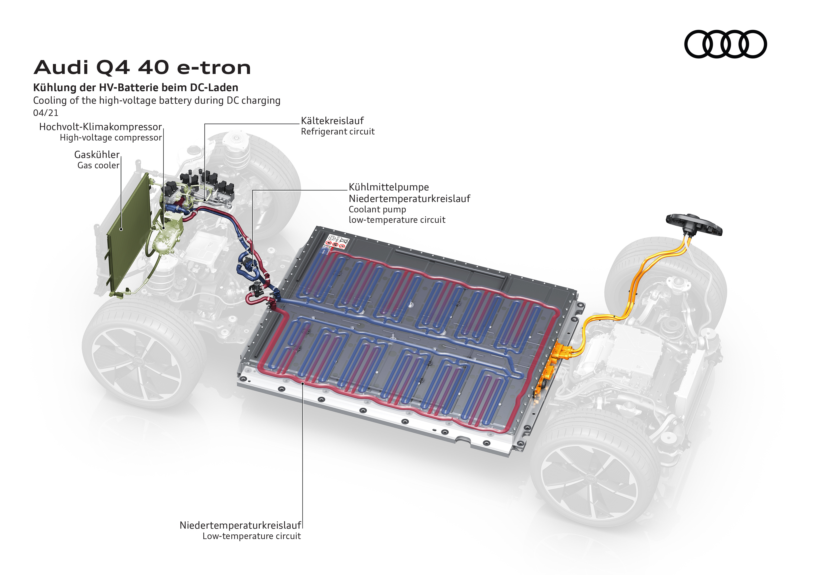

Kjøreporteføljen til de to kompakte elektriske modellene lever opp til forventningene til svært forskjellige kundegrupper – fra bypendleren til langdistansesjåføren. Den inkluderer to batterivarianter og tre drivvarianter. Det kompakte batteriet til Q4 35 e-tron har et netto energiinnhold på 52 kWh (55 kWh brutto), mens tallene for det store batteriet i Q4 40 e-tron og Q4 50 e-tron quattro er 77 (82) kWh.

## Battericeller

Battericellene i Q4-modellene er produsert av LG Chem

| **Spesifikasjon** | **verdi** |
|-----|-----|
| Produsent | LG Chem |
| Modell | LGX E78 |
| Spenning | 3,65 V |
| Kapasitet | 78 Ah |
| Vekt | 1,073 g |
| Gravimetrisk energitetthet | 265 Wh/kg |
| Kjemi | NCM 712 |

## Batteri Q4 35

Q4 35 e-tron-batteriet består av 8 batterimoduler med 12 celler i hver modul.

| **Spesifikasjon** | **Verdi** |
| ----- |----- |
| Bruttokapasitet | 55 kWh |
| Brukbar kapasitet | 52 kWh (94 %)|
| Moduler | 8 |
| Celler | 192 |
| Cell pr-moduler | 24 |
| Cellekonfigurasjon | 96s2p |
| Spenning | 350 V |
| Total cellevekt | 206 kg |
| TMS | aktiv væskekjøling |
| Pakkevekt | 344 kg |

## Batteri Q4 40 e-tron og Q4 50 e-tron

| **Spesifikasjon** | **Verdi** |
| ----- |----- |
| Bruttokapasitet | 82 kWh |
| Brukbar kapasitet | 77 kWh (94 %)|
| Moduler | 12 |
| Celler | 288 |
| Cell pr-moduler | 24 |
| Cellekonfigurasjon | 96s3p |
| Spenning | 350 V |
| Total cellevekt | 309 kg |
| TMS | aktiv væskekjøling |
| Pakkevekt | 493 kg |
| Pakningstetthet wH/kg | 166 |

## Termisk styring

## Detaljert gjennomgang av batteri

Nedenfor ser du Sandy Munro gå i detaljer om Q4-batteriet.



{}
