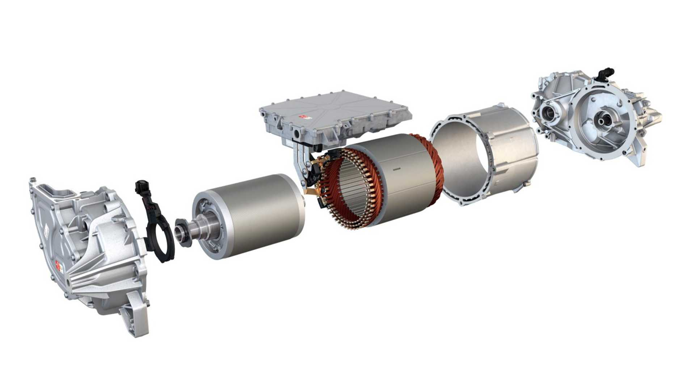
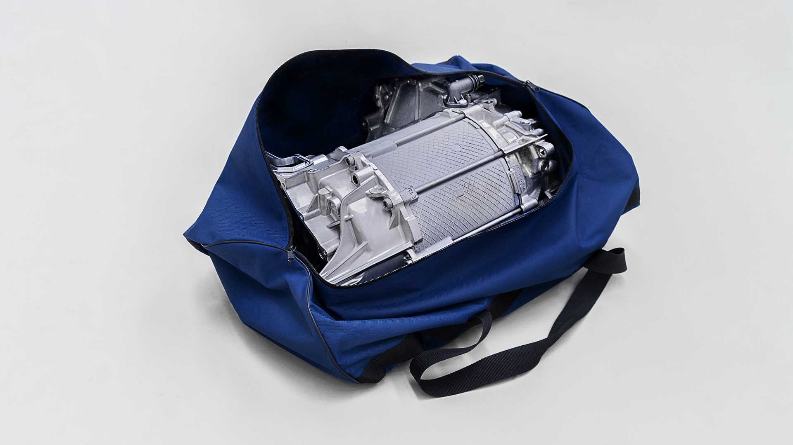
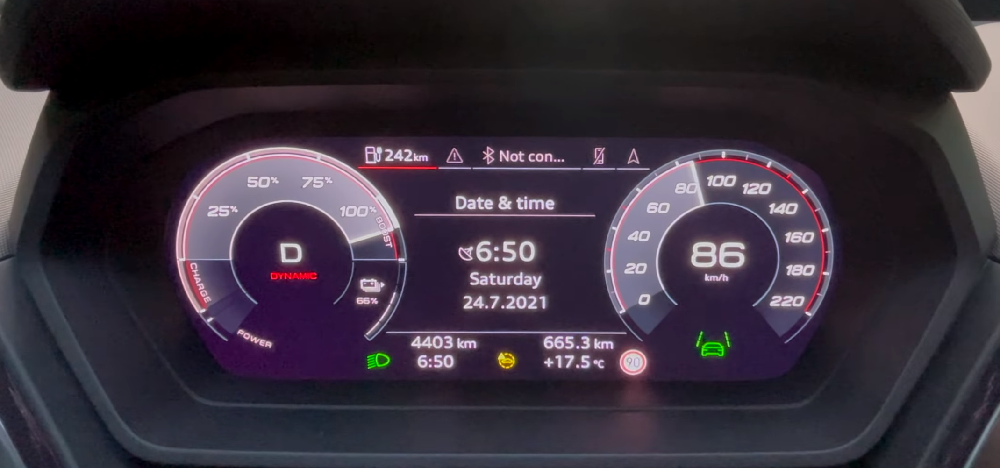
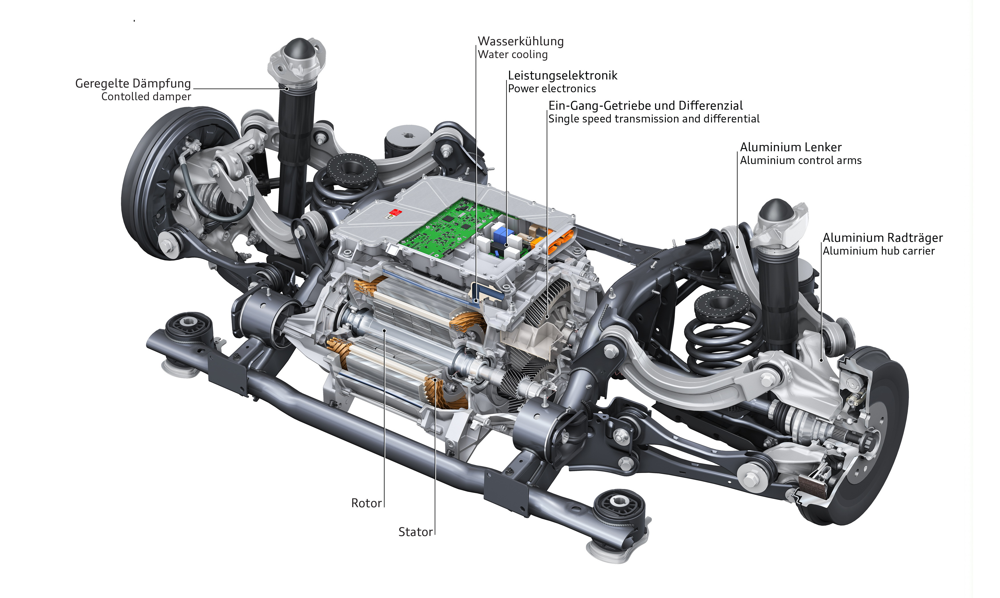
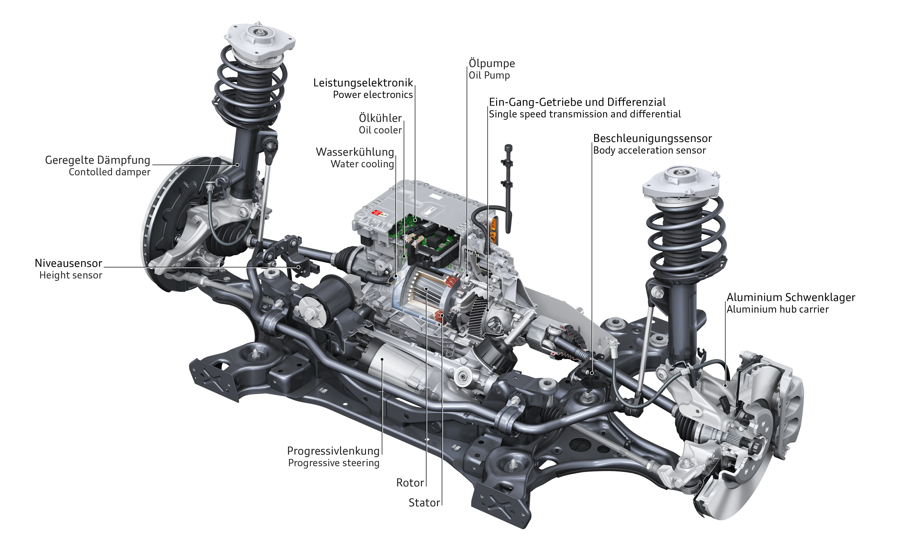
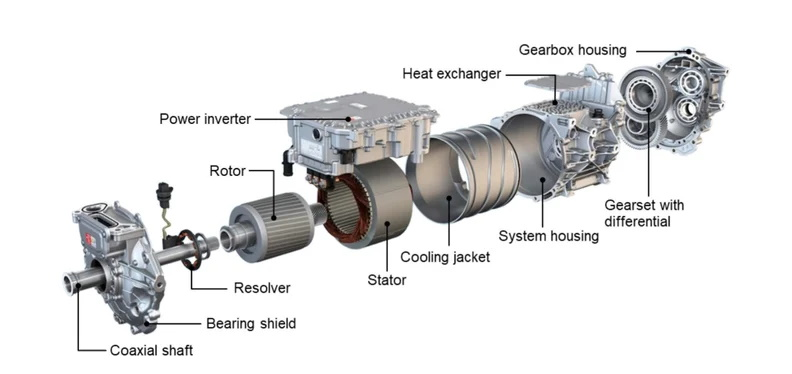

Audi Q4 e-tron og Q4 Sportback e-tron inkluderer et bredt utvalg av stasjoner – fra citycruiser til den kraftige quattroen. De lanseres på de europeiske markedene med to forskjellige batteristørrelser og tre motorserier. I Q4 35 e-tron og Q4 40 e-tron sørger en permanent excited synchronous machine (PSM) på bakhjulene for drivkraften – disse to modellene, sammen med R8 V10 RWD høyytelses sportsbil, er de eneste serie- produksjon av Audi-modeller med rent bakhjulsdrift. Q4 45 e-tron og Q4 50 e-tron quattro som den sporty toppmodellen bruker to elektriske motorer for sin elektriske firehjulsdrift.

## Inngangsmodell: Q4 35 e-tron

Inngangsmodellene Audi Q4 35 e-tron er utstyrt med det kompakte batteriet som har et netto energiinnhold på 52 kWh (55 kWh brutto). En elektrisk motor med en effekt på 125 kW (170 PS) og
dreiemoment på 310 Nm gir drivkraften. I begge karosserivariantene akselererer den den elektriske SUV-en fra 0 til 100 km/t på 9,0 sekunder og gir en regulert topphastighet på 160 km/t.
Q4 35 e-tron kan dekke opptil 341 kilometer (211,9 mi) (WLTP-syklus) på én enkelt batterilading, mens Q4 Sportback 35 e-tron klarer opptil 349 kilometer (216,9 mi) (WLTP).

## Rekkevidde på opptil 520 kilometer (323,1 mi): Q4 40 e-tron

Audi Q4 40 e-tron har det store batteriet, som lagrer netto 76,6 kWh energi (82 kWh brutto).
Den elektriske motoren genererer 150 kW (204 PS) og 310 Nm i denne konfigurasjonen. Det er samme motor (APP310) som brukes.

## Inngangsmodell med to elektriske motorer: Q4 45 e-tron quattro

Q4 45 e-tron quattro kjører på 76,6 kWh-batteriet (82 kWh brutto). Den leverer to elektriske motorer som kombineres for å produsere en maksimal effekt på 195 kW (265 PS) og 460 Nm (339,3 lb-ft) dreiemoment, samtidig som elektrisk firehjulsdrift blir en realitet.

## Toppmodell med to elektriske motorer: Q4 50 e-tron quattro

Toppmodellene Q4 50 e-tron quattro og Q4 Sportback 50 e-tron quattro går også på 77 kWh-batteriet (82 kWh brutto). Den leverer to elektriske motorer som kombineres for å produsere en maksimal effekt på 220 kW (299 PS) (maksimal effekt bestemt i henhold til UN-GTR.21.) og 460 Nm (339,3 lb-ft) dreiemoment, samtidig som den lager elektrisk firehjulsdrift kjøretur blitt en realitet. Den bakre motoren genererer 150 kW (204 PS) og 310 Nm, den fremre motoren 80 kW (109 PS) og 162 Nm. De elektriske motorene holder reserver tilgjengelige for visse kjøresituasjoner, og det er grunnen til at summen av deres individuelle ytelser overstiger frekvensomformerens totale ytelse.

Full effekt er kun tilgjengelig over 80 % SOC. Etter det vil den falle ned mot 265HK. Dette skjermbildet viser hvordan boost-nivået er omtrent 50 % ved 66 % SOC.

## Motorteknologi

Mens det er tre motorkonfigurasjoner, er det bare to typer elektriske motorer som brukes på Q4 e-tron

### APP310 - Bakre elektrisk motor

Det er den samme elektriske motoren bak på alle versjoner av Q4, men den yter forskjellig
på Q35 vs Q40/Q45/Q50 på grunn av forskjellig batteripakke. Den bakre elektriske motoren har følgende spesifikasjoner.

- aksial parallell arkitektur
- PSM-motor med hårnålsvikling
- 150 kW / 310 Nm
- væskeavkjølt
- maks. rotorhastighet: 16.000 rpm
- enkelttrinns girkasse
- To-trinns hastighetsreduksjon (13:1 RWD / 11,5:1 AWD)
- vekt: ~90 kg

Nedenfor ser du Sandy Munro gå gjennom den bakre motoren



### elektrisk motor foran

Kun Q5 45 Quattro og 50 Quattro har frontmotor. Den fremre elektriske motoren har følgende spesifikasjoner.

- koaksial arkitektur
- ASM-motor med distribuert inntrekksvikling
- Rotor i aluminium
- 80 kW / 162 Nm
- væskeavkjølt
- maks. rotorhastighet: 14.000 rpm
- enkelttrinns girkasse
- to-trinns hastighetsreduksjon (~10:1)
- vekt: ~60 kg

De viktigste fordelene med ASM er dens kortsiktige overbelastningskapasitet og minimale luftmotstandstap ved tomgang. Av effektivitetsgrunner trer den fremre e-akselen kun i bruk når høy kraft eller et sterkt grep er nødvendig.

## Girkasse

Den kraftige APP310 e-drive-enheten overfører kraft til de drevne hjulene ved hjelp av en ekstremt kompakt girkasse. Q4 enkeltgir er i stand til å takle alle kjøresituasjoner. Mekanismen som brukes har bare et lite antall tannhjul. Denne 1-trinns girkassen er en del av det elektriske drivsystemet for den modulære elektriske drivmatrisen (MEB) og er produsert av Volkswagen Group Components ved fabrikken i Kassel.

## Termisk styring

Motorene er væskekjølte. Hver motor har flytende statorkjøling for å gi maksimal termisk robusthet under alle driftsforhold

{}
