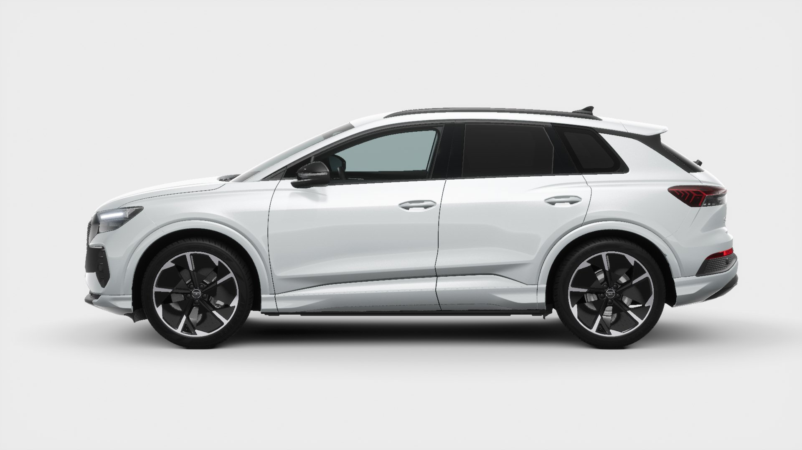

{}

The front axle of the compact electric SUVs is designed in the classic McPherson construction method, the steering is located underneath at the front. A compact five-link design featuring similarities with the rear axle of the large Audi models works at the rear. As with the front axle, it is mounted on a subframe. Several parts of the suspension are made of lightweight aluminum. The track widths are 1,587 millimeters at the front and 1,565 millimeters at the rear.

On request, Audi can equip the two compact electric SUVs with the dynamic package or the dynamic package plus. In the dynamic package, the sport suspension (standard in the S line) lowers the body by 15 millimeters, 
while the conventional steering is replaced here by progressive steering (standard in the quattro models), which operates more directly the further the steering is turned.

The third element of the dynamic package is the Audi drive select dynamic handling system (standard in the Sportback), which brings new dimensions to the driving experience. With Audi drive select, the driver can switch the characteristics of the steering, the electric motors, and (in the quattro models) the electric all-wheel drive between the “comfort,” “auto,” “efficiency,” “individual,” and “dynamic” modes.

