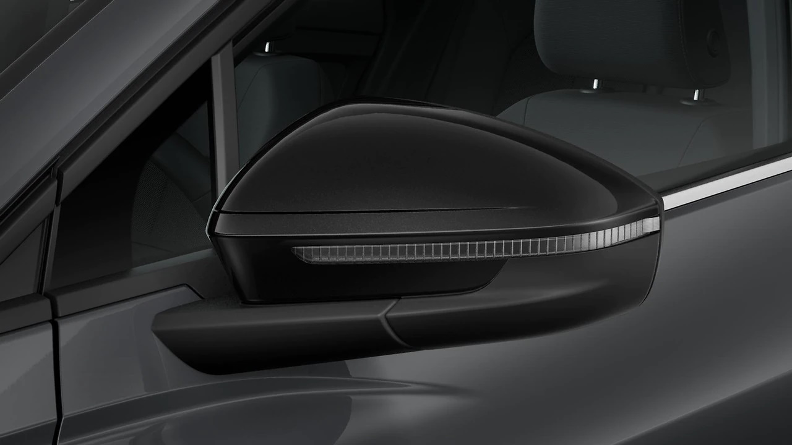

## Functionality

Electric adjustable mirrors with heating are standard on Audi e-tron (option ID 6XN). They are controlled in the drivers door on the joystick.

### Retractable mirrors

As an option you can have electrically adjustable, heated and retractable side mirrors, automatically dimmable on both sides, with integrated LED turn signal and curb automatic in the side mirror on the passenger side and projection light in  the side mirrors that project a graphic light onto the ground.

This is part part of [comfort package](/models/q4-e-tron/optionguide/list/#equipment-packages) with option id **PYA**

## Mirror Style

The mirrors can be delivered in different styles.

Painted mirrors in veichle color. Option code **6FG**

This is the standard option.

Black mirrors. Option code **6FJ**

{}
