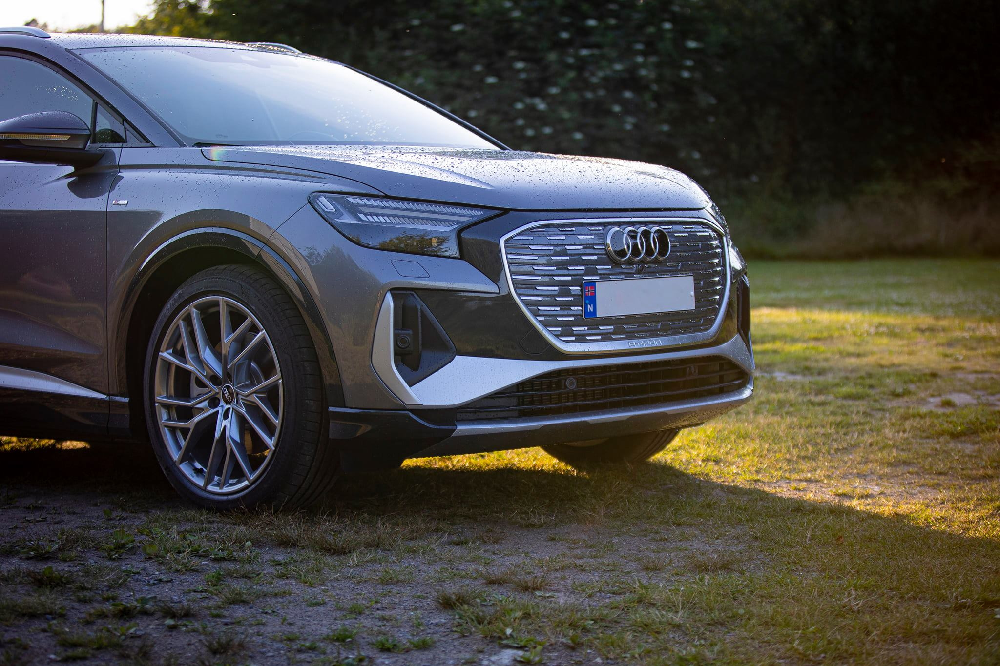
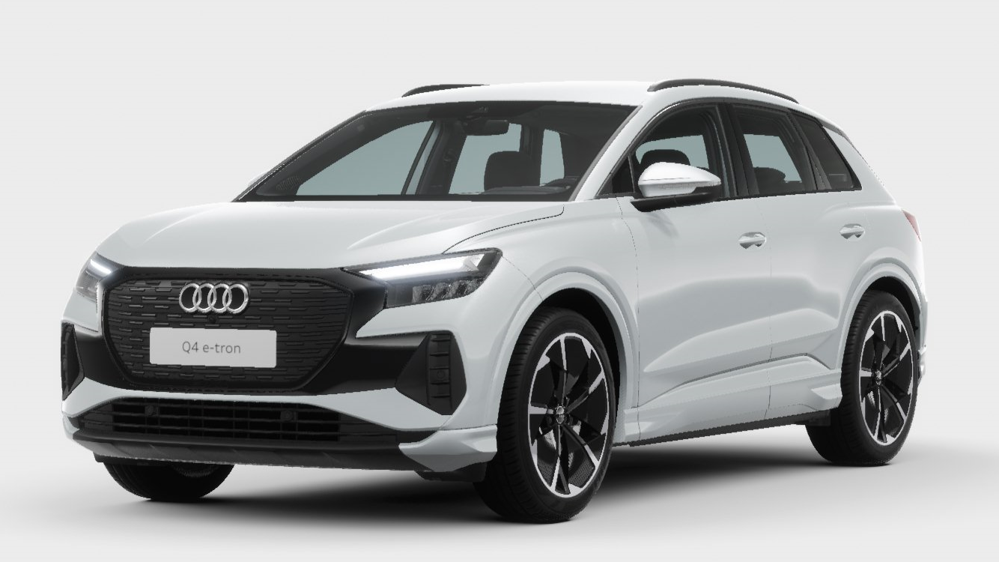

## Optics

There is 3 different optics to choose from

### Silver optics

Silver optics is the standard optic.

Video with Mythos black with Silver optics. Warning: No privacy windows. Can't unsee.



### Shadow optics

Shadow optics is the standard optics for S-line exterior

### Shadow optics plus

Shadow optics plus is a special optics for edition one Q4.

Sets expressive accents in the form of black painted areas on particularly striking design elements on the front, sides and rear.

Shadow look black includes:
Black accents on the Audi Singleframe
Black accents on the front and rear bumpers
Black moldings around the side windows
Rails in black

### Black Optics

The black optics package contains gloss black front, rails and window rims. Option code **4ZD**

