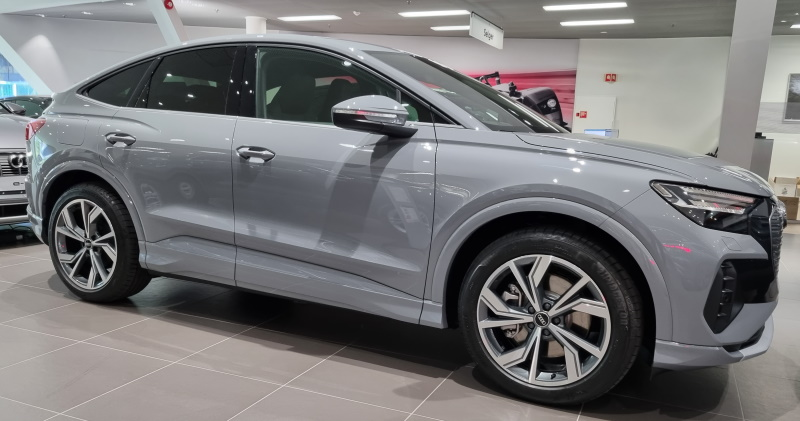
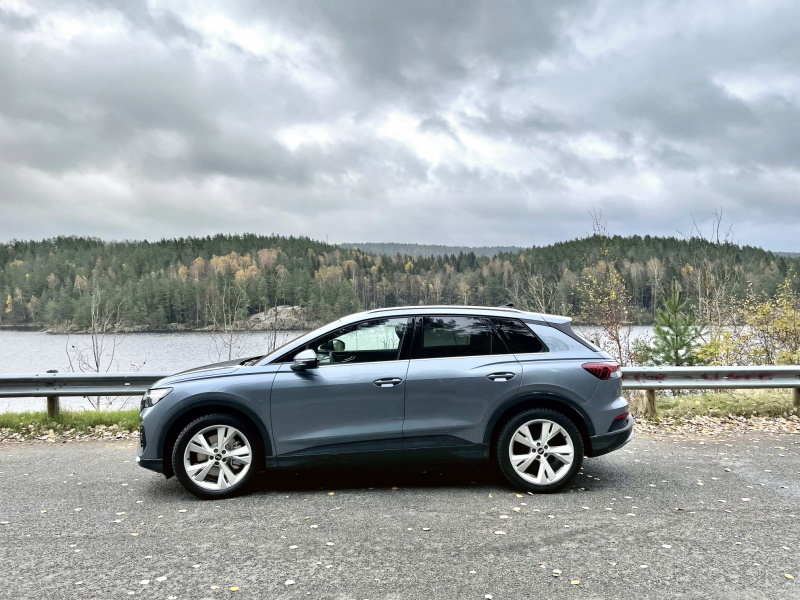
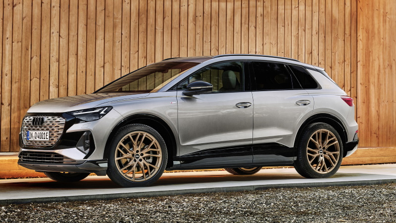
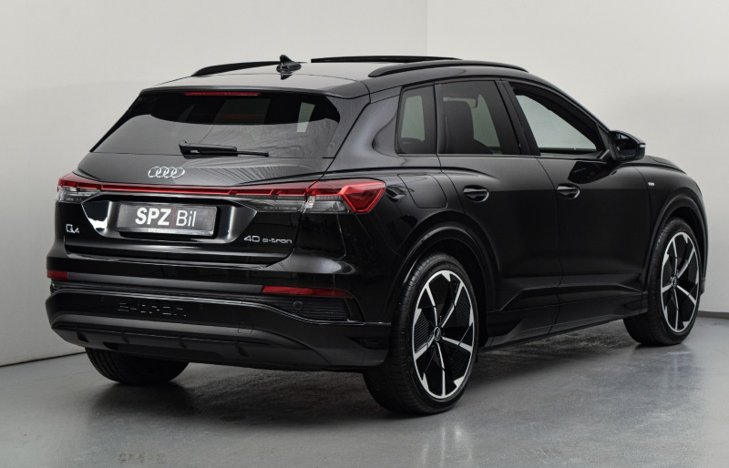
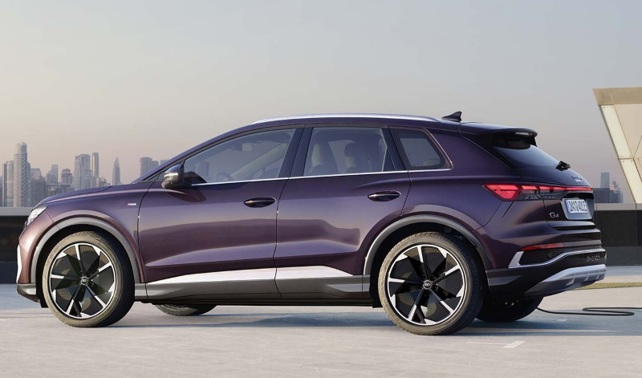
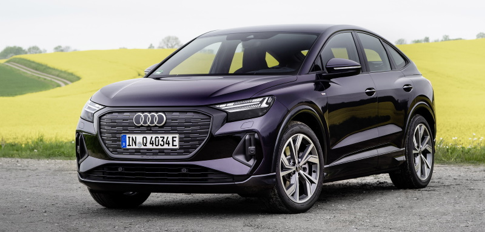
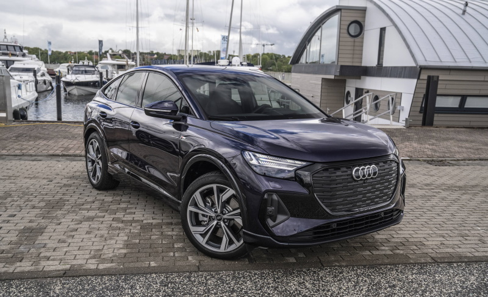
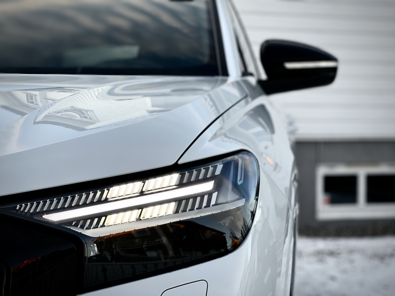

<!-- markdownlint-disable MD033 -->
Here you find high resolution picture of real cars in the different standard colors. Click pictures for large versions.

Click on links for quick access to a color.

- [Pebble Stone](/models/q4-e-tron/exterior/paint/#pebble-stone-gray)
- [Geyser Blue](/models/q4-e-tron/exterior/paint/#geyser-blue)
- [Typhoon Grey](/models/q4-e-tron/exterior/paint/#typhoon-grey)
- [Florett Silver](/models/q4-e-tron/exterior/paint/#florett-silver)
- [Navarra Blue](/models/q4-e-tron/exterior/paint/#navarra-blue)
- [Mythos Black](/models/q4-e-tron/exterior/paint/#mythos-black)
- [Aurora Violett](/models/q4-e-tron/exterior/paint/#aurora-violett)
- [Glacier White](/models/q4-e-tron/exterior/paint/#glacier-white)

## Paint Trims

### Basic paint

On the basic trim the bumpers and wheel arches are not painted

<figure>
    
    <figcaption><h4>Basic trim - wheel archer and bumpers are not painted</h4></figcaption>
</figure>

<figure>
    
    <figcaption><h4>Basic trim - wheel archer and bumpers are not painted</h4></figcaption>
</figure>

<figure>
    
    <figcaption><h4>Basic trim - wheel archer and bumpers are not painted</h4></figcaption>
</figure>

### Contrast paint

If you select Advanced line or s-line [exterior package](/models/q4-e-tron/optionguide/list/#exterior-packages) the
wheel archer and lower parts of the car is painted in a contrast color. Manhatten grey is used as contrast color. Option code **FB5**

<figure>
    
    <figcaption><h4>Audi Q4 50 e-tron quattro in florett silver with manhatten contrast color</h4></figcaption>
</figure>

### Full body paint

For glacier white, mythos black, pepple grey and navarra blue you can get full body paint. Option code **FB4**

<figure>
    
    <figcaption><h4>Audi Q4 Sportback 50 e-tron quattro in Navarra blue with full body paint</h4></figcaption>
</figure>

<figure>
    
    <figcaption><h4>Audi Q4 35 e-tron quattro in Stone grey with black optics, S-line exterior and full body paint</h4></figcaption>
</figure>

## Paint colors

The color swatch for the Audi Q4 e-tron and Q4 Sportback e-tron contains eight colors. Their restrained character is inspired by the colors and hues found in nature. The solid paint color is called stone gray, the metallic shades are named aurora violet (new), floret silver, geyser blue, glacier white, mythos black, Navarra blue, and typhoon gray. Aurora violet is a color that has been taken from Audi Sport.

Below you see photos of Audi Q4-etron and Q4 Sportback e-tron with the different colors.

### Pebble Stone gray

This is the only non metallic pain available. Color code **C2**

<figure>
    
    <figcaption><h4>Audi Q4 40 e-tron in Stone grey</h4></figcaption>
</figure>

<figure>
    
    <figcaption><h4>Audi Q4 50 e-tron quattro in Stone grey with black optics</h4></figcaption>
</figure>

<figure>
    
    <figcaption><h4>Audi Q4 50 e-tron quattro in Stone grey with black optics</h4></figcaption>
</figure>

<figure>
    
    <figcaption><h4>Audi Q4 35 e-tron in Stone grey with black optics, S-line exterior and full body paint</h4></figcaption>
</figure>

<figure>
    
    <figcaption><h4>Audi Q4 35 e-tron in Stone grey with black optics, S-line exterior and full body paint</h4></figcaption>
</figure>

<figure>
    
    <figcaption><h4>Audi Q4 35 e-tron in Stone grey with black optics, S-line exterior and full body paint</h4></figcaption>
</figure>

<figure>
    
    <figcaption><h4>Audi Q4 50 e-tron Sportback in Pebblestone grey with standard optics and full body paint</h4></figcaption>
</figure>

### Geyser Blue

Color code **5Y**

<figure>
    
    <figcaption><h4>Audi Q4 50 e-tron quattro in geyser blue metallic with contrast color</h4></figcaption>
</figure>

<figure>
    
    <figcaption><h4>Audi Q4 50 e-tron quattro in geyser blue metallic with contrast color</h4></figcaption>
</figure>

<figure>
    
    <figcaption><h4>Audi Q4 50 e-tron quattro in geyser blue metallic with contrast color</h4></figcaption>
</figure>

<figure>
    
    <figcaption><h4>Audi Q4 50 e-tron quattro in geyser blue metallic with contrast color</h4></figcaption>
</figure>

<figure>
    
    <figcaption><h4>Audi Q4 50 e-tron quattro in geyser blue metallic with contrast color</h4></figcaption>
</figure>

The below footage shows dynamic driving scenes of the Audi Q4 Sportback e-tron in the colour Geyser blue on the streets of Lübeck.



### Typhoon Grey

Color code **2L**

<figure>
    
    <figcaption><h4>Audi Q4 50 e-tron quattro in typhoon grey metallic with shadow optics plus optics and mythos contast color</h4></figcaption>
</figure>

<figure>
    
    <figcaption><h4>Audi Q4 50 e-tron quattro in typhoon grey metallic with shadow optics plus optics and mythos contast color</h4></figcaption>
</figure>

<figure>
    
    <figcaption><h4>Audi Q4 50 e-tron quattro in typhoon grey metallic with shadow optics and contrast color</h4></figcaption>
</figure>

<figure>
    
    <figcaption><h4>Audi Q4 50 e-tron quattro in typhoon grey metallic with shadow optics and contrast color</h4></figcaption>
</figure>

<figure>
    
    <figcaption><h4>Audi Q4 Sportback 50 e-tron quattro in typhoon grey metallic with shadow optics plus and manhatten contrast color by @auditography</h4></figcaption>
</figure>

<figure>
    
    <figcaption><h4>Audi Q4 Sportback 50 e-tron quattro in typhoon grey metallic with shadow optics plus and manhatten contrast color by @auditography</h4></figcaption>
</figure>

 The below footage shows dynamic driving scenes of the Audi Q4 e-tron in the colour Typhoon grey on the streets of Lübeck.



### Florett Silver

Color code **L5**

<figure>
    
    <figcaption><h4>Audi Q4 Sportback 50 e-tron quattro in florett silver with contrast color</h4></figcaption>
</figure>

<figure>
    
    <figcaption><h4>Audi Q4 50 e-tron quattro in florett silver with manhatten contrast color</h4></figcaption>
</figure>

<figure>
    
    <figcaption><h4>Audi Q4 50 e-tron quattro in florett silver with manhatten contrast color</h4></figcaption>
</figure>

The below footage shows dynamic driving scenes of the Audi Q4 Sportback e-tron in the colour Floret silver in the streets of Spain.



### Navarra Blue

Color code **2D**

<figure>
    
    <figcaption><h4>Audi Q4 40 e-tron quattro in Navarra blue and full body color</h4></figcaption>
</figure>

<figure>
    
    <figcaption><h4>Audi Q4 40 e-tron quattro in Navarra blue and full body color</h4></figcaption>
</figure>

<figure>
    
    <figcaption><h4>Audi Q4 40 e-tron quattro in Navarra blue and full body color</h4></figcaption>
</figure>

### Mythos Black

Color code **0E**

<figure>
    
    <figcaption><h4>Audi Q4 40 e-tron with s-line exterior in Mythos Black and full body paint</h4></figcaption>
</figure>

<figure>
    
    <figcaption><h4>Audi Q4 40 e-tron with s-line exterior in Mythos Black and full body paint</h4></figcaption>
</figure>

<figure>
    
    <figcaption><h4>Audi Q4 40 e-tron with s-line exterior in Mythos Black and full body paint</h4></figcaption>
</figure>

<figure>
    
    <figcaption><h4>Audi Q4 40 e-tron with s-line exterior in Mythos Black and full body paint</h4></figcaption>
</figure>

<figure>
    
    <figcaption><h4>Audi Q4 50 e-tron quattro with s-line exterior in Mythos Black</h4></figcaption>
</figure>

<figure>
    
    <figcaption><h4>Audi Q4 50 e-tron quattro with s-line exterior in Mythos Black</h4></figcaption>
</figure>

<figure>
    
    <figcaption><h4>Audi Q4 50 e-tron quattro with advance line exterior and black optics in Mythos Black</h4></figcaption>
</figure>

<figure>
    
    <figcaption><h4>Audi Q4 50 e-tron quattro with advance line exterior and black optics in Mythos Black</h4></figcaption>
</figure>

### Aurora Violett

Color code **J6**
<figure>
    
    <figcaption><h4>Audi Q4 Sportback 50 e-tron quattro in Aurora Violett with contrast color</h4></figcaption>
</figure>

<figure>
    
    <figcaption><h4>Audi Q4 Sportback 40 e-tron in Aurora Violett with black optics</h4></figcaption>
</figure>

<figure>
    
    <figcaption><h4>Audi Q4 Sportback 40 e-tron in Aurora Violett with black optics by Auditography</h4></figcaption>
</figure>

<figure>
    
    <figcaption><h4>Audi Q4 Sportback 40 e-tron in Aurora Violett with black optics by Auditography</h4></figcaption>
</figure>

<figure>
    
    <figcaption><h4>Audi Q4 50 e-tron in Aurora Violett S-line exterior by Auditography</h4></figcaption>
</figure>

<figure>
    
    <figcaption><h4>Audi Q4 50 e-tron in Aurora Violett S-line exterior by Auditography</h4></figcaption>
</figure>

The below video shos a Audi Q4 Sportback e-tron in Aurora Violett with black optics and S-line exterior.



See video below of Audi Q4 e-tron in Aurora Violett with S-line exterior



### Glacier White

Color code **2Y**

<figure>
    
    <figcaption><h4>Audi Q4 50 e-tron quattro S-line in Glacier white with black optics and full body paint</h4></figcaption>
</figure>

<figure>
    
    <figcaption><h4>Audi Q4 50 e-tron quattro S-line in Glacier white with black optics and full body paint</h4></figcaption>
</figure>

<figure>
    
    <figcaption><h4>Audi Q4 50 e-tron quattro S-line in Glacier white with black optics and full body paint</h4></figcaption>
</figure>

<figure>
    
    <figcaption><h4>Audi Q4 50 e-tron quattro S-line in Glacier white with black optics and full body paint</h4></figcaption>
</figure>

<figure>
    
    <figcaption><h4>Audi Q4 50 e-tron quattro S-line in Glacier white with black optics and full body paint</h4></figcaption>
</figure>

<figure>
    
    <figcaption><h4>Audi Q4 50 e-tron quattro S-line in Glacier white with black optics and full body paint</h4></figcaption>
</figure>

<figure>
    
    <figcaption><h4>Audi Q4 50 e-tron quattro in Glacier white and manhatten grey contrast paint</h4></figcaption>
</figure>

<figure>
    
    <figcaption><h4>Audi Q4 50 e-tron quattro in Glacier white and manhatten grey contrast paint</h4></figcaption>
</figure>

<figure>
    
    <figcaption><h4>Audi Q4 50 e-tron quattro in Glacier white and manhatten grey contrast paint</h4></figcaption>
</figure>

<figure>
    
    <figcaption><h4>Audi Q4 50 e-tron quattro in Glacier white and manhatten grey contrast paint</h4></figcaption>
</figure>

<figure>
    
    <figcaption><h4>Audi Q4 50 e-tron quattro in Glacier white with black optics and full body paint</h4></figcaption>
</figure>

<figure>
    
    <figcaption><h4>Audi Q4 50 e-tron quattro S-line in Glacier white with black optics and full body paint</h4></figcaption>
</figure>

