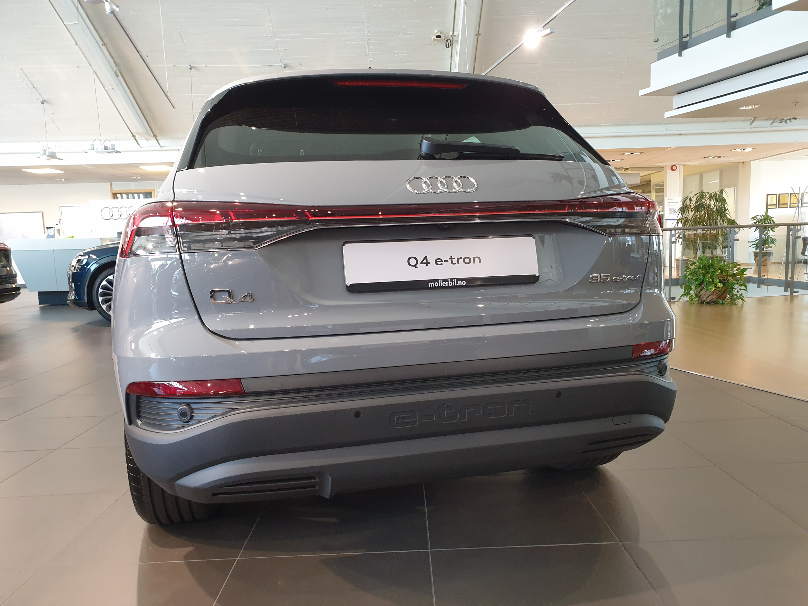
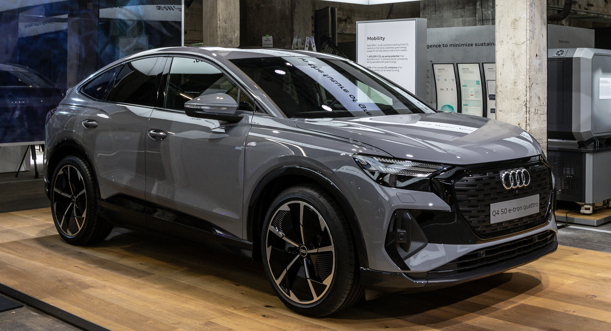
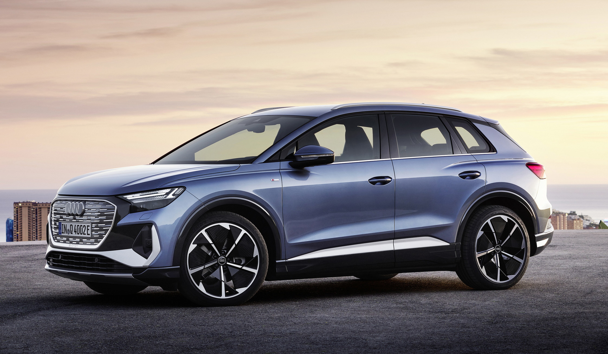
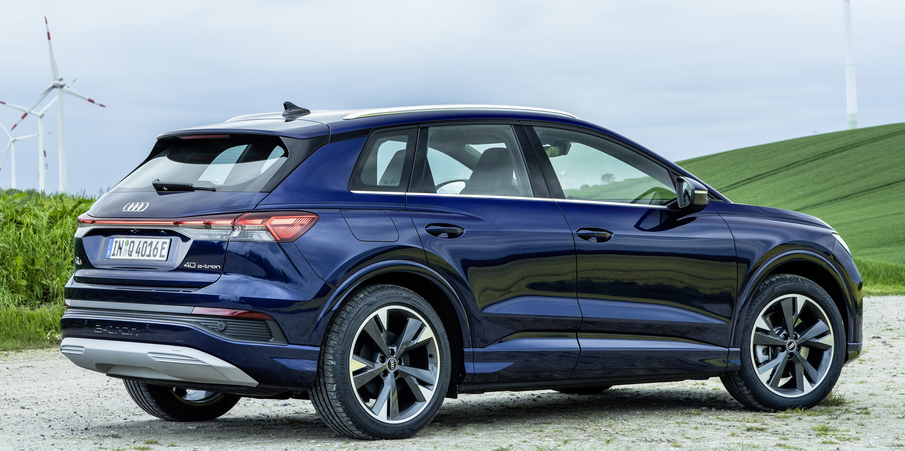
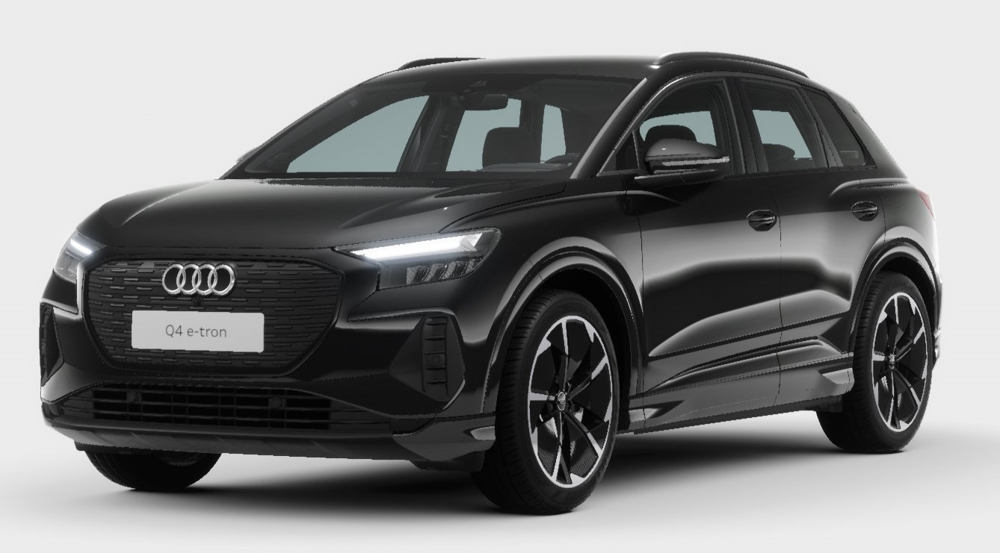
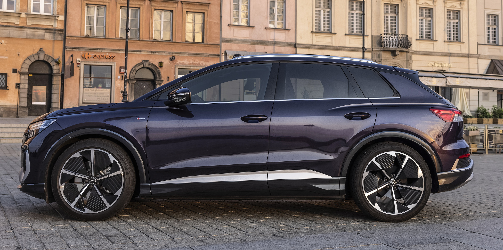
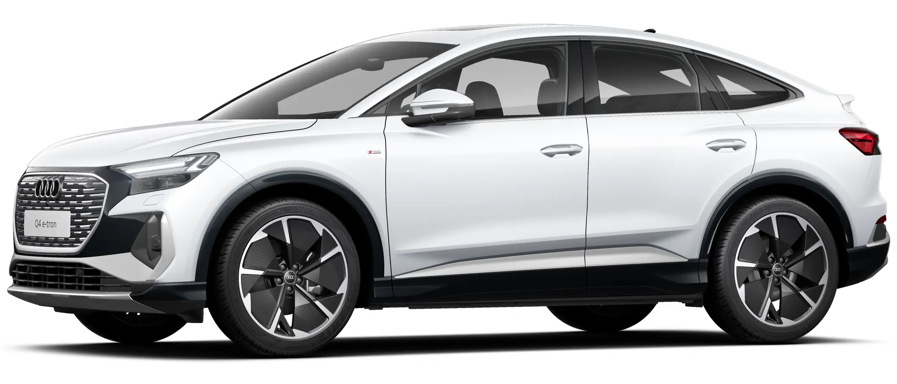
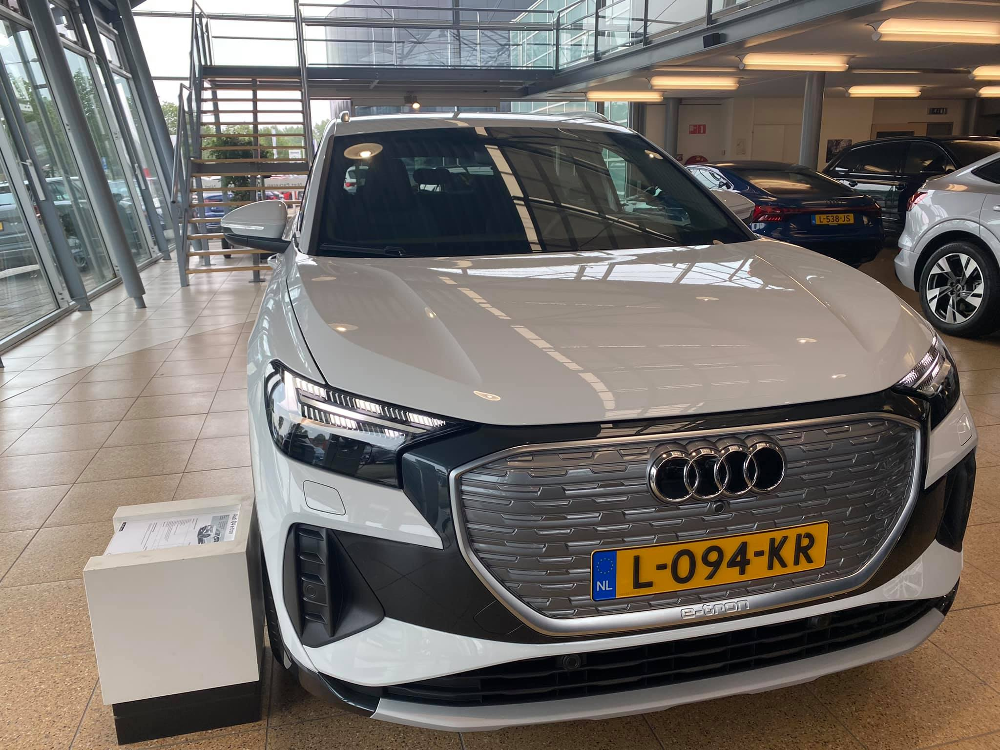

## Paint Trims

### Basic paint

On the basic trim the bumpers and wheel arches are not painted

### Contrast paint

The standard paint is with Manhatten grey as contrast color. Option code **FB5**

### Full body paint or with contrast paint

For glacier white, mythos black, pepple grey and navarra blue you can get full body paint. Option code **FB4**

## Paint colors

The color swatch for the Audi Q4 e-tron and Q4 Sportback e-tron contains eight colors. Their restrained character is inspired by the colors and hues found in nature. The solid paint color is called stone gray, the metallic shades are named aurora violet (new), floret silver, geyser blue, glacier white, mythos black, Navarra blue, and typhoon gray. Aurora violet is a color that has been taken from Audi Sport.

Below you see photos of Audi Q4-etron and Q4 Sportback e-tron with the different colors.

### Pebble Stone gray

This is the only non metallic pain available. Color code **C2**

### Geyser Blue

Color code **5Y**

The below footage shows dynamic driving scenes of the Audi Q4 Sportback e-tron in the colour Geyser blue on the streets of Lübeck.



### Typhoon Grey

Color code **2L**

 The below footage shows dynamic driving scenes of the Audi Q4 e-tron in the colour Typhoon grey on the streets of Lübeck.



### Florett Silver

Color code **L5**

The below footage shows dynamic driving scenes of the Audi Q4 Sportback e-tron in the colour Floret silver in the streets of Spain.



### Navarra Blue

Color code **2D**

### Mythos Black

Color code **0E**

### Aurora Violet

Color code **J6**

The below video shos a Audi Q4 Sportback e-tron in Aurora Violet with black optics and S-line exterior.



See video below of Audi Q4 e-tron in Aurora Violet with S-line exterior



### Glacier White

Color code **2Y**

