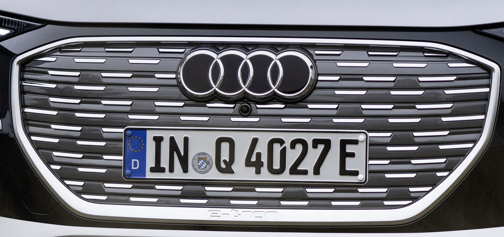

The more distinctively contoured bumper is flanked by more expressive air curtains painted in silver.

In addition, the Single frame grill has a shadow look compared with the standard that has a silver look.

The rear diffusor have a more sporty and dynamic look.

Elements on the door is in silver compared to standard that has body color or contrast color for standard.
This element is black when combined with black optics.

You get a s-line badge with the s-line package.

The option Id is **PY2** for s-line exterior.

S-line exterior package can be combined with a [black optics](/models/q4-e-tron/exterior/styling/#black-optics) package

## Additional requiremens with S-line exterior

It is important to know if you want the s-line exterior option (PY2) it is required to have minimum 20" wheels and
you need to choose [sport suspension](https://electrichasgoneaudi.net/models/q4-e-tron/drivetrain/suspension/) (option ID **1JC**) or [dynamic package plus](https://electrichasgoneaudi.net/models/q4-e-tron/drivetrain/suspension/#dynamic-package-plus-option-py9) with option PY2.

{}
