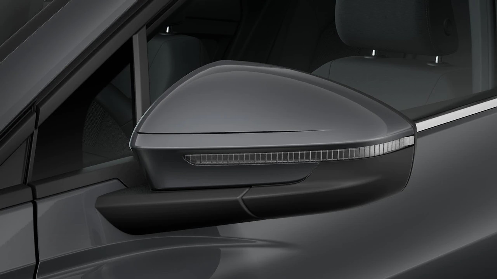

## Full body paint or with contrast paint

The standard paint is with Manhatten grey as contrast color. Option code **FB5**

For glacier white, mythos black, pepple grey and navarra blue you can get full body paint. Option code **FB4**

## Optics

There is 3 different optics to choose from

### Silver optics

Silver optics is the standard front.

### Shadow optics

Sets expressive accents in the form of black painted areas on particularly striking design elements on the front, sides and rear.

Shadow look black includes:
Black accents on the Audi Singleframe
Black accents on the front and rear bumpers
Black moldings around the side windows
Rails in black

### Black Optics

The black optics package contains gloss black front, rails and window rims. Option code **4ZD**

## Mirrors

The mirrors can be delivered in different styles.

Painted mirrors in veichle color. Option code **6FG**

Black mirrors. Option code **6FJ**

{}
