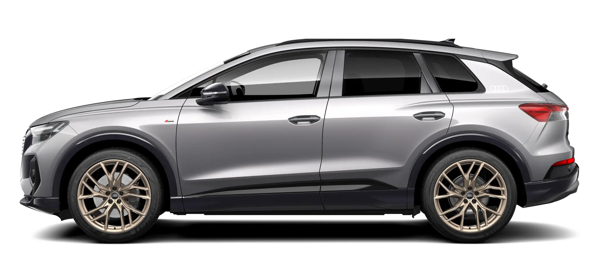

The following wheels have been available from Audi to Audi Q4 e-tron. Varies for the different markets

## 19" 5-arm design

8,0 J x 19 with 235/55 R 19 tires front and 255/50 R 19 tires rear

 Part No: **40S**

## 19" 5-W design

8,0 J x 19 with 235/55 R 19 tires front and 255/50 R 19 tires rear

 Part No: **40Z**

## 20" 5Y design

8.0J x 20 with 235/50R 20 tires in front and 9.0J 20 with 255/45R 20 tires rear.

 Part No: **55J**

## 20" 5Y graphite grey design

8.0J x 20 with 235/50R 20 tires in front and 9.0J 20 with 255/45R 20 tires rear.

 Part No: **55K**

## 20" 10 spoke design

8.0J x 20 with 235/50R 20 tires in front and 9.0J 20 with 255/45R 20 tires rear.

 Part No: **56J**

## 20" 5V design

8.0J x 20 with 235/50R 20 tires in front and 9.0J 20 with 255/45R 20 tires rear.

 Part No: **56H**

## 21" 5-arm rotor design

8,5 J x 21 with 235/45 R 21 tires front 9,0 J x 21 255/40 R 21 tires rear

 Part No: **55L**

## 21" 5-W design

8,5 J x 21 with 235/45 R 21 tires front 9,0 J x 21 255/40 R 21 tires rear

 Part No: **C5W**

## 21" 5-W design bronze

8,5 J x 21 with 235/45 R 21 tires front 9,0 J x 21 255/40 R 21 tires rear

 Part No: **C7A**

## 21" 5 Arm rotor design

8,5 J x 21 with 235/45 R 21 tires front 9,0 J x 21 255/40 R 21 tires rear

 Part No: **C1P**

