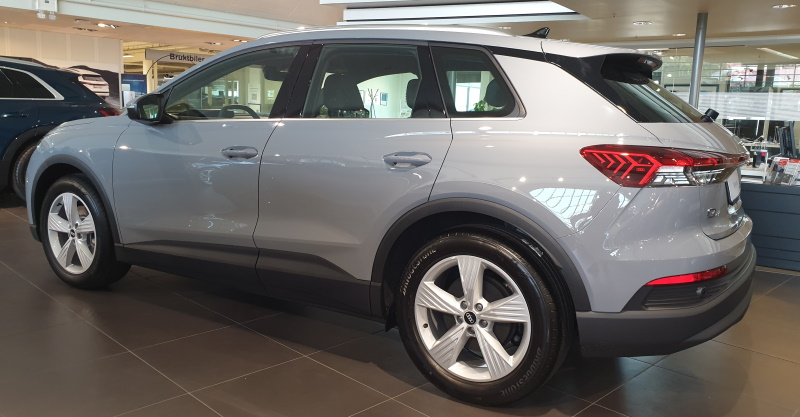
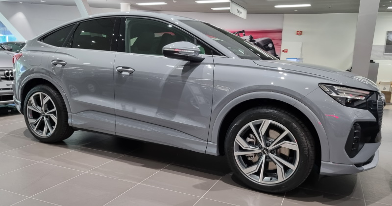
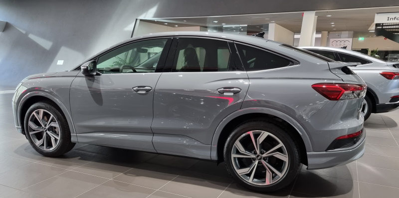
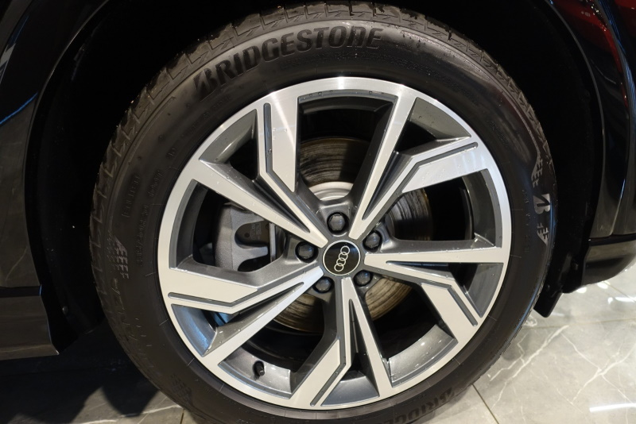
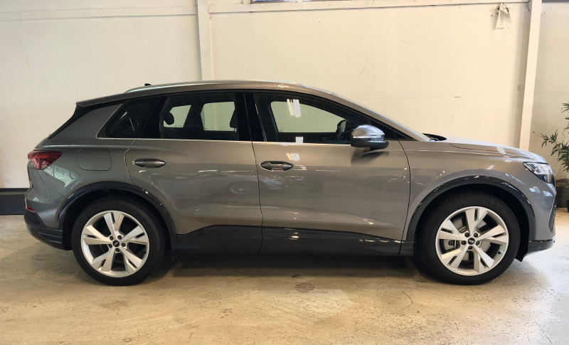
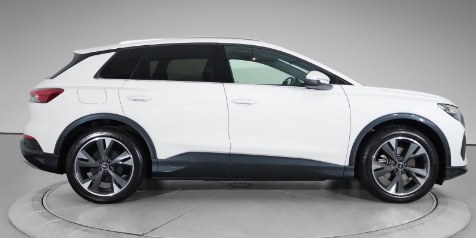
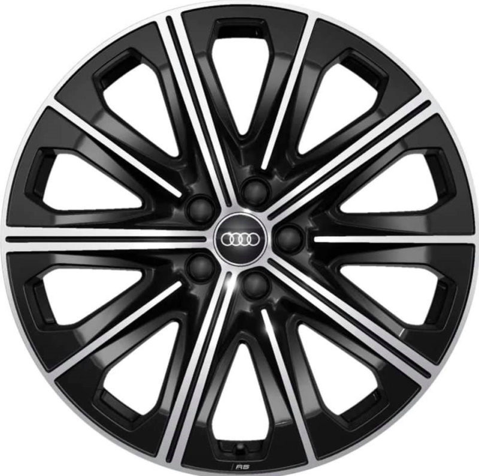

<!-- markdownlint-disable MD033 -->

Følgende felger er tilgjengelig fra Audi til Audi Q4 e-tron.
Senterboring er 57,1 mm og boltmønster er 5x112 mm.

## 19" 5-arm design

8,0 J x 19 med 235/55 R 19 dekk foran og 255/50 R 19 dekk bak

 Opsjonsnr: **40S**

<figure>
    
    <figcaption><h4>19 inch 5-arm design</h4></figcaption>
</figure>

<figure>
    
    <figcaption><h4>19 inch 5-arm design</h4></figcaption>
</figure>

## 19" 5-W design

8,0 J x 19 felger med 235/55 R 19 dekk foran og 255/50 R 19 dekk bak

 Opsjonsnr: **40Z**

<figure>
    
    <figcaption><h4>19 inch 5-W design</h4></figcaption>
</figure>

<figure>
    
    <figcaption><h4>19 inch 5-W design</h4></figcaption>
</figure>

## 20" 5-spoke V-style design

8.0J x 20 felger med 235/50R 20 dekk foran og 9.0J 20 felger med 255/45R 20 dekk bak.

 Opsjonsnr: **44L**

<figure>
    
    <figcaption><h4>5-spoke V-style design</h4></figcaption>
</figure>

<figure>
    
    <figcaption><h4>5-spoke V-style design</h4></figcaption>
</figure>

<figure>
    
    <figcaption><h4>5-spoke V-style design</h4></figcaption>
</figure>

## 20" 5Y design

8.0J x 20 felger med 235/50R 20 dekk foran og 9.0J 20 felger med 255/45R 20 dekk bak.

 Opsjonsnr: **55J**

<figure>
    
    <figcaption><h4>20" 5Y design</h4></figcaption>
</figure>

<figure>
    
    <figcaption><h4>20" 5Y design</h4></figcaption>
</figure>

<figure>
    
    <figcaption><h4>20" 5Y design</h4></figcaption>
</figure>

<figure>
    
    <figcaption><h4>20" 5Y design</h4></figcaption>
</figure>

## 20" 5Y graphite grey design

8.0J x 20 felger med 235/50R 20 dekk foran og 9.0J 20 felger med 255/45R 20 dekk bak.

 Opsjonsnr: **55K**

<figure>
    
    <figcaption><h4>20" 5Y design graphite grey</h4></figcaption>
</figure>

<figure>
    
    <figcaption><h4>20" 5Y design graphite grey</h4></figcaption>
</figure>

<figure>
    
    <figcaption><h4>20" 5Y design graphite grey</h4></figcaption>
</figure>

<figure>
    
    <figcaption><h4>20" 5Y design graphite grey</h4></figcaption>
</figure>

## 20" 10 spoke design

8.0J x 20 felger med 235/50R 20 dekk foran og 9.0J 20 felger med 255/45R 20 dekk bak.

 Opsjonsnr: **56J**

 <figure>
    
    <figcaption><h4>20" 10 spoke design</h4></figcaption>
</figure>

<figure>
    
    <figcaption><h4>20" 10 spoke design</h4></figcaption>
</figure>

 <figure>
    
    <figcaption><h4>20" 10 spoke design</h4></figcaption>
</figure>

## 20" 5V design

8.0J x 20 felger med 235/50R 20 dekk foran og 9.0J 20 felger med 255/45R 20 dekk bak.

 Opsjonsnr: **56H**

<figure>
    
    <figcaption><h4>20" 5V design</h4></figcaption>
</figure>

<figure>
    
    <figcaption><h4>20" 5V design</h4></figcaption>
</figure>

## 21" 5-arm rotor design

8,5 J x 21 ET 40 felger med 235/45 R 21 dekk foran 9,0 J x 21 ET 42 felger med  255/40 R 21 dekk bak.

 Opsjonsnr: **55L**

<figure>
    
    <figcaption><h4>21" 5-arm rotor design</h4></figcaption>
</figure>

<figure>
    
    <figcaption><h4>21" 5-arm rotor design</h4></figcaption>
</figure>

<figure>
    
    <figcaption><h4>21" 5-arm rotor design</h4></figcaption>
</figure>

## 21" 5-W design

8,5 J x 21 ET 40 felger med 235/45 R 21 dekk foran 9,0 J x 21 ET 42 felger med  255/40 R 21 dekk bak.

 Opsjonsnr: **C5W**

<figure>
    
    <figcaption><h4>21" 5-W design</h4></figcaption>
</figure>

<figure>
    
    <figcaption><h4>21" 5-W design</h4></figcaption>
</figure>

## 21" 5-W design bronze

8,5 J x 21 ET 40 felger med 235/45 R 21 dekk foran 9,0 J x 21 ET 42 felger med  255/40 R 21 dekk bak.

 Opsjonsnr: **C7A**

<figure>
    
    <figcaption><h4>21" 5-W design bronze for edition one</h4></figcaption>
</figure>

<figure>
    
    <figcaption><h4>21" 5-W design bronze for edition one</h4></figcaption>
</figure>

## 21" 5 Arm rotor aero design

8,5 J x 21 ET 40 felger med 235/45 R 21 dekk foran 9,0 J x 21 ET 42 felger med  255/40 R 21 dekk bak.

 Opsjonsnr: **C1P**

<figure>
    
    <figcaption><h4>21" 5 Arm rotor aero design</h4></figcaption>
</figure>

<figure>
    
    <figcaption><h4>21" 5 Arm rotor aero design</h4></figcaption>
</figure>
