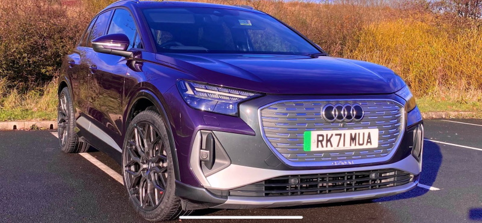
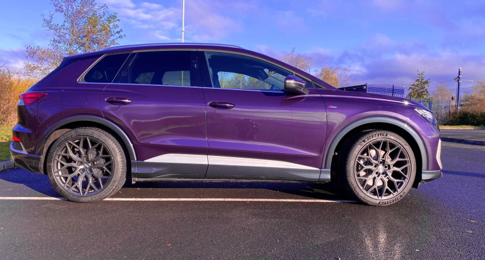

<!-- markdownlint-disable MD033 -->
## 21 Vossen HF2 21x9.5

<figure>
    
    <figcaption><h4>21 x 9.5 Vossen HF2 with 255/40 Tires</h4></figcaption>
</figure>

<figure>
    
    <figcaption><h4>21 x 9.5 Vossen HF2 with 255/40 Tires</h4></figcaption>
</figure>

<figure>
    
    <figcaption><h4>21 x 9.5 Vossen HF2 with 255/40 Tires</h4></figcaption>
</figure>

