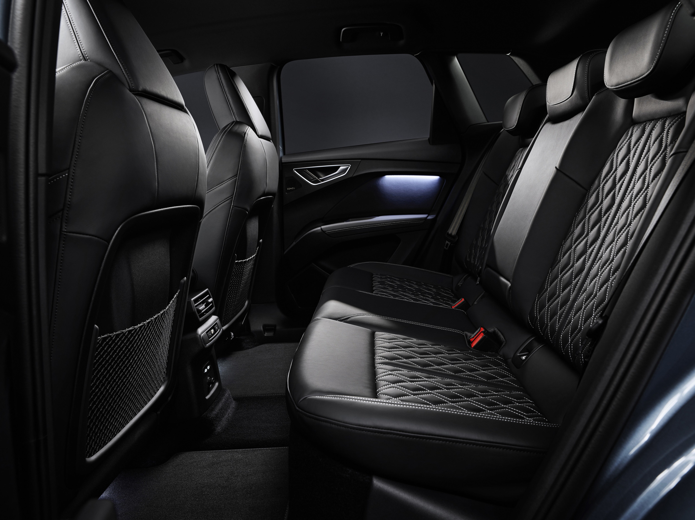

## Standard interiørlys

Følgende interiørlys er standard på Audi Q4

- LED-takmodul foran og bak (hvit)
- bagasjeromslys, venstre (hvit)
- oppbevaringsrom i midtkonsollen foran (hvit)
- opplyst hanskerom

## Ambiente lyspakke

Hvite lys med alternativ-ID **QQ8**

I tillegg til standardlysene du får

- opplyste sminkespeil foran (hvitt)
- omgivelsesbelysning for front- og bakdører (hvit)
- inngangslys på undersiden av inngangsdørene (hvit)
- konturbelysning på dashbordet (flerfarget)
- fotromsbelysning foran og bak
  
## Ambiente lyspakke plus

Omgivelseslyspakken pluss med opsjons-ID **QQ9**. tilbyr følgende rekke funksjoner, noen i hvitt lys, andre med flere fargejusteringer:

- opplyste sminkespeil foran (hvitt)
- omgivelsesbelysning for front- og bakdører (flerfarget)
- inngangslys på undersiden av inngangsdørene (hvit)
- konturbelysning på dashbordet (flerfarget)
- Gulvbelysning foran og bak

Fargen kan endres basert på kjøremodusen din i [Audi Drive Select](/models/q4-e-tron/technology/audidriveselect/).

