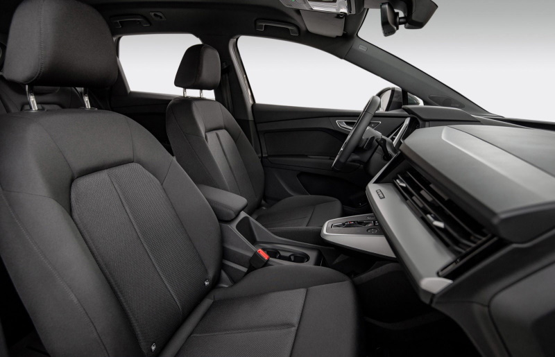
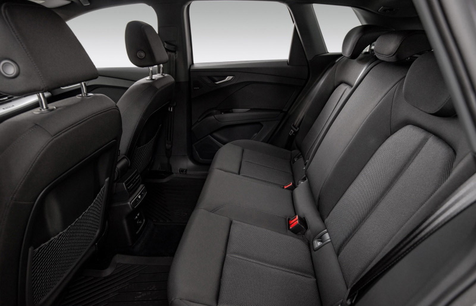
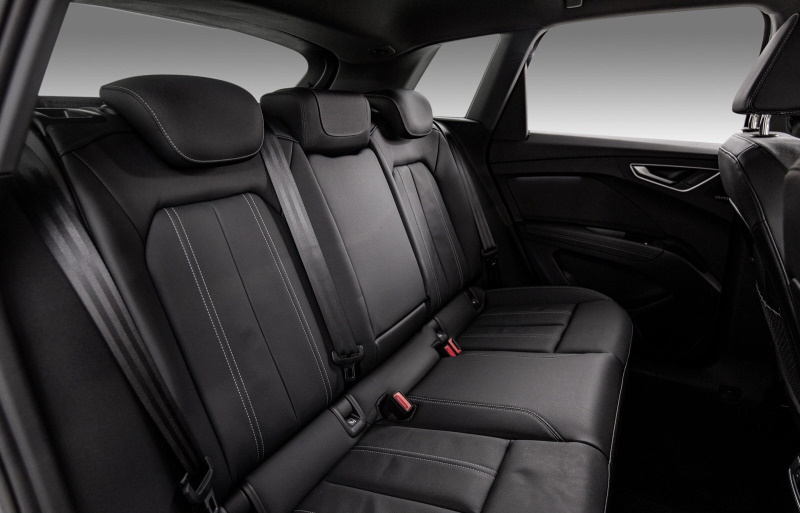
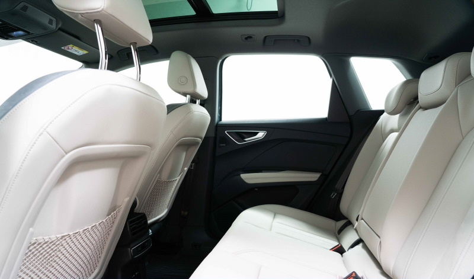
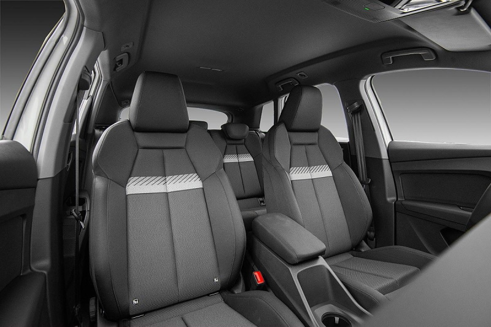
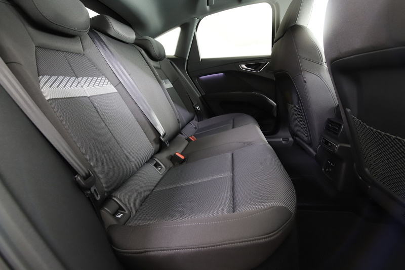

<!-- markdownlint-disable MD033 -->

Each seat type have different seat materials in different colors to choose from. Making it possible to the interior just as you like it.

## Seat functionality

| **Seat type** | **Standard** | **Sport** | **S-line sport**|
|-------|-------|-------|-------|
|Front seat heating| option | option | option |
|Rear seat heating| N/A | N/A | N/A |
|Front seat ventilation| N/A | N/A | N/A |
|Front seat massage| N/A | N/A | N/A |
|Power seat adjustment driver | option | option | option |
|Power seat adjustment passenger | option | option | option |
|Driver seat memory | option | option | option |
|Passenger seat memory | N/A | N/A | N/A |
|Extending thigh support |N/A | standard |standard |
|Electric 4-way lumbar support |option | option |option |
|Adjustment of headrest height| standard | N/A |N/A |
|Adjustment of headrest distance| N/A | N/A | N/A |
|Rear seat split | 40:60 (40:20:40 option) | 40:20:40 | 40:20:40 |

## Standard Seats

### Standard seats in black fabric

<figure>
    
    <figcaption><h4>Standard seats in black fabric (AI)</h4></figcaption>
</figure>

<figure>
    
    <figcaption><h4>Standard seats in black fabric (AI)</h4></figcaption>
</figure>

<figure>
    
    <figcaption><h4>Standard seats in black fabric (AI)</h4></figcaption>
</figure>

### Standard seats in black leather option PWA

<figure>
    
    <figcaption><h4>Standard seats in mono.pur 550 black leather (A0) from interior design package 1</h4></figcaption>
</figure>

<figure>
    
    <figcaption><h4>Standard seats in mono.pur 550 black leather (A0) from interior design package 1</h4></figcaption>
</figure>

<figure>
    
    <figcaption><h4>Standard seats in mono.pur 550 black leather (A0) from interior design package 1</h4></figcaption>
</figure>

<figure>
    
    <figcaption><h4>Standard seats in mono.pur 550 black leather (A0) from interior design package 1</h4></figcaption>
</figure>

### Standard seats in brown leather option PWB

 from interior design package 2")

### Standard seats in beige leather option PWC

<figure>
    
    <figcaption><h4>Standard seats in mono.pur 550 pergament beige leather (BH) from interior design package 3</h4></figcaption>
</figure>

<figure>
    
    <figcaption><h4>Standard seats in mono.pur 550 pergament beige leather (BH) from interior design package 3</h4></figcaption>
</figure>

<figure>
    
    <figcaption><h4>Standard seats in mono.pur 550 pergament beige leather (BH) from interior design package 3</h4></figcaption>
</figure>

## Sport Seats

### Sport seats with dinamica option PWD

<figure>
    
    <figcaption><h4>Sport seats in black Dynamik fabric (AI) from interior design package 4</h4></figcaption>
</figure>

<figure>
    
    <figcaption><h4>Sport seats in black Dynamik fabric (AI) from interior design package 4</h4></figcaption>
</figure>

<figure>
    
    <figcaption><h4>Sport seats in black Dynamik fabric (AI) from interior design package 4</h4></figcaption>
</figure>

### Sport seats with black leather option PWE

 from interior design package 5")

 from interior design package 5")

 from interior design package 5")

## S-Line Sport Seats

### S-line seats with leather/fabric option PWK

")

### S-line seats with Leather edition one

 on edition one")

 on edition one")

### S-line seats with Leather option PWL

")

### S-line seats with Leather and Dinamica option PWM

")

")

")

### S-line Sport seats with Feinappa leather option PWN

")

")

")