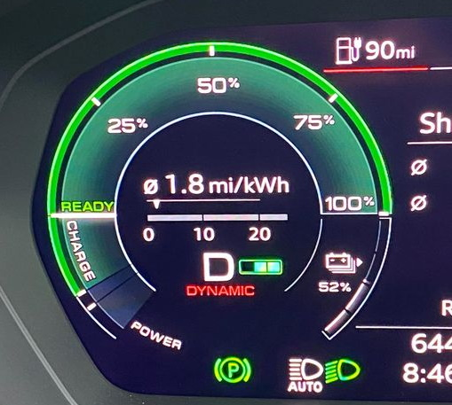

<!-- markdownlint-disable MD033 -->
På Audi Q4 e-tron er det to tilgjengelige kjøremoduser.

- **D-modus** : bil ruller når du løfter wattpedalen (kraft)
- **B-modus (brems)** : bilen reduserer hastigheten mens den gjenvinner energi.

Hvilke av dem er mest effektiv hvis man ønsker lengst mulig rekkevidde?

Svaret er **D-modus**. Årsaken er at i B-modus vil du ende opp med å restituere når det ikke er nødvendig, og som vil miste energi under konverteringen av kinetisk energi til elektrisk energi på batteriet. Rundt 80 % av den kinetiske energien legges inn i batteriet mens det restitueres.
Hvis du kysser vil du beholde den energien som kinetisk energi.

For å kunne kjøre i B-modus må du holde foten på gassen på et bestemt sted, men selv den beste sjåføren vil ikke kunne skifte mellom kjøring og frikjøring i samme hastighet som i D-modus.

På andre biler ville B-modus vært mer effektivt, men Audi har laget blandede bremser som alltid restituerer når du trykker på bremsepedalen hvis mulig. Derfor kaster du ikke bort energi på å bruke bremsepedalen på Audi Q4 e-tron.

Merk: Hvis "dynamisk"-modus er innstilt i det valgfrie [Audi drive select dynamic handling system](../../../technology/audidriveselect/) (standard i Sportback), skjer restitusjonen også i gir D, men litt svakere enn i B.

## Hvor mye betyr det?

Selv D-modus er den mest effektive i de fleste tilfeller kan forskjellene ignoreres. Hvis du foretrekker å kjøre med B-modus i byen (én-pedal-kjøring) bør du bare gjøre det.
Den ekstra rekkevidden du får fra D-modus i bykjøring er sannsynligvis ikke noe du bryr deg om.

På motorvei er det mye mer behagelig å bruke D-modus i tillegg til å være mer effektivt.

## Vil du lære mer

Les vår [en-pedal driving guide](../../../../../guides/onepedaldriving/).