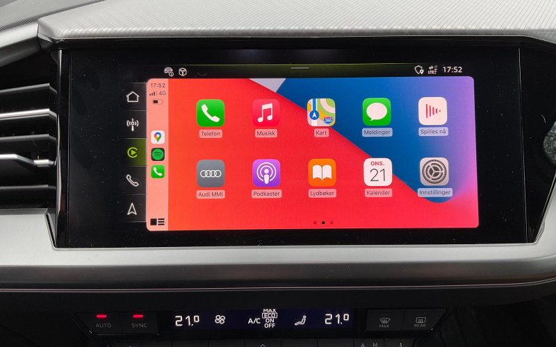
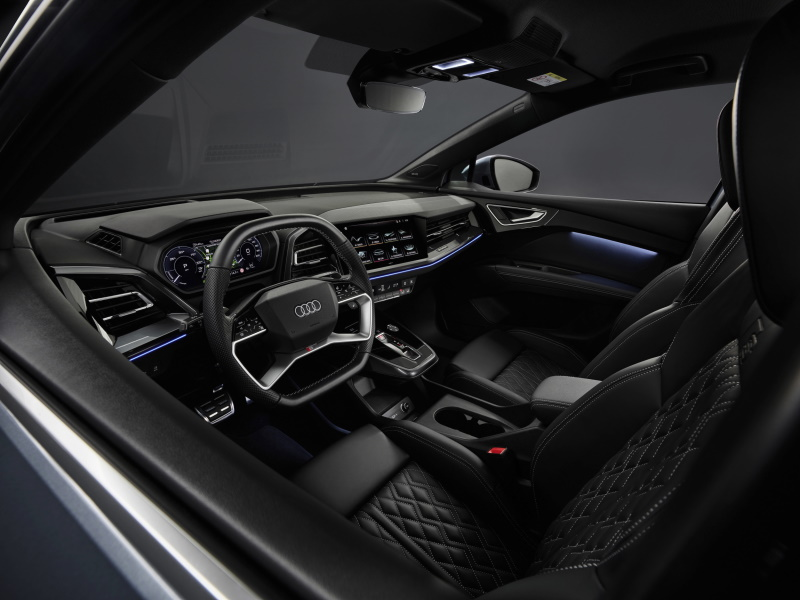

The following guide is based on the basic model. Many markets have trim package with options included.

Below are the most important options you need to consider when buying an Audi Q4 e-tron

## Smartphone interface: Option ID IU1

Without smartphone interface you are not able to use Android Auto / Apple Carplay and then use apps like Waze or control Spotify in a good way.

Currently this is only avaiable in the infotainment package with optionID **PYX** that also include phone box, and two USB-C in rear seats.

[See smartphone interface for details.](../technology/uiandoperations/smartphoneinterface/)

## Privacy windows: Option ID QL5

Improves looks a lot and you dont need to drive around in a fish tank on display.

[See windows for details](../exterior/windows/#privacy-glass)

## MMI Navigation plus: Option ID PYG

With the MMI Navigation Plus option you get MMI navigation system and Virtual Cockpit.
Having a built in Navigation System gives serveral advantages over using your phone.

See details on [MMI Navigation Plus](../technology/uiandoperations/navigation/) and
[Virtual Cockpit](../technology/uiandoperations/virtualcockpit/)

## Assistantpackage Pro: Option ID PY7

The assistant package pro contains most of the important driver assist functionality  like [Adaptive Cruise Assist](../technology/drivingassistance/adaptivecruiseassist/), [Adaptive Cruise Control](../technology/drivingassistance/adaptivecruisecontrol/)  and [Parking System Plus](../technology/drivingassistance/parkingsystemplus/)

## Security Package plus: Option ID PYU

Side assist is not part Assistantpackage Pro but is included in the security package plus package. The package include [Side Assist](../technology/drivingassistance/sideassist/), [exit warning](../technology/drivingassistance/exitwarning/), [cross traffic assist rear](../technology/drivingassistance/crosstrafficassistrear/), [Audi Pre Sense rear](../technology/drivingassistance/presenserear/).

## Multicolour ambient lightning: Option ID QQ2

With multicolor ambient lightning the look and feel inside the car gets to another planet.

[See ambient lightning to get convinced](../interior/interiorlights/)

{}
