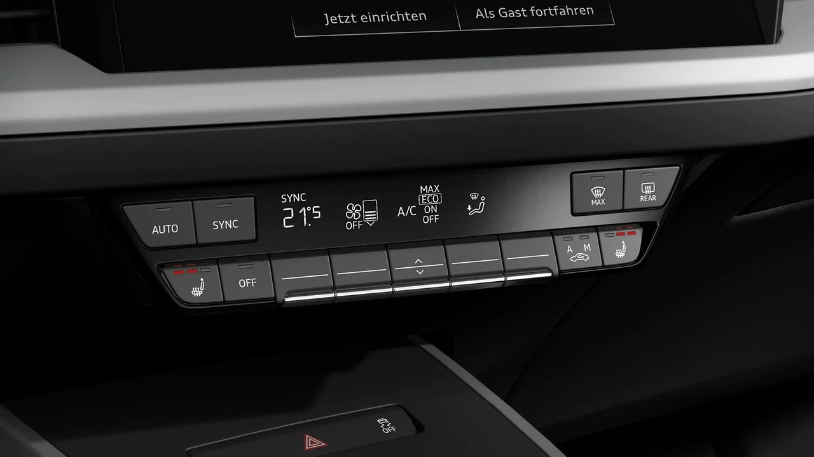
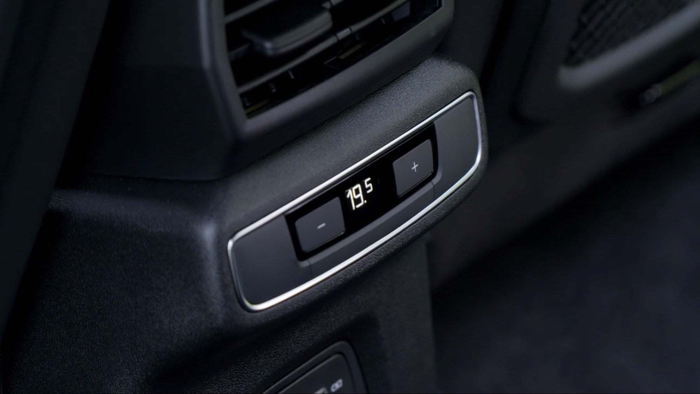

The system has the following characteristics.

- Electronic regulation of air temperature, volume and distribution
- Solar-dependent regulation
- Automatic recirculation
- Dust and odor-secreting allergy filter
- Separate defroster switch for faster defrosting of the front and side windows

The controls are located just below the MMI screen.

## 3-zone climate control system

As an option, you can order a 3-zone climate control system.

In the front, this means that the passenger and driver can have individual set temperatures.

It also gives the passenger in the back seat a separate panel where they can adjust the rear zone.

The 3-zone climate control system is part of the climate and winter package with option id **WNW**

## Auxiliary air conditioner with preconditioner

Audi e-tron is equipped with an auxiliary air conditioner that can be used when the car is turned off. This can be activated
from the MMI manually or set by a timer. One typical use case is when charging since the car needs to be turned off then and the main AC unit does not work.

The auxiliary air conditioner can also be controlled by the myAudi app. This is useful when you need to heat or cool the car before using it.

When using the pre-condition functionality you can also heat the steering wheel and front seats.

The Auxiliary air conditioner with preconditioner has Option ID **GA2** but is standard equipment.

## Heatpump

The heat pump reuses heat from the drivetrain to heat the coupe efficiently.

This can reduce consumption in cold weather and by that increase the range. How much this help would vary on the weather.

Has option Id **9M3** but it is only available as part of the [climate- and winter-package](/models/q4-e-tron/optionguide/list/#equipment-packages) **WNW**

{}
